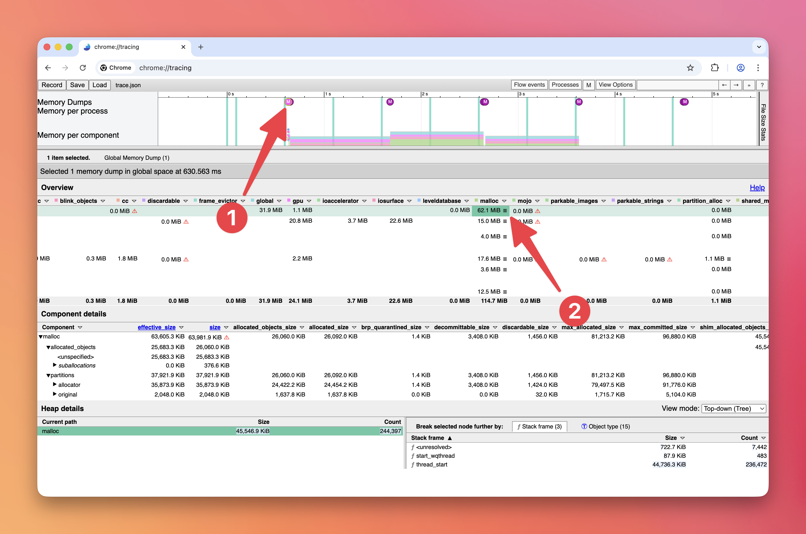

# contentTracing

> Collect tracing data from Chromium to find performance bottlenecks and slow operations.

Process: [Main](../glossary.md#main-process)

This module does not include a web interface. To view recorded traces, use
[trace viewer][], available at `chrome://tracing` in Chrome.

> [!NOTE]
> You should not use this module until the `ready` event of the app
> module is emitted.

```js
const { app, contentTracing } = require('electron')

app.whenReady().then(() => {
  (async () => {
    await contentTracing.startRecording({
      included_categories: ['*']
    })
    console.log('Tracing started')
    await new Promise(resolve => setTimeout(resolve, 5000))
    const path = await contentTracing.stopRecording()
    console.log('Tracing data recorded to ' + path)
  })()
})
```

## Methods

The `contentTracing` module has the following methods:

### `contentTracing.getCategories()`

<!--
```YAML history
changes:
  - pr-url: https://github.com/electron/electron/pull/16583
    description: "This method now returns a Promise instead of using a callback function."
    breaking-changes-header: api-changed-callback-based-versions-of-promisified-apis
```
-->

Returns `Promise<string[]>` - resolves with an array of category groups once all child processes have acknowledged the `getCategories` request

Get a set of category groups. The category groups can change as new code paths
are reached. See also the
[list of built-in tracing categories](https://chromium.googlesource.com/chromium/src/+/main/base/trace_event/builtin_categories.h).

> **NOTE:** Electron adds a non-default tracing category called `"electron"`.
> This category can be used to capture Electron-specific tracing events.

### `contentTracing.startRecording(options)`

<!--
```YAML history
changes:
  - pr-url: https://github.com/electron/electron/pull/13914
    description: "The `options` parameter now accepts `TraceConfig` in addition to `TraceCategoriesAndOptions`."
  - pr-url: https://github.com/electron/electron/pull/16584
    description: "This function now returns a callback`Promise<void>`."
    breaking-changes-header: api-changed-callback-based-versions-of-promisified-apis
```
-->

* `options` ([TraceConfig](structures/trace-config.md) | [TraceCategoriesAndOptions](structures/trace-categories-and-options.md))

Returns `Promise<void>` - resolved once all child processes have acknowledged the `startRecording` request.

Start recording on all processes.

Recording begins immediately locally and asynchronously on child processes
as soon as they receive the EnableRecording request.

If a recording is already running, the promise will be immediately resolved, as
only one trace operation can be in progress at a time.

### `contentTracing.stopRecording([resultFilePath])`

<!--
```YAML history
changes:
  - pr-url: https://github.com/electron/electron/pull/16584
    description: "This method now returns a Promise instead of using a callback function."
    breaking-changes-header: api-changed-callback-based-versions-of-promisified-apis
  - pr-url: https://github.com/electron/electron/pull/18411
    description: "The `resultFilePath` parameter is now optional."
```
-->

* `resultFilePath` string (optional)

Returns `Promise<string>` - resolves with a path to a file that contains the traced data once all child processes have acknowledged the `stopRecording` request

Stop recording on all processes.

Child processes typically cache trace data and only rarely flush and send
trace data back to the main process. This helps to minimize the runtime overhead
of tracing since sending trace data over IPC can be an expensive operation. So,
to end tracing, Chromium asynchronously asks all child processes to flush any
pending trace data.

Trace data will be written into `resultFilePath`. If `resultFilePath` is empty
or not provided, trace data will be written to a temporary file, and the path
will be returned in the promise.

### `contentTracing.getTraceBufferUsage()`

<!--
```YAML history
changes:
  - pr-url: https://github.com/electron/electron/pull/16600
    description: "This method now returns a Promise instead of using a callback function."
    breaking-changes-header: api-changed-callback-based-versions-of-promisified-apis
```
-->

Returns `Promise<Object>` - Resolves with an object containing the `value` and `percentage` of trace buffer maximum usage

* `value` number
* `percentage` number

Get the maximum usage across processes of trace buffer as a percentage of the
full state.

### `contentTracing.enableHeapProfiling([options])` _Experimental_

<!--
```YAML history
added:
  - pr-url: https://github.com/electron/electron/pull/50826
```
-->

* `options` ([EnableHeapProfilingOptions](structures/enable-heap-profiling-options.md)) (optional)

Returns `Promise<void>` - Resolves once heap profiling has been enabled.

Enable [heap profiling](https://chromium.googlesource.com/chromium/src/+/lkgr/docs/memory-infra/heap_profiler.md)
for MemoryInfra traces. Equivalent to the `--memlog` switch in Chrome.

Only takes effect if the `disabled-by-default-memory-infra` category is included.

Needs to be called before `contentTracing.startRecording()`.

Usage:

```js
const { contentTracing } = require('electron')

async function recordTrace () {
  await contentTracing.enableHeapProfiling()
  await contentTracing.startRecording({
    included_categories: ['disabled-by-default-memory-infra'],
    excluded_categories: ['*'],
    memory_dump_config: {
      triggers: [
        { mode: 'detailed', periodic_interval_ms: 1000 }
      ]
    }
  })

  await new Promise(resolve => setTimeout(resolve, 5000))

  const filePath = await contentTracing.stopRecording()
}
```

To view the recorded heap dumps:

1. Download the breakpad symbols for your Electron version from the Electron GitHub
   [releases](https://github.com/electron/electron/releases)
2. Clone the [Electron source code](../development/build-instructions-gn.md)
3. In your Chromium checkout for Electron, run this command to symbolicate the heap dump:

   ```bash
   python3 third_party/catapult/tracing/bin/symbolize_trace --use-breakpad-symbols --breakpad-symbols-directory /path/to/breakpad_symbols /path/to/trace.json
   ```

4. Open the symbolicated trace in `chrome://tracing` (the Perfetto UI does not support memory dumps
   yet)
5. Click on one of the `M` symbols
6. Click on a `☰` triple bar icon (e.g., in the `malloc` column)



[trace viewer]: https://chromium.googlesource.com/catapult/+/HEAD/tracing/README.md
