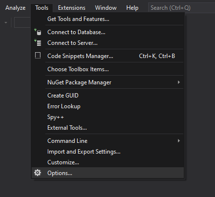
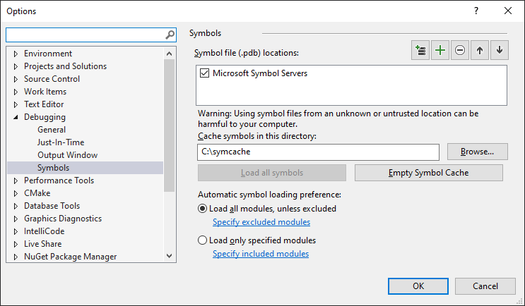

# Setting Up Symbol Server in Debugger

Debug symbols allow you to have better debugging sessions. They have information
about the functions contained in executables and dynamic libraries and provide
you with information to get clean call stacks. A Symbol Server allows the
debugger to load the correct symbols, binaries and sources automatically without
forcing users to download large debugging files. The server functions like
[Microsoft's symbol server](https://support.microsoft.com/kb/311503) so the
documentation there can be useful.

Note that because released Electron builds are heavily optimized, debugging is
not always easy. The debugger will not be able to show you the content of all
variables and the execution path can seem strange because of inlining, tail
calls, and other compiler optimizations. The only workaround is to build an
unoptimized local build.

The official symbol server URL for Electron is
<https://symbols.electronjs.org>.
You cannot visit this URL directly, you must add it to the symbol path of your
debugging tool. In the examples below, a local cache directory is used to avoid
repeatedly fetching the PDB from the server. Replace `c:\code\symbols` with an
appropriate cache directory on your machine.

## Using the Symbol Server in Windbg

The Windbg symbol path is configured with a string value delimited with asterisk
characters. To use only the Electron symbol server, add the following entry to
your symbol path (**Note:** you can replace `c:\code\symbols` with any writable
directory on your computer, if you'd prefer a different location for downloaded
symbols):

```powershell
SRV*c:\code\symbols\*https://symbols.electronjs.org
```

Set this string as `_NT_SYMBOL_PATH` in the environment, using the Windbg menus,
or by typing the `.sympath` command. If you would like to get symbols from
Microsoft's symbol server as well, you should list that first:

```powershell
SRV*c:\code\symbols\*https://msdl.microsoft.com/download/symbols;SRV*c:\code\symbols\*https://symbols.electronjs.org
```

## Using the symbol server in Visual Studio





## Troubleshooting: Symbols will not load

Type the following commands in Windbg to print why symbols are not loading:

```powershell
> !sym noisy
> .reload /f electron.exe
```
