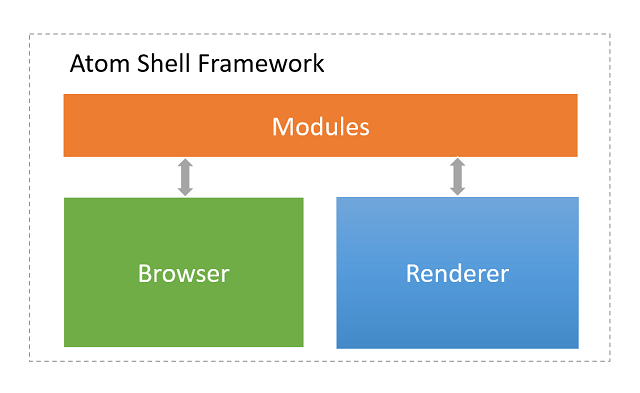
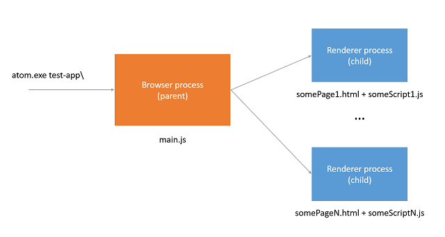
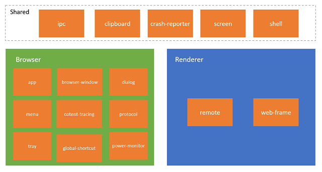

# Atom Shell Architecture
## 1. Introduction
Traditional web pages are designed to be executed inside a web browser with high control and limited access to OS resources such as file system due to security reasons. That's why it is impossible to build web application that is interacting with native systems and resources.

Atom Shell framework provides opportunity to create desktop application with access to system resources using popular web technologies HTML, CSS and JavaScript. Framework is based on JavaScript runtime [io.js](https://iojs.org/) (Node.js fork with better support of new features) and web browser [Chromium](http://www.chromium.org/) (open-source parts of Google Chrome).

## 2. Components
Atom Shell framework consists of three main parts:
* **Browser-side** is responsible for business logic and data access  
* **Renderer-side** is responsible for UI rendering
* **Modules** that bridge browser-side and renderer-side, and also help control application lifecycle



Important note, in Atom Shell terminology by **renderer-side** we mean thing that we usually call client-side (scripts and markup that executed in a web browser) and by **browser-side** we mean thing that we usually call server-side (scripts that executed on a server). For more information on names and purposes please read **Internals** section.

## 3. Application structure
Atom Shell applications usually include three types of files:
* JavaScript scripts
* HTML and CSS markups
* Package.json

```
test-app/
├── package.json
├── main.js
├── mystyles.css
└── index.html
```

The most important file in your application is **package.json** that specifies the entry point for your application, the script that will be executed by Atom Shell runtime.

```json
{
  "name"    : "sample-app",
  "version" : "0.1.0",
  "main"    : "main.js"
}
```

In your application you can have different JavaScript scripts that can be executed on browser-side or renderer-side depending on where you have called them. On every side you can use io.js (Node.js) modules and on renderer-side also DOM APIs for your page.

Atom Shell provides some extra built-in modules for developing native desktop applications. Some modules are only available on the browser side, some are only available on the renderer side, and some can be used on both sides. The basic rule is: if a module is GUI or low-level system related, then it should be only available on the browser side.

Browser-side scripts:

```javascript
var fs = require("fs");                                     // using io.js (Node.js) module
var myName = require(__dirname + "/myScript.js");           // using my browser script

fs.readFile(__dirname + "/test.txt", function (err, data) {
  if (err) throw err;
  console.log(data.toString() + ", " + myName);
});

```

Your application also contains HTML and CSS files for UI purposes that will be rendered by renderer-side.

Renderer-side scripts and HTML with CSS:

```html
<!DOCTYPE html>
<html>
  <head>
    <title>Hello World!</title>
    <link rel="stylesheet" type="text/css" href="mystyles.css">
  </head>
  <body>
    <h1>Hello World!</h1>
    <script>
      // using io.js (Node.js) module in renderers-side
      var fs = require("fs");
      fs.readFile(__dirname + "/test.txt", function (err, data) {
        if (err) throw err;
        console.log(data.toString());
      });

      //using DOM APIs
      var h1 = document.getElementsByTagName("h1")[0];
      h1.innerHTML = "Hello DOM";
    </script>.
  </body>
</html>
```

## 4. Execution process
To launch your application you should run Atom Shell with the path of your application.

```
atom.exe test-app\

```

When you execute this command, OS will create for you a new instance of Atom Shell (browser process) that will load the script specified in the package.json. From this point your script will have control and you can do anything that you want.



Renderer process will be created for each window that you specify in your browser code.

```javascript
var window1 = new BrowserWindow({width: 800, height: 600});
var window2 = new BrowserWindow({width: 800, height: 600});

window1.loadUrl('file://' + __dirname + '/index.html');
window2.loadUrl('file://' + __dirname + '/index2.html');
```

You can use special [app module](https://github.com/atom/atom-shell/blob/master/docs/api/app.md) to control lifecycle of your application.

```javascript
// Wait for Atom Shell initialization
app.on('ready', function() {
  // do something
});

// Quit when all windows are closed.
app.on('window-all-closed', function() {
  if (process.platform != 'darwin')
    app.quit();
});

```

## 5. Communication between Browser and Renderer
Atom Shell provides two special modules for communication between renderer and browser sides:
* [**IPC**](https://github.com/atom/atom-shell/blob/master/docs/api/ipc-browser.md) (available on both sides) - based on Chromium IPC (see **Internals** section)
* [**Remote**](https://github.com/atom/atom-shell/blob/master/docs/api/remote.md) (available on renderer side) - remote method invocation of browser's process objects

An example of sending and handling messages via IPC:

```javascript
// In browser.
var ipc = require('ipc');
ipc.on('asynchronous-message', function(event, arg) {
  console.log(arg);  // prints "ping"
  event.sender.send('asynchronous-reply', 'pong');
});

ipc.on('synchronous-message', function(event, arg) {
  console.log(arg);  // prints "ping"
  event.returnValue = 'pong';
});
```

```javascript
// In web page.
var ipc = require('ipc');
console.log(ipc.sendSync('synchronous-message', 'ping')); // prints "pong"

ipc.on('asynchronous-reply', function(arg) {
  console.log(arg); // prints "pong"
});
ipc.send('asynchronous-message', 'ping');
```

An example of creating a browser window in renderer process via Remote:

```javascript
var remote = require('remote');
var BrowserWindow = remote.require('browser-window');
var win = new BrowserWindow({ width: 800, height: 600 });
win.loadUrl('https://github.com');
```

For more information about Communication between sides please read **Internals** section.

## 6. Modules


Atom Shell provides different modules for convenience that can be used on one of the sides or on both.

Browser-side:
* [**app**](https://github.com/atom/atom-shell/blob/master/docs/api/app.md) - responsible for controlling the application's lifecycle
* [**browser-window**](https://github.com/atom/atom-shell/blob/master/docs/api/browser-window.md) - gives you ability to create a browser window
* [**content-tracing**](https://github.com/atom/atom-shell/blob/master/docs/api/content-tracing.md) - used to collect tracing data generated by the underlying Chromium content module (see **Internals** section)
* [**dialog**](https://github.com/atom/atom-shell/blob/master/docs/api/dialog.md) - show native system dialogs
* [**global-shortcut**](https://github.com/atom/atom-shell/blob/master/docs/api/global-shortcut.md) -  register/unregister a global keyboard shortcut in operating system
* [**menu**](https://github.com/atom/atom-shell/blob/master/docs/api/menu.md) - used to create native menus that can be used as application menus and context menus
* [**power-monitor**](https://github.com/atom/atom-shell/blob/master/docs/api/power-monitor.md) - used to monitor the power state change
* [**protocol**](https://github.com/atom/atom-shell/blob/master/docs/api/protocol.md) - can register a new protocol or intercept an existing protocol
* [**tray**](https://github.com/atom/atom-shell/blob/master/docs/api/tray.md) -  represents an icon in operating system's notification area

Renderer-side:
* [**remote**](https://github.com/atom/atom-shell/blob/master/docs/api/remote.md) - remote method invocation
* [**web-frame**](https://github.com/atom/atom-shell/blob/master/docs/api/web-frame.md) - can custom the rendering of current web page (for example zoom level)

Both sides:
* [**ipc**](https://github.com/atom/atom-shell/blob/master/docs/api/ipc-browser.md) - communication between renderer and browser
* [**clipboard**](https://github.com/atom/atom-shell/blob/master/docs/api/clipboard.md) - provides methods to do copy/paste operations
* [**crash-reporter**](https://github.com/atom/atom-shell/blob/master/docs/api/crash-reporter.md) - automatically submitting crash reporters to remote server
* [**screen**](https://github.com/atom/atom-shell/blob/master/docs/api/screen.md) - info about screen size, displays, cursor position, etc.
* [**shell**](https://github.com/atom/atom-shell/blob/master/docs/api/shell.md) - provides functions related to desktop integration

## 7. Custom DOM elements
Framework contains custom DOM elements and functions for convenience. [**File object**](https://github.com/atom/atom-shell/blob/master/docs/api/file-object.md) is abstraction that provides access to native files from HTML5 file API.

[**window.open function**](https://github.com/atom/atom-shell/blob/master/docs/api/window-open.md) implemented internally as a new instance of window (new renderer process) but the web page, that executed it, will receive proxy object with standard limited functionality of HTML.

[**webview tag**](https://developer.chrome.com/apps/tags/webview) is special Chromium tag for Chrome apps that embed guest content. Guest content executed in separate renderer process than your application that keeps your app safe from the embedded content.

## 8. Internals
### 8.1. Browser and Renderer
Atom Shell roots go to open-source web browser [Chromium](http://www.chromium.org/), that is customized and extended in Atom Shell framework for writing desktop applications using web technologies. Framework uses main part of Chromium called [Content module](http://www.chromium.org/developers/content-module) that is responsible only for HTML rendering and separated from other features such as extensions, spell checking and so on.

In Chromium you have two main processes:
* **Browser** - main process that control everything (windows, tabs, plugins, etc.)
* **Renderer** - process for interpreting and laying out HTML using [WebKit](https://www.webkit.org/)

In other words, browser is the manager of separately running rendering processes. Amount of renderers and their scope is defined by different [process models](http://www.chromium.org/developers/design-documents/process-models):
* Renderer per site instance (default)
* Renderer per site
* Renderer per tab
* Single renderer

Also usually there is additional renderer process called GPU that is used only for GPU accelerated rendering of content. Atom Shell uses default process model, that is why your Atom Shell application will have three types of processes:
* **Browser** (one)
* **GPU** (one)
* **Renderer** (multiple)

### 8.2. No Sandboxing
Sandboxing is one of the key principles that isolates web applications from each other and OS in Chromium. It is implemented via broker and target process [sandbox architecture](http://www.chromium.org/developers/design-documents/sandbox). The broker is a privileged controller/supervisor of the activities of the sandboxed (target) processes. In Chromium, the broker is always the browser process and the renderer is always target process, unless the --no-sandbox command specified.

Atom Shell uses **no-sandbox** configuration that's why all your rendering processes and browser process have access to system resources without restrictions.

### 8.3. Chromium and io.js (Node.js)
Atom Shell implements JavaScript runtime by integrating io.js (fork of Node.js). Integration has been done by using [multiple execution contexts](https://strongloop.com/strongblog/whats-new-node-js-v0-12-multiple-context-execution/) in Node. By design io.js is a single-threaded application, built around the concept of a single event loop, with hundreds of global variables that store various bits of state. **Multiple execution contexts** feature provides you ability to safe your contexts if you call the Node from multi-threaded app, like Chromium. Atom Shell uses **no-sandbox** configuration, as we mentioned before, that gives you with multi-context execution ability to use Node.

You can run JavaScript code and Node.js (io.js) modules inside browser and renderer processes.

### 8.4. Communication between Renderer and Browser
Browser and renderer are separately running processes that communicate in Chromium using special API called [Chromium Inter Process Communication (Chromium IPC)](http://www.chromium.org/developers/design-documents/inter-process-communication). Atom Shell built simplified API called [ipc](https://github.com/atom/atom-shell/blob/master/docs/api/ipc-browser.md) on top of it. You can easily use it in JavaScript. Atom Shell also provides simplified remote method invocation that called [remote](https://github.com/atom/atom-shell/blob/master/docs/api/remote.md) and built on top of ipc.
