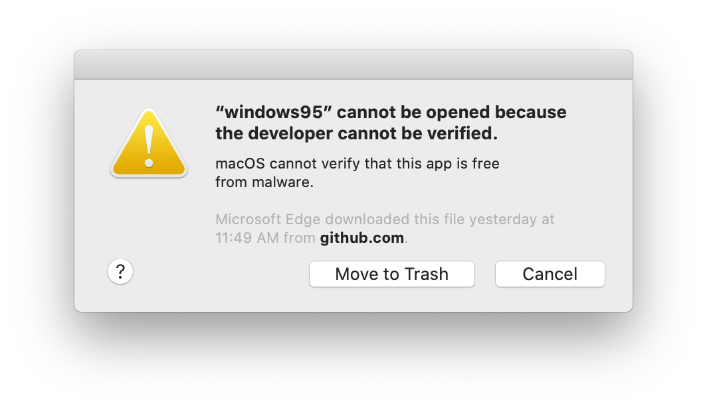

Code signing is a security technology to certify that an app was created by you.
You should sign your application so it does not trigger any operating system
security warnings.



Both Windows and macOS prevent users from running unsigned applications. It is
possible to distribute applications without codesigning them - but in order to
run them, users need to go through multiple advanced and manual steps to run
them.

If you are building an Electron app that you intend to package and distribute,
it should be code signed. The Electron ecosystem tooling makes codesigning your
apps straightforward - this documentation explains how sign your apps on both
Windows and macOS.

## Signing & notarizing macOS builds

Preparing macOS applications for release requires two steps: First, the
app needs to be code signed. Then, the app needs to be uploaded to Apple for a
process called **notarization**, where automated systems will further verify that
your app isn't doing anything to endanger its users.

To start the process, ensure that you fulfill the requirements for signing and
notarizing your app:

1. Enroll in the [Apple Developer Program][] (requires an annual fee)
2. Download and install [Xcode][] - this requires a computer running macOS
3. Generate, download, and install [signing certificates][]

Electron's ecosystem favors configuration and freedom, so there are multiple
ways to get your application signed and notarized.

### Using Electron Forge

If you're using Electron's favorite build tool, getting your application signed
and notarized requires a few additions to your configuration. [Forge](https://electronforge.io) is a
collection of the official Electron tools, using [`@electron/packager`][],
[`@electron/osx-sign`][], and [`@electron/notarize`][] under the hood.

Detailed instructions on how to configure your application can be found in the
[Signing macOS Apps](https://www.electronforge.io/guides/code-signing/code-signing-macos) guide in
the Electron Forge docs.

### Using Electron Packager

If you're not using an integrated build pipeline like Forge, you
are likely using [`@electron/packager`][], which includes [`@electron/osx-sign`][] and
[`@electron/notarize`][].

If you're using Packager's API, you can pass
[in configuration that both signs and notarizes your application](https://electron.github.io/packager/main/modules.html).
If the example below does not meet your needs, please see [`@electron/osx-sign`][] and
[`@electron/notarize`][] for the many possible configuration options.

```js @ts-nocheck
const packager = require('@electron/packager')

packager({
  dir: '/path/to/my/app',
  osxSign: {},
  osxNotarize: {
    appleId: 'felix@felix.fun',
    appleIdPassword: 'my-apple-id-password'
  }
})
```

### Signing Mac App Store applications

See the [Mac App Store Guide][].

## Signing Windows builds

Before you can code sign your application, you need to acquire a code signing
certificate. Unlike Apple, Microsoft allows developers to purchase those
certificates on the open market. They are usually sold by the same companies
also offering HTTPS certificates. Prices vary, so it may be worth your time to
shop around. Popular resellers include:

- [Certum EV code signing certificate](https://shop.certum.eu/data-safety/code-signing-certificates/certum-ev-code-sigining.html)
- [DigiCert EV code signing certificate](https://www.digicert.com/signing/code-signing-certificates)
- [Entrust EV code signing certificate](https://www.entrustdatacard.com/products/digital-signing-certificates/code-signing-certificates)
- [GlobalSign EV code signing certificate](https://www.globalsign.com/en/code-signing-certificate/ev-code-signing-certificates)
- [IdenTrust EV code signing certificate](https://www.identrust.com/digital-certificates/trustid-ev-code-signing)
- [Sectigo (formerly Comodo) EV code signing certificate](https://sectigo.com/ssl-certificates-tls/code-signing)
- [SSL.com EV code signing certificate](https://www.ssl.com/certificates/ev-code-signing/)

It is important to call out that since June 2023, Microsoft requires software to
be signed with an "extended validation" certificate, also called an "EV code signing
certificate". In the past, developers could sign software with a simpler and cheaper
certificate called "authenticode code signing certificate" or "software-based OV certificate".
These simpler certificates no longer provide benefits: Windows will treat your app as
completely unsigned and display the equivalent warning dialogs.

The new EV certificates are required to be stored on a hardware storage module
compliant with FIPS 140 Level 2, Common Criteria EAL 4+ or equivalent. In other words,
the certificate cannot be simply downloaded onto a CI infrastructure. In practice,
those storage modules look like fancy USB thumb drives.

Many certificate providers now offer "cloud-based signing" - the entire signing hardware
is in their data center and you can use it to remotely sign code. This approach is
popular with Electron maintainers since it makes signing your applications in CI (like
GitHub Actions, CircleCI, etc) relatively easy.

At the time of writing, Electron's own apps use [DigiCert KeyLocker](https://docs.digicert.com/en/digicert-keylocker.html), but any provider that provides a command line tool for
signing files will be compatible with Electron's tooling.

All tools in the Electron ecosystem use [`@electron/windows-sign`][] and typically
expose configuration options through a `windowsSign` property. You can either use it
to sign files directly - or use the same `windowsSign` configuration across Electron
Forge, [`@electron/packager`][], [`electron-winstaller`][], and [`electron-wix-msi`][].

### Using Electron Forge

Electron Forge is the recommended way to sign your app as well as your `Squirrel.Windows`
and `WiX MSI` installers. Detailed instructions on how to configure your application can
be found in the [Electron Forge Code Signing Tutorial](https://www.electronforge.io/guides/code-signing/code-signing-windows).

### Using Electron Packager

If you're not using an integrated build pipeline like Forge, you
are likely using [`@electron/packager`][], which includes [`@electron/windows-sign`][].

If you're using Packager's API, you can pass
[in configuration that signs your application](https://electron.github.io/packager/main/modules.html).
If the example below does not meet your needs, please see [`@electron/windows-sign`][]
for the many possible configuration options.

```js @ts-nocheck
const packager = require('@electron/packager')

packager({
  dir: '/path/to/my/app',
  windowsSign: {
    signWithParams: '--my=custom --parameters',
    // If signtool.exe does not work for you, customize!
    signToolPath: 'C:\\Path\\To\\my-custom-tool.exe'
  }
})
```

### Using electron-winstaller (Squirrel.Windows)

[`electron-winstaller`][] is a package that can generate Squirrel.Windows installers for your
Electron app. This is the tool used under the hood by Electron Forge's
[Squirrel.Windows Maker][maker-squirrel]. Just like `@electron/packager`, it uses
[`@electron/windows-sign`][] under the hood and supports the same `windowsSign`
options.

```js {10-11} @ts-nocheck
const electronInstaller = require('electron-winstaller')
// NB: Use this syntax within an async function, Node does not have support for
//     top-level await as of Node 12.
try {
  await electronInstaller.createWindowsInstaller({
    appDirectory: '/tmp/build/my-app-64',
    outputDirectory: '/tmp/build/installer64',
    authors: 'My App Inc.',
    exe: 'myapp.exe',
    windowsSign: {
      signWithParams: '--my=custom --parameters',
      // If signtool.exe does not work for you, customize!
      signToolPath: 'C:\\Path\\To\\my-custom-tool.exe'
    }
  })
  console.log('It worked!')
} catch (e) {
  console.log(`No dice: ${e.message}`)
}
```

For full configuration options, check out the [`electron-winstaller`][] repository!

### Using electron-wix-msi (WiX MSI)

[`electron-wix-msi`][] is a package that can generate MSI installers for your
Electron app. This is the tool used under the hood by Electron Forge's [MSI Maker][maker-msi].
Just like `@electron/packager`, it uses [`@electron/windows-sign`][] under the hood
and supports the same `windowsSign` options.

```js {12-13} @ts-nocheck
import { MSICreator } from 'electron-wix-msi'

// Step 1: Instantiate the MSICreator
const msiCreator = new MSICreator({
  appDirectory: '/path/to/built/app',
  description: 'My amazing Kitten simulator',
  exe: 'kittens',
  name: 'Kittens',
  manufacturer: 'Kitten Technologies',
  version: '1.1.2',
  outputDirectory: '/path/to/output/folder',
  windowsSign: {
    signWithParams: '--my=custom --parameters',
    // If signtool.exe does not work for you, customize!
    signToolPath: 'C:\\Path\\To\\my-custom-tool.exe'
  }
})

// Step 2: Create a .wxs template file
const supportBinaries = await msiCreator.create()

// 🆕 Step 2a: optionally sign support binaries if you
// sign you binaries as part of of your packaging script
for (const binary of supportBinaries) {
  // Binaries are the new stub executable and optionally
  // the Squirrel auto updater.
  await signFile(binary)
}

// Step 3: Compile the template to a .msi file
await msiCreator.compile()
```

For full configuration options, check out the [`electron-wix-msi`][] repository!

### Using Electron Builder

Electron Builder comes with a custom solution for signing your application. You
can find [its documentation here](https://www.electron.build/code-signing).

### Signing Windows Store applications

See the [Windows Store Guide][].

[apple developer program]: https://developer.apple.com/programs/
[`@electron/osx-sign`]: https://github.com/electron/osx-sign
[`@electron/packager`]: https://github.com/electron/packager
[`@electron/notarize`]: https://github.com/electron/notarize
[`@electron/windows-sign`]: https://github.com/electron/windows-sign
[`electron-winstaller`]: https://github.com/electron/windows-installer
[`electron-wix-msi`]: https://github.com/electron-userland/electron-wix-msi
[xcode]: https://developer.apple.com/xcode
[signing certificates]: https://developer.apple.com/support/certificates/
[mac app store guide]: ./mac-app-store-submission-guide.md
[windows store guide]: ./windows-store-guide.md
[maker-squirrel]: https://www.electronforge.io/config/makers/squirrel.windows
[maker-msi]: https://www.electronforge.io/config/makers/wix-msi
