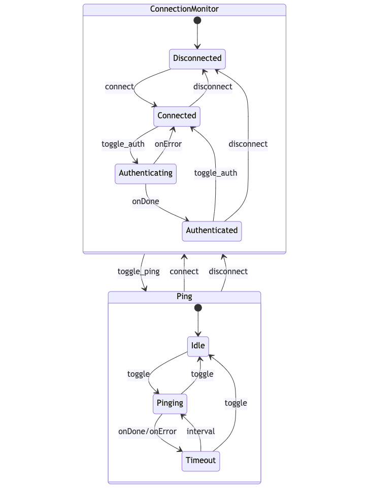

# Connection Monitor

Many applications require some sort of online/offline detection mechanism.
As detailed in the [Online/Offline Event Detection](./online-offline-events.md)
guide, the Chromium browser does provide a mechanism for determining
connectivity; however, this mechanism is trivial. It only checks for the
presance of a _network_ connection on the machine and not if it can actually
connect to a given resource. This example builds a connection monitoring
service that pings a given resource over a given interval. Depending on the
result of that request, the service changes its state from **CONNECTED** to
**DISCONNECTED** and shares this information with the rest of application.
Additionally, the example includes an secondary guide for adding a trivial
authentication flow.

This example was built with the intent to be a starting point for other
projects. You'll most likely have to change things to suit your own needs.
Certain parts of the example were designed for this exact reason. For example,
the `pingOperationService` and the additional `authOperationService`
functions are generalized in a way where you may only need to modify the
internal logic of the function and the state machine can remain the same (more
details later).

The example is built on the [XState](https://github.com/statelyai/xstate)
library. The connection monitor service is a state machine and utilizes the
XState API heavily. Knowledge of state machines is not required to follow along
with this example, but is encouraged. For more information as well as an useful
introduction to state machines, read through the
[XState documentation](https://xstate.js.org/docs/).

## Example

```javascript fiddle='docs/fiddles/connection-monitor/base/main.js'
const { app, BrowserWindow, ipcMain } = require('electron');
const path = require('path');
const { interpret } = require('xstate');
const { createConnectionMonitorMachine } = require('./connectionMonitor.js');

const {
  CM_IPC_CHANNEL,
  PING_SERVICE_ID,
  CM_ACTION_TYPES
} = require('./constants.js');

function createWindow () {
  const mainWindow = new BrowserWindow({
    width: 800,
    height: 600,
    webPreferences: {
      preload: path.join(__dirname, 'preload.js')
    }
  });

  mainWindow.loadFile('index.html');
  mainWindow.webContents.openDevTools();

  // Create the Connection Monitor machine
  const connectionMonitorMachine = createConnectionMonitorMachine({
    url: 'https://login.microsoftonline.com',
    window: mainWindow
  });

  // Use the XState `interpret` method to create a service out of the machine
  const connectionMonitorService = interpret(connectionMonitorMachine);

  /**
   * Initialize the onTransition listener for the service to forward the
   * machine's state and context to the renderer process. Uses the
   * action/reducer pattern described in other parts of the code and
   * documentation.
   */
  function onConnectionMonitorServiceTransition (state) {
    mainWindow.webContents.send(CM_IPC_CHANNEL, {
      type: CM_ACTION_TYPES.RENDERER.TRANSITION,
      payload: {
        connectionMonitor: { value: state.value }
      }
    });
  }

  connectionMonitorService.onTransition(onConnectionMonitorServiceTransition);

  /**
   * Start the connection monitor service. All this does is set the monitor
   * to its default state of `DISCONNECTED`
   */
  connectionMonitorService.start();

  /**
   * Get the reference to the spawned ping service using the `PING_SERVICE_ID`
   * constant.
   */
  const pingService = connectionMonitorService.children.get(PING_SERVICE_ID);

  if (!pingService) {
    throw new Error('Connection Monitor Service did not spawn a Ping Service');
  }

  /**
   * Create another onTransition listener for the ping service to forward along
   * state and context to the renderer process.
   */
  function onPingServiceTransition (state) {
    mainWindow.webContents.send(CM_IPC_CHANNEL, {
      type: CM_ACTION_TYPES.RENDERER.TRANSITION,
      payload: {
        ping: { value: state.value }
      }
    });
  }

  pingService.onTransition(onPingServiceTransition);

  /**
   * Set up a reducer for handeling messages coming from the renderer
   * process. This reducer method uses the action types defined in the
   * constants object. This pattern is useful for consolidating how the
   * process communicate about a similar service.
   */
  function connectionMonitorMainProcessReducer (_, action) {
    switch (action.type) {
      case CM_ACTION_TYPES.MAIN.REQUEST_STATE: {
        return {
          connectionMonitor: {
            value: connectionMonitorService.state.value
          },
          ping: {
            value: pingService.state.value
          }
        };
      }
      case CM_ACTION_TYPES.MAIN.TRIGGER_EVENT: {
        connectionMonitorService.send(action.payload);
        break;
      }
      default: {
        console.log(`Unrecognized action type: ${action.type}`);
        break;
      }
    }
  }

  ipcMain.handle(
    CM_IPC_CHANNEL,
    connectionMonitorMainProcessReducer
  );
}

app.whenReady().then(() => {
  createWindow();

  app.on('activate', function () {
    if (BrowserWindow.getAllWindows().length === 0) createWindow();
  });
});

app.on('window-all-closed', function () {
  if (process.platform !== 'darwin') app.quit();
});

```

## Guide

The remainder of the guide will breakdown the example into its various core
components. The application utilizes [Interprocess Communication](./process-model.md)
to securely share app state between processes. The core of the example exists
in the main process. The connection monitor and ping machines run on the main
process, and they are interacted with by the user using an API exposed through
the [Context Bridge](./../api/context-bridge.md). The renderer process is built
using HTML, CSS, and ES2020 JavaScript. This can be replaced with any frontend
framework without impacting the core functionality of the example.

### Ping Machine

The `base/ping.js` file defines and exports a function called `createPingMachine`.
This function creates a state machine that can be interpreted as a ping service
for use within the connection monitor. The `options` argument must be passed an
`interval: number`, an `url: string`, and a `window: BrowserWindow` for the
pinging operation. The resulting machine is based on the states and events
defined in `PING_STATES` and `PING_EVENTS`. For this sample, the
`pingOperationService` method uses Node.js [https](https://nodejs.org/api/https.html)
module to make a `HEAD` request to the given `url` endpoint to determine
connection status.


Starting in the `IDLE` state, the machine waits for a `TOGGLE` event before
transitioning to the `PINGING` state. At any time, the `TOGGLE` event will
transition this machine back to the `IDLE` state.

Upon entering the `PINGING` state, the machine invokes the
`pingOperationService` method. The service makes a single `HEAD` request to the
given `options.url`. The method returns a `Promise` that _resolves_ when the
request is successful (`statusCode === 200`), and _rejects_ otherwise.
Additionally, if an `'error'` event is emitted from the `request`, and the
`error.code === 'ENOTFOUND'`, a custom error message is rejected and sent to
the renderer process using the `RENDERER.ERROR` action. If the service resolves,
the machine sends a `CONNECT` event to the parent machine; otherwise, if it
rejects, it sends a `DISCONNECT` event to the parent. Regardless, this machine
then transitions to the `TIMEOUT` state.

Upon entering the `TIMEOUT` state, it waits `options.interval` milliseconds
before transitioning back to the `PINGING` state restarting the cycle.

### Connection Monitor Machine

The connection monitor machine is defined in `base/connectionMonitor.js`.
Similar to the ping machine, it is instantiated using the
`createConnectionMonitorMachine` function and can be interpreted as a service
using the XState `interpret` method. The `options` object for this method
expects the same arguments as the `options` object for the ping machine since
all of the properties are forwarded along. The machine initially instantiates a
ping machine instance:

```js
const pingMachine = createPingMachine({
  interval: options.interval || 5000,
  url: options.url,
  window: options.window
})
```

This machine is immediately invoked by the connection monitor machine and is
assigned the `PING_SERVICE_ID` constant so that it can be referenced later in
the application. The rest of the connection monitor machine defines the various
states and events using `CM_STATES` and `CM_EVENTS` constants.


The connection monitor machine starts in the `DISCONNECTED` state and invokes
the ping machine as a service making it enter the `IDLE` state. When the
`TOGGLE_PING` event is triggered, the connection monitor sends a `TOGGLE` event
to the ping service. When the ping service successfully _connects_ to the `url`
, it will send a `CONNECT` event back to the connection monitor. The connection
monitor then enters the `CONNECTED` state and the ping service continues to
make requests. At any time, the connection monitor can send a `TOGGLE_PING`
event to the ping service turning it off or on. The connection monitor will
**not** change state when this happens. Finally, if the ping service ever fails
to connect to the `url`, it will send a `DISCONNECT` event to the connection
monitor. And if the connection monitor is in the `CONNECTED` state it will
transition to the `DISCONNECTED` state.

Since the connection monitor will only change state from `CONNECTED` to
`DISCONNECTED` using the `DISCONNECT` event (and vice-versa with the `CONNECT`
event), the ping service can _connect_ or _disconnect_ as much as it would
like, but the connection monitor will not emit a state change. This composition
enables a better application design since the remainder of the application only
has to listen to the state change of the connection monitor service and respond
to those events when they occur.

### Context Bridge `mainAPI`

As mentioned previously, this example utilizes an IPC based secure context
isolation to facilitate communication between the main and renderer processes.
While the connection monitor runs entirely on the main process, all of its
state transitions are broadcasted to the renderer process. Additionally, the
api enables the renderer process to initiate certain events for the connection
monitor service such as toggling the ping service. The api follows an
action/reducer like pattern where all of the methods invoke or send an object
with a `type` and a `payload` that is then handeled by the respective process
using a reducer function (that generally switches over the various `type`
values to decide what to do). The `CM_ACTION_TYPES` constant defines the set of
available action types for both process. The entries are sub-mapped by their
respective processes. For example, the `MAIN.REQUEST_STATE` action type would
be invoked by the renderer process and handeled by the main process.

Akin to many Electron v12+ examples, the main browser window defined in
`main.js` has a `webPreferences.preload` script aptly named `preload.js`.

```js
contextBridge.exposeInMainWorld('mainAPI', {
  // ...
})
```

This script adds the `mainAPI` to the `window` object on the renderer process
and exposes a handful of useful methods. These methods make use of the `MAIN`
set of action types.

#### `mainAPI.requestState`

The `requestState` method gets the current state of the connection monitor
service.

```js
{
  // ...
  requestState: () =>
    ipcRenderer.invoke(CM_IPC_CHANNEL, {
      type: CM_ACTION_TYPES.MAIN.REQUEST_STATE
    })
  // ...
}
```

It is useful for when the app first starts and the renderer process needs to
know what the current state of the main process is. It invokes the
`MAIN.REQUEST_STATE` action and can expect to recieve the current state of both
the connection monitor and ping services in the form of:

```ts
{
  connectionMonitor?: { value: string },
  ping?: { value: string }
}
```

#### `mainAPI.togglePing`

The `togglePing` method toggles the ping operation.

```js
{
  // ...
  togglePing: () =>
    ipcRenderer.invoke(CM_IPC_CHANNEL, {
      type: CM_ACTION_TYPES.MAIN.TRIGGER_EVENT,
      payload: CM_EVENTS.TOGGLE_PING
    })
  // ...
}
```

The underlying ping service is either on or off; this method switches between
the two states by having the connection monitor send a `TOGGLE_PING` event to
ping service. Remember that this will have no affect on the current state of
the connection monitor. This method invokes the `MAIN.TRIGGER_EVENT` action
with a payload of `CM_EVENTS.TOGGLE_PING`.

#### `mainAPI.addConnectionMonitorListener`

The `addConnectionMonitorListener` method is used to establish a main process
to renderer process communication pathway.

```js
{
  // ...
  addConnectionMonitorListener: (listener) => {
    ipcRenderer.on(CM_IPC_CHANNEL, listener)
    return () => {
      ipcRenderer.removeListener(CM_IPC_CHANNEL, listener)
    }
  }
  // ...
}
```

The listener function passed to this method can expect actions with a similar
`type` and `payload` to be passed as the second argument. The action types for
this method will use the `RENDERER` constants from the action type constant
previously mentioned. The renderer process has access to these constant values
through the `mainAPI.constants` object defined next.

#### `mainAPI.constants`

The `constants` property contains three constant string maps useful for the
renderer process, `CM_STATES`, `PING_STATES`, and `CM_ACTION_TYPES`. In a more
robust application these would most likely be bundled directly with the
renderer process code, but for this example they are shared via the `mainAPI`.

```js
{
  // ...
  constants: {
    CM_STATES,
    PING_STATES,
    CM_ACTION_TYPES
  }
}
```

### Main Process

The main process portion of this example is comprised entirely within the
`createWindow()` method defined in `main.js`. It begins by instantiating a
connection monitor machine using the `createConnectionMonitorMachine` method.

```js
const connectionMonitorMachine = createConnectionMonitorMachine({
  url: 'https://login.microsoftonline.com',
  window: mainWindow
})
```

Once instantiated, the machine is interpreted as a service using the provided
`interpret` method from XState.

```js
const connectionMonitorService = interpret(connectionMonitorMachine)
```

An `onTransition` handler is added and then the service is started, kicking off
the connection monitor initial steps of spawning a ping service and moving into
the **DISCONNECTED** state. This listener utilizes the `RENDERER.TRANSITION`
action type to share the connection monitor's state as it changes.

```js
function onConnectionMonitorServiceTransition (state) {
  mainWindow.webContents.send(CM_IPC_CHANNEL, {
    type: CM_ACTION_TYPES.RENDERER.TRANSITION,
    payload: {
      connectionMonitor: { value: state.value }
    }
  })
}

connectionMonitorService.onTransition(onConnectionMonitorServiceTransition)

connectionMonitorService.start()
```

Once spawned, the ping service is referenced using the constant
`PING_SERVICE_ID` string and a similar `onTransition` handler is established.

```js
const pingService = connectionMonitorService.children.get(PING_SERVICE_ID)

if (!pingService) {
  throw new Error('Connection Monitor Service did not spawn a Ping Service')
}

function onPingServiceTransition (state) {
  mainWindow.webContents.send(CM_IPC_CHANNEL, {
    type: CM_ACTION_TYPES.RENDERER.TRANSITION,
    payload: {
      ping: { value: state.value }
    }
  })
}

pingService.onTransition(onPingServiceTransition)
```

Finally, a main process reducer is defined and hooked up to the constant
`CM_IPC_CHANNEL` handler

```js
function connectionMonitorMainProcessReducer (_, action) {
  switch (action.type) {
    case CM_ACTION_TYPES.MAIN.REQUEST_STATE: {
      return {
        connectionMonitor: {
          value: connectionMonitorService.state.value
        },
        ping: {
          value: pingService.state.value
        }
      }
    }
    case CM_ACTION_TYPES.MAIN.TRIGGER_EVENT: {
      connectionMonitorService.send(action.payload)
      break
    }
    default: {
      console.log(`Unrecognized action type: ${action.type}`)
      break
    }
  }
}

ipcMain.handle(
  CM_IPC_CHANNEL,
  connectionMonitorMainProcessReducer
)
```

### Renderer Process

The final part of this example is the renderer process. As mentioned previously
, it uses HTML, CSS, and ES2020 JavaScript and could be replaced by any
frontend framework. The `mainAPI` defined in `preload.js` is available on the
global `window` object and used to interact with the main process. The file has
a collection of code blocks responsible for updating the UI in response to
changes from the main process. The rendering is mainly controlled by two parts.

First, the listener that utilizes the `mainAPI.addConnectionMonitorListener`
method to sync with the main process. As defined in the
[Context Bridge `mainAPI`](#context-bridge-mainapi) section, this method
expects action objects and uses a `switch` statement to handle the different
types. The `ERROR` type is used to send connection monitor error messages with
the UI, and the `TRANSITION` type is used to initiate a page update when the
state of either main process services change.

```js
function connectionMonitorListener (_, action) {
  const { CM_ACTION_TYPES } = window.mainAPI.constants
  switch (action.type) {
    case CM_ACTION_TYPES.RENDERER.ERROR: {
      updateError(action.payload)
      break
    }
    case CM_ACTION_TYPES.RENDERER.TRANSITION: {
      updatePage(action.payload)
      break
    }
    default:
      console.log(`Unrecognized action ${action.type}`)
  }
}

window.mainAPI.addConnectionMonitorListener(connectionMonitorListener)
```

Second, a `window.onload` method is defined to request the initial state of the
main process services so the UI can render respectively. This function is
important because the services may start executing before the page finishes
loading. Additionally, this kind of method is helpful for fetching the initial
state when only the renderer process is reloaded and the main process remains
the same.

```js
window.onload = () => {
  window.mainAPI.requestState().then((states) => {
    updatePage(states)
  })
}
```

Finally, at the end of the renderer process code, a series of DOM-related
methods are defined for modifying the UI based on the service updates.

```js
function updatePage (states) {
  if (states.connectionMonitor) {
    updateConnectionMonitorElements(states.connectionMonitor)
  }

  if (states.ping) {
    updatePingStatus(states.ping)
  }
}

function updatePingStatus ({ value }) {
  const { PING_STATES } = window.mainAPI.constants
  const pingStatus = document.getElementById('ping-status')
  pingStatus.innerHTML = value === PING_STATES.TIMEOUT ? 'pinging' : value
}

function updateConnectionMonitorElements ({ value }) {
  const connectionStatus = document.getElementById('connection-status')
  connectionStatus.innerHTML = value
}

function updateError ({ error }) {
  document.getElementById('error').hidden = false
  document.getElementById('error-message').innerHTML = error.message
}

document.getElementById('toggle-ping').onclick =
  function onPingButtonClick () {
    window.mainAPI.togglePing()
  }

document.getElementById('clear-error').onclick =
  function onClearErrorButtonClick () {
    document.getElementById('error-message').innerHTML = ''
    document.getElementById('error').hidden = true
  }
```

## Adding Authentication

Thus far, the code so far is fully functional and should run without issue.
This section will demonstrate how to expand the existing services to support an
authentication flow. The authentication flow shared in this example is trivial
and for demonstration purposes only. The logic for the service will need to be
adapted for your authentication provider of choice.

### Implementing the `AUTHENTICATED` state

The first change is in `constants.js` file. Add an `AUTHENTICATING` and
`AUTHENTICATED` state, and a `TOGGLE_AUTH` event to the relative constant
string maps:

```diff
const CM_EVENTS = {
  TOGGLE_PING: 'toggle ping',
  CONNECT: 'connect',
  DISCONNECT: 'disconnect',
+ TOGGLE_AUTH: 'toggle auth'
};

const CM_STATES = {
  CONNECTED: 'connected',
  DISCONNECTED: 'disconnected',
+ AUTHENTICATING: 'authenticating',
+ AUTHENTICATED: 'authenticated'
};
```

Next, update the `connectionMonitor.js` file to support the new states and
events.

```diff
const { BrowserWindow } = require('electron');
-const { createMachine, send } = require('xstate');
+const { createMachine, send, assign } = require('xstate');
const {
  CM_STATES: STATES,
  CM_EVENTS: EVENTS,
  PING_EVENTS,
  PING_SERVICE_ID,
+ CM_IPC_CHANNEL,
+ CM_ACTION_TYPES,
} = require('./constants.js');
const { createPingMachine } = require('./ping.js');

+function authOperationService () {
+  return new Promise((resolve, reject) => {
+    setTimeout(() => {
+      const r = Math.random();
+      if (r < 0.5) {
+        resolve({
+          id: 'xyz57',
+          username: 'Clippy'
+        });
+      } else {
+        reject(new Error('Auth flow failed'));
+      }
+    }, 3000).unref();
+  });
+}

function createConnectionMonitorMachine (options) {
  if (typeof options.url !== 'string') {
    throw new TypeError('options.url must be a string');
  }
  if (!options.window) {
    throw new TypeError('options.window must exist');
  }

  const pingMachine = createPingMachine({
    interval: options.interval || 5000,
    url: options.url,
    window: options.window
  });

  return createMachine({
    id: 'connectionMonitor',
    initial: STATES.DISCONNECTED,
+   context: { user: undefined },
    invoke: { id: PING_SERVICE_ID, src: pingMachine },
    states: {
      [STATES.DISCONNECTED]: {
        on: {
          [EVENTS.TOGGLE_PING]: {
            actions: send(
              { type: PING_EVENTS.TOGGLE },
              { to: PING_SERVICE_ID }
            )
          },
          [EVENTS.CONNECT]: {
            target: STATES.CONNECTED
          }
        }
      },
      [STATES.CONNECTED]: {
        on: {
          [EVENTS.TOGGLE_PING]: {
            actions: send(
              { type: PING_EVENTS.TOGGLE },
              { to: PING_SERVICE_ID }
            )
          },
          [EVENTS.DISCONNECT]: {
            target: STATES.DISCONNECTED
          },
+         [EVENTS.TOGGLE_AUTH]: {
+           target: STATES.AUTHENTICATING
+         }
        }
      },
+     [STATES.AUTHENTICATING]: {
+       invoke: {
+         id: 'authOperationService',
+         src: () => authOperationService(),
+         onDone: {
+           target: STATES.AUTHENTICATED,
+           actions: assign({ user: (_, event) => event.data })
+         },
+         onError: {
+           target: STATES.CONNECTED,
+           actions: (_, event) => {
+             options.window.webContents.send(CM_IPC_CHANNEL, {
+               type: CM_ACTION_TYPES.RENDERER.ERROR,
+               payload: {
+                 error: event.data
+               }
+             });
+           }
+         }
+       }
+     },
+     [STATES.AUTHENTICATED]: {
+       on: {
+         [EVENTS.TOGGLE_PING]: {
+           actions: send(
+             { type: PING_EVENTS.TOGGLE },
+             { to: PING_SERVICE_ID }
+           )
+         },
+         [EVENTS.TOGGLE_AUTH]: {
+           target: STATES.CONNECTED
+         },
+         [EVENTS.DISCONNECT]: {
+           target: STATES.DISCONNECTED
+         }
+       }
+     }
    }
  });
}

module.exports = {
  createConnectionMonitorMachine
};
```

These changes make the connection monitor machine look a lot like the ping
machine. The `AUTHENTICATING` state invokes the `authOperationService` method.
This method returns a promise that resolves for a successful authentication and
rejects otherwise. This trivial example simulates a couple second delay with
`setTimeout`, and relies on a random value from `Math.random` to determine
authentication success. This enables the application to demonstrate both
possible authentication flow outcomes. If the flow succeeds, the connection
monitor transitions to the `AUTHENTICATED` state and sets the returned `user`
to the service `context`. If the flow fails, the connection monitor transitions
back to the `CONNECTED` state and sends the error to the renderer process using
the same method the ping service does to communicate errors. From the
`AUTHENTICATED` state, the connecion monitor can toggle the ping service,
disconnect, and toggle the authentication. The following state machine diagram
shows the new complete flow of the connection monitor machine.



Now that the connection monitor machine is storing the `user` context, it needs
to be included with the `state` when the service communicates with the renderer
process. In `main.js`, update the `onConnectionMonitorServiceTransition` and
`connectionMonitorMainProcessReducer` methods:

```diff
// ...

function onConnectionMonitorServiceTransition (state) {
  mainWindow.webContents.send(CM_IPC_CHANNEL, {
    type: CM_ACTION_TYPES.RENDERER.TRANSITION,
    payload: {
-     connectionMonitor: { value: state.value }
+     connectionMonitor: { value: state.value, context: state.context }
    }
  });
}

// ...

function connectionMonitorMainProcessReducer (_, action) {
  switch (action.type) {
    case CM_ACTION_TYPES.MAIN.REQUEST_STATE: {
      return {
        connectionMonitor: {
-         value: connectionMonitorService.state.value
+         value: connectionMonitorService.state.value,
+         context: conectionMonitorService.state.context
        },
        ping: {
          value: pingService.state.value
        }
      };
    }
    case CM_ACTION_TYPES.MAIN.TRIGGER_EVENT: {
      connectionMonitorService.send(action.payload);
      break;
    }
    default: {
      console.log(`Unrecognized action type: ${action.type}`);
      break;
    }
  }
}

// ...
```

With the main process set up to forward along the connection monitor context,
the next change is in `preload.js`. Add a new method to the `mainAPI` called
`toggleAuth`. This method should mimic the `togglePing` method but use the
`TOGGLE_AUTH` event instead.

```diff
{
  // ...
+ toggleAuth: () =>
+   ipcRenderer.invoke(CM_IPC_CHANNEL, {
+     type: CM_ACTION_TYPES.MAIN.TRIGGER_EVENT,
+     payload: CM_EVENTS.TOGGLE_AUTH
+   })
}
```

The last remaining changes are for the renderer process. Add two elements to
`index.html`. A `button` for toggling the authentication operation, and a `div`
for displaying the `user` details.

```diff
<body>
  <h1>connection monitor with xstate</h1>
  <p class="error" id="error" hidden>
    <button id="clear-error">+</button><span id="error-message"></span>
  </p>
  <button id="toggle-ping">Toggle Ping</button>
+ <button id="toggle-auth">Toggle Auth</button>
  <p>Pinging Status: <span id="ping-status"></span></p>
  <p>Connection Status: <span id="connection-status"></span></p>
+ <div id="user-details-container" hidden>
+   <h4>User Details</h4>
+   <pre id="user-details"></pre>
+ </div>

  <!-- You can also require other files to run in this process -->
  <script src="./renderer.js"></script>
</body>
```

Finally, update the `renderer.js` file. There a couple of changes to make here.

First, add an `onclick` handler for the auth button that calls the
`mainAPI.toggleAuth` method:

```diff
+ document.getElementById('toggle-auth').onclick =
+   function onAuthButtonClick () {
+     window.mainAPI.toggleAuth();
+   };
```

Then, inside the `updateConnectionMonitorElements` method, add a switch
statement that handles different element rendering based on the various
connection monitor service states.

```diff
-function updateConnectionMonitorElements ({ value }) {
+function updateConnectionMonitorElements ({ value, context }) {
+ const { CM_STATES } = window.mainAPI.constants;

  const connectionStatus = document.getElementById('connection-status');
+ const authButton = document.getElementById('toggle-auth');
+ const userDetailsContainer = document.getElementById(
+   'user-details-container'
+ );
+ const userDetails = document.getElementById('user-details');

  connectionStatus.innerHTML = value;
+ switch (value) {
+   case CM_STATES.DISCONNECTED: {
+     authButton.disabled = true;
+     authButton.innerHTML = 'Log In';
+     userDetailsContainer.hidden = true;
+     break;
+   }
+   case CM_STATES.CONNECTED: {
+     authButton.disabled = false;
+     authButton.innerHTML = 'Log In';
+     userDetailsContainer.hidden = true;
+     break;
+   }
+   case CM_STATES.AUTHENTICATING: {
+     authButton.disabled = true;
+     authButton.innerHTML = 'Authenticating...';
+     userDetailsContainer.hidden = true;
+     break;
+   }
+   case CM_STATES.AUTHENTICATED: {
+     authButton.disabled = false;
+     authButton.innerHTML = 'Log Out';
+     userDetailsContainer.hidden = false;
+     userDetails.innerHTML = JSON.stringify(
+       {
+         id: context.user.id,
+         username: context.user.username
+       },
+       0,
+       2
+     );
+     break;
+   }
+   default: {
+     console.error(`Unrecognized state ${value}`);
+   }
+ }
}
```

As stated previously, you could replace this rendering logic with any frontend
framework. It becomes increasingly complex to handle all the various element
states in this manner, but it is suitable for this example.

Now with all of these changes together the application should display a new
button next to `toggle ping`. When the application is in the `connected` state,
the button will be enabled, and when clicked it will trigger the authentication
flow changing the state to `authenticating`. If it succeeds the `user` details
will be displayed and the state will change to `authenticated`; otherwise, an
error will display and the state will change back to `connected`.

## Conclusion

This guide introduces a connection monitoring service for Electron applications.
As the authentication example demonstrates, the state machines are adaptable to
fit your project's specific needs as well.
