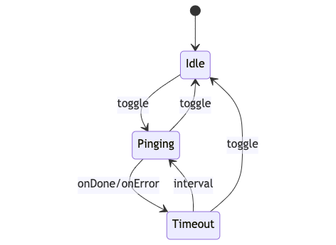
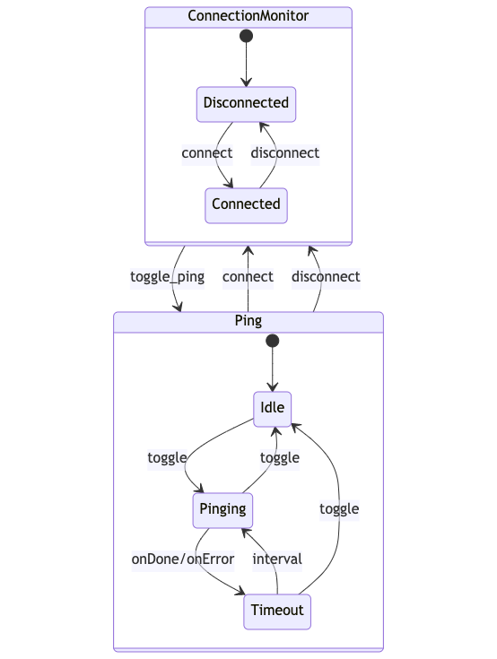

# Connection Monitor

Many applications require some sort of online/offline detection mechanism.
As detailed in the [Online/Offline Event Detection](./online-offline-events.md)
guide, the Chromium browser does provide a mechanism for determining
connectivity; however, this mechanism is trivial. It only checks for the
presance of a _network_ connection on the machine and not if it can actually
connect to a given resource. This example builds a connection monitoring
service that pings a given resource over a given interval. Depending on the
result of that request, the service changes its state from **CONNECTED** to
**DISCONNECTED** and shares this information with the rest of application. In
addition, the same service is wired up to a common authentication library,
[@azure/msal-node](https://www.npmjs.com/package/@azure/msal-node) to
demonstrate how the service can be expanded to support a production-ready
authentication flow.

This example was built with the intent to be a starting point for other
projects. You'll most likely have to changes things to suit your own needs.
Certain parts of the example were designed for this exact reason. For example,
the `authenticationOperationService` and the `pingOperationService` functions
are generalized in a way where you may only need to modify the internal logic
of the function and the state machine can remain the same (more details later).

Additionally, this example is built on the
[XState](https://github.com/statelyai/xstate) library. The connection monitor
service is a state machine and utilizes the XState API heavily. Knowledge of
state machines is not required to follow along with this example, but is
encouraged. For more information as well as an useful introduction to state
machines, read through the [XState documentation](https://xstate.js.org/docs/).

Before getting started with the example, if you intend on running this locally
with `@azure/msal-node` you'll need to include some environment variables. The
following section will walk you through everything you need to do.

## Example

Once configured, the application should run entirely from [Electron Fiddle](https://www.electronjs.org/fiddle).
Later sections will introduce and explain the different parts of
the example such as the Ping machine, Connection Monitor machine, the IPC
communication API, and the HTML rendering.

To run this example **without** setting up @azure/msal-node, jump to the
[Example without @azure/msal-node](#example-without-azuremsal-node) section.

```javascript fiddle='docs/fiddles/connection-monitor/main.js'
const { app, BrowserWindow, ipcMain } = require('electron');
const path = require('path');
const { interpret } = require('xstate');
const { createConnectionMonitorMachine } = require('./connectionMonitor.js');

/*
 * Either create a .env file and add the necessary variables as described in
 * the set up steps, or replace `process.env.MSAL_*` variables with the
 * respective strings in-line.
 */
require('dotenv').config();

const {
  CONNECTION_MONITOR_IPC_CHANNEL,
  PING_SERVICE_ID,
  CONNECTION_MONITOR_IPC_REDUCER_ACTION_TYPES: ACTION_TYPES
} = require('./constants.js');

function createWindow () {
  const mainWindow = new BrowserWindow({
    width: 800,
    height: 600,
    webPreferences: {
      preload: path.join(__dirname, 'preload.js')
    }
  });

  mainWindow.loadFile('index.html');
  mainWindow.webContents.openDevTools();

  // Create the Connection Monitor machine
  const connectionMonitorMachine = createConnectionMonitorMachine({
    window: mainWindow,
    msal: {
      auth: {
        clientId: process.env.MSAL_CLIENT_ID,
        authority: process.env.MSAL_AUTHORITY
      },
      redirectUri: process.env.MSAL_REDIRECT_URI
    }
  });

  // Use the XState `interpret` method to create a service out of the machine
  const connectionMonitorService = interpret(connectionMonitorMachine);

  /**
   * Initialize the onTransition listener for the service to forward the
   * machine's state and context to the renderer process. Uses the
   * action/reducer pattern described in other parts of the code and
   * documentation.
   */
  function onConnectionMonitorServiceTransition (state) {
    mainWindow.webContents.send(CONNECTION_MONITOR_IPC_CHANNEL, {
      type: ACTION_TYPES.RENDERER.TRANSITION,
      payload: {
        connectionMonitor: { value: state.value, context: state.context }
      }
    });
  }

  connectionMonitorService.onTransition(onConnectionMonitorServiceTransition);

  /**
   * Start the connection monitor service. All this does is set the monitor
   * to its default state of **DISCONNECTED**
   */
  connectionMonitorService.start();

  /**
   * Get the reference to the spawned Ping service using the `PING_SERVICE_ID`
   * constant.
   */
  const pingService = connectionMonitorService.children.get(PING_SERVICE_ID);

  if (!pingService) {
    throw new Error('Connection Monitor Service did not spawn a Ping Service');
  }

  /**
   * Create another onTransition listener for the ping service to forward along
   * state and context to the renderer process.
   */
  function onPingServiceTransition (state) {
    mainWindow.webContents.send(CONNECTION_MONITOR_IPC_CHANNEL, {
      type: ACTION_TYPES.RENDERER.TRANSITION,
      payload: {
        ping: { value: state.value }
      }
    });
  }

  pingService.onTransition(onPingServiceTransition);

  /**
   * Set up a reducer for for handeling messages coming from the renderer
   * process. This reducer method uses the action types defined in the
   * constants object. This pattern is useful for consolidating how the
   * process communicate about a similar service.
   */
  function connectionMonitorMainProcessReducer (_, action) {
    switch (action.type) {
      case ACTION_TYPES.MAIN.REQUEST_INIT_STATE: {
        return {
          connectionMonitor: {
            value: connectionMonitorService.state.value,
            context: connectionMonitorService.state.context
          }
        };
      }
      case ACTION_TYPES.MAIN.TRIGGER_EVENT: {
        connectionMonitorService.send(action.payload);
        break;
      }
      default: {
        console.log(`Unrecognized action type: ${action.type}`);
        break;
      }
    }
  }

  ipcMain.handle(
    CONNECTION_MONITOR_IPC_CHANNEL,
    connectionMonitorMainProcessReducer
  );
}

app.whenReady().then(() => {
  createWindow();

  app.on('activate', function () {
    if (BrowserWindow.getAllWindows().length === 0) createWindow();
  });
});

app.on('window-all-closed', function () {
  if (process.platform !== 'darwin') app.quit();
});

```

## Configuring `@azure/msal-node`

> If you are using your own authentication library you may skip this section

In order to run this example locally you'll need an Azure AAD Tenant as well as
an Azure App Registration. This guide on [Registering your app](https://docs.microsoft.com/en-us/graph/auth-register-app-v2)
will show you how to do so. You'll need to keep note of 3 things:

1. The App Registration Client ID
2. Your AAD Tenant Authority (for a majority of users this will be
`https://login.microsoft.com/common`)
3. The app authentication redirect URI

When creating the redirect URI, select "Public Client (Mobile & Desktop)". The
URI should be in the form `msal<APP_CLIENT_ID>://auth`.

Assign the three values to their respective environment variables:

```sh
MSAL_CLIENT_ID=
MSAL_AUTHORITY=
MSAL_REDIRECT_URI=
```

Or in-line them in the options object passed to the
`createConnectionMonitorMachine` function call in `main.js`.

## Example (without `@azure/msal-node`)

Included within the fiddle repo is a file `connectionMonitor-withoutMSAL.js`.
Use this file in place of `connectionMonitor.js` to skip configuring Azure AAD.

The only change required is replacing the `require` path in `main.js`. The
environment variables will return undefined and the app should not throw any
errors.

The ping service will still use the `'https://login.microsoftonline.com'` URL;
this can be modified by changing the options object passed to
`createPingMachine` within `connectionMonitor-withoutMSAL.js` (~line 39).

## Guide

The remainder of the guide will breakdown the example into its various core
components. The application utilizes [Interprocess Communication](./process-model.md)
to securely share app state between processes. The core of the example exists
in the main process. The Connection Monitor and Ping machines run on the main
process, and they are interacted with by the user using an API exposed through
the [Context Bridge](./../api/context-bridge.md). The renderer process is built
using HTML, CSS, and ES2020 JavaScript. This can be replaced with any frontend
framework without impacting the core functionality of the example.

### Ping Machine & Service

The `ping.js` file defines and exports a function called `createPingMachine`.
This function creates a state machine that can be interpreted as a Ping service
for use within the Connection Monitor. The `options` argument must be passed an
`interval: number` and an `url: string` for the pinging operation. The
resulting machine is based on the relative constant string maps `PING_STATES`
and `PING_EVENTS`. For this sample, the `pingService` action uses Node.js
[https](https://nodejs.org/api/https.html) module to make a `HEAD` request to
the given `url` endpoint to determine connection status.


<!-- https://mermaid-js.github.io/mermaid-live-editor/edit##eyJjb2RlIjoic3RhdGVEaWFncmFtLXYyXG4gICAgWypdIC0tPiBJZGxlXG4gICAgSWRsZSAtLT4gUGluZ2luZyA6IHRvZ2dsZVxuICAgIFBpbmdpbmcgLS0-IFRpbWVvdXQgOiBvbkRvbmUvb25FcnJvclxuICAgIFBpbmdpbmcgLS0-IElkbGUgOiB0b2dnbGVcbiAgICBUaW1lb3V0IC0tPiBQaW5naW5nIDogaW50ZXJ2YWxcbiAgICBUaW1lb3V0IC0tPiBJZGxlIDogdG9nZ2xlXG4gICAgICAgICAgICAiLCJtZXJtYWlkIjoie1xuICBcInRoZW1lXCI6IFwiZGVmYXVsdFwiXG59IiwidXBkYXRlRWRpdG9yIjp0cnVlLCJhdXRvU3luYyI6dHJ1ZSwidXBkYXRlRGlhZ3JhbSI6ZmFsc2V9 -->

Starting in the **IDLE** state, the machine waits for a **TOGGLE** event before
transitioning to the **PINGING** state. At any time, the **TOGGLE** event will
transition this machine back to the **IDLE** state.

Upon entering the **PINGING** state, the machine invokes the
`pingOperationService` method. The service makes a single `HEAD` request to the
given `options.url`. The method returns a `Promise` that _resolves_ when the
request is successful (`statusCode === 200`), and _rejects_ otherwise. If the
service resolves, the machine sends a **CONNECT** event to the parent machine;
otherwise, if it rejects, it sends a **DISCONNET** event to the parent.
Regardless, this machine then transitions to the **TIMEOUT** state.

Upon entering the **TIMEOUT** state, it waits `options.interval` milliseconds
before transitioning back to the **PINGING** state restarting the cycle.

### Connection Monitor Machine & Service

The Connection Monitor machine is the core of the whole example. It depends on
the previously described Ping machine. Defined in the `connectionMonitor.js`
file, the `createConnectionMonitorMachine` function returns a Connection
Monitor state machine that can be interpreted for use within the application.
It takes an `options` argument with two required properties `window` and `msal`
, and one optional property `interval` that is forwarded along the Ping machine
options object.

```ts
{
  window: BrowserWindow,
  msal: {
    auth: {
      cliendId: string,
      authority: string,
    },
    redirectUri: string
  },
  interval?: number
}
```

This demonstrates how its possible to configure the machine using env vars so
different environments can use the same interface (i.e. prod, dev, qa).

The method starts by defining the MSAL application for the authentication flow.

```js
const msalApp = new msal.PublicClientApplication({
  auth: options.msal.auth,
  system: {
    loggerOptions: {
      loggerCallback: console.log,
      piiLoggingEnabled: false,
      logLevel: msal.LogLevel.Info
    }
  }
})
```

Next, it initializes the Ping machine. In this example, the `url` is set to the
common Microsoft authentication endpoint `'https://login.microsoftonline.com'`.
This may change depending on your Azure Active Directory tenant or other
authentication library.

```js
const pingMachine = createPingMachine({
  interval: options.interval || 5000,
  url: 'https://login.microsoftonline.com'
})
```


<!-- https://mermaid-js.github.io/mermaid-live-editor/edit##eyJjb2RlIjoic3RhdGVEaWFncmFtLXYyXG4gICAgc3RhdGUgQ29ubmVjdGlvbk1vbml0b3Ige1xuICAgICAgICBbKl0gLS0-IERpc2Nvbm5lY3RlZFxuICAgICAgICBEaXNjb25uZWN0ZWQgLS0-IENvbm5lY3RlZCA6IGNvbm5lY3RcbiAgICAgICAgQ29ubmVjdGVkIC0tPiBEaXNjb25uZWN0ZWQgOiBkaXNjb25uZWN0XG4gICAgICAgIENvbm5lY3RlZCAtLT4gQXV0aGVudGljYXRpbmcgOiB0b2dnbGVfYXV0aFxuICAgICAgICBBdXRoZW50aWNhdGluZyAtLT4gQXV0aGVudGljYXRlZCA6IG9uRG9uZVxuICAgICAgICBBdXRoZW50aWNhdGluZyAtLT4gQ29ubmVjdGVkIDogb25FcnJvclxuICAgICAgICBBdXRoZW50aWNhdGVkIC0tPiBEaXNjb25uZWN0ZWQgOiBkaXNjb25uZWN0XG4gICAgfVxuXG4gICAgc3RhdGUgUGluZyB7XG4gICAgICAgIFsqXSAtLT4gSWRsZVxuICAgICAgICBJZGxlIC0tPiBQaW5naW5nIDogdG9nZ2xlXG4gICAgICAgIFBpbmdpbmcgLS0-IFRpbWVvdXQgOiBvbkRvbmUvb25FcnJvclxuICAgICAgICBQaW5naW5nIC0tPiBJZGxlIDogdG9nZ2xlXG4gICAgICAgIFRpbWVvdXQgLS0-IFBpbmdpbmcgOiBpbnRlcnZhbFxuICAgICAgICBUaW1lb3V0IC0tPiBJZGxlIDogdG9nZ2xlXG4gICAgfVxuXG4gICAgQ29ubmVjdGlvbk1vbml0b3IgLS0-IFBpbmcgOiB0b2dnbGVfcGluZ1xuICAgIFBpbmcgLS0-IENvbm5lY3Rpb25Nb25pdG9yIDogY29ubmVjdFxuICAgIFBpbmcgLS0-IENvbm5lY3Rpb25Nb25pdG9yIDogZGljb25uZWN0XG4iLCJtZXJtYWlkIjoie1xuICBcInRoZW1lXCI6IFwiZGVmYXVsdFwiXG59IiwidXBkYXRlRWRpdG9yIjpmYWxzZSwiYXV0b1N5bmMiOnRydWUsInVwZGF0ZURpYWdyYW0iOmZhbHNlfQ -->

Using the msal application and ping machine, the Connection Monitor state
machine is generated. Upon start, the machine invokes the `pingMachine` as a
service using the `PING_SERVICE_ID` constant. The connection monitor machine
will forward along **TOGGLE_PING** events to the spawned ping service at any
time. Additionally, the **TOGGLE_PING** event does **not** cause this machine
to change state. The connection monitor will remain in whichever state it is in
when the ping service is toggled off.

Starting in the **DISCONNECTED** state, the machine is looking for two things
to happen. First, the **TOGGLE_PING** event which is forwarded along to the
Ping service. When the ping service establishes a connection it will send back
to this machine the **CONNECT** event transitioning the machine to the
**CONNECTED** state.

The **CONNECTED** state waits for either the Ping service to send an
**DISCONNECT** event or the user to send a **TOGGLE_AUTH** event resulting in a
transition to the **DISCONNECTED** and **AUTHENTICATING** states respectfully.

The **AUTHENTICATING** state invokes the `authenticationOperationService`
method similar to how the Ping machine's **PINGING** state invokes the
`pingOperationService`. The service is expected to return a promise that
resolves for a successful authentication or reject for a failed auth flow. When
the auth flow succeeds, the result is assigned to the machine's context and the
machine transitions to the **AUTHENTICATED** state. If the flow fails, the
error is sent to the renderer process and the machine transitions back to the
**CONNECTED** state.

Once authenticated, the user can log out resulting in a transition back to
**CONNECTED** state. If the Ping service fails to maintain a connection, the
**DISCONNECT** event will transition the use back to the **DISCONNECTED** state
, but will not clear the user from context. Ideally, when the App reconnects,
the service can reauthenticate the user silently. This example does not
implement this flow, but it is possible using the MSAL library using
[caching and silent token retrieval](https://docs.microsoft.com/en-us/azure/active-directory/develop/msal-acquire-cache-tokens#acquiring-tokens-silently-from-the-cache).

### Context Bridge `mainAPI`

As mentioned previously, this example utilizes an IPC based secure context isolation to facilitate communication between the main and renderer processes. While the Connection Monitor runs entirely on the main process, all of its state transitions are broadcasted to the renderer process. Additionally, the api enables the renderer process to initiate certain events for the connection monitor service such as toggling the ping service and the authentication flow. The api follows an action/reducer like pattern where all of the methods invoke or send an object with a `type` and a `payload` that is then handeled by the respective process using a reducer function (that generally switches over the various `type` values to decide what to do). The `CONNECTION_MONITOR_IPC_REDUCER_ACTION_TYPES` constant string map defines the set of available action types for both process. The entries are sub-mapped by their respective processes. For example, the `MAIN.REQUEST_STATE` action type would be invoked by the renderer process and handeled by the main process.

Akin to many Electron v12+ examples, the main browser window defined in `main.js` has a `webPreferences.preload` script aptly named `preload.js`. This script adds the `mainAPI` to the `window` object on the renderer process and exposes a handful of useful methods. These methods make use of the `MAIN` set of action types.

The `requestState` method gets the current state of the connection monitor instance. It is useful for when the app first starts and the renderer process needs to know what the current state of the main process is. It invokes the `MAIN.REQUEST_STATE` action and can expect to recieve the current state of both the connection monitor and ping services in the form of:

```ts
{
  connectionMonitor?: { value: string, context: any },
  ping?: { value: string }
}
```

The `togglePing` method toggles the ping operation. The underlying ping service is either on or off; this method switches between the two states by having the connection monitor send a `TOGGLE_PING` event to ping service. Remember that this will no affect the current state of the connection monitor. This method invokes the `MAIN.TRIGGER_EVENT` action with a payload of `CONNECTION_MONITOR_EVENTS.TOGGLE_PING`.

The `toggleAuth` method toggles the authentication state of the connection monitor. It switches between logging in and logging out depending on the relative state of the service. It invokes the `MAIN.TRIGGER_EVENT` action with a payload of `CONNECTION_MONITOR_EVENTS.TOGGLE_AUTH`.

The `addConnectionMonitorListener` method is used to establish a main process to renderer process communication pathway. The listener function passed to this method can expect actions with a similar `type` and `payload` to be passed as the second argument. The action types for this method will use the `RENDERER` constants from the action type constant string map previously mentioned. The renderer process has access to these constant values through the `mainAPI.constants` object defined next.

The `constants` property contains three constant string maps useful for the renderer process, `CONNECTION_MONITOR_STATES`, `PING_STATES`, and `CONNECTION_MONITOR_IPC_REDUCER_ACTION_TYPES`. In a more robust application these would most likely be bundled directly with the renderer process code, but for this example they are shared via the `mainAPI`.

### Main Process

The main process portion of this example is comprised entirely within the `createWindow()` method defined in `main.js`. It begins by instantiating a connection monitor machine using the `createConnectionMonitorMachine` method. The `options` argument uses environment variables for msal related things, and the `mainWindow` is passed through for the authentication window.

```js
const connectionMonitorMachine = createConnectionMonitorMachine({
  window: mainWindow,
  msal: {
    auth: {
      clientId: process.env.MSAL_CLIENT_ID,
      authority: process.env.MSAL_AUTHORITY
    },
    redirectUri: process.env.MSAL_REDIRECT_URI
  }
})
```

Once instantiated, the machine is interpreted as a service using the provided `interpret` method from XState.

```js
const connectionMonitorService = interpret(connectionMonitorMachine)
```

An `onTransition` handler is added and then the service is started kicking off the connection monitor initial steps of spawning a ping service and moving into the **DISCONNECTED** state. This listener utilizes the `RENDERER.TRANSITION` action type to share the connection monitor's state as it changes.

```js
function onConnectionMonitorServiceTransition (state) {
  mainWindow.webContents.send(CONNECTION_MONITOR_IPC_CHANNEL, {
    type: ACTION_TYPES.RENDERER.TRANSITION,
    payload: {
      connectionMonitor: { value: state.value, context: state.context }
    }
  })
}

connectionMonitorService.onTransition(onConnectionMonitorServiceTransition)

connectionMonitorService.start()
```

Once spawned, the ping service is referenced using the constant `PING_SERVICE_ID` string and a similar `onTransition` handler is established.

```js
const pingService = connectionMonitorService.children.get(PING_SERVICE_ID)

if (!pingService) {
  throw new Error('Connection Monitor Service did not spawn a Ping Service')
}

function onPingServiceTransition (state) {
  mainWindow.webContents.send(CONNECTION_MONITOR_IPC_CHANNEL, {
    type: ACTION_TYPES.RENDERER.TRANSITION,
    payload: {
      ping: { value: state.value }
    }
  })
}

pingService.onTransition(onPingServiceTransition)
```

Finally, a main process reducer is defined and hooked up to the constant `CONNECTION_MONITOR_IPC_CHANNEL` handler

```js
function connectionMonitorMainProcessReducer (_, action) {
  switch (action.type) {
    case ACTION_TYPES.MAIN.REQUEST_STATE: {
      return {
        connectionMonitor: {
          value: connectionMonitorService.state.value,
          context: connectionMonitorService.state.context
        }
      }
    }
    case ACTION_TYPES.MAIN.TRIGGER_EVENT: {
      connectionMonitorService.send(action.payload)
      break
    }
    default: {
      console.log(`Unrecognized action type: ${action.type}`)
      break
    }
  }
}

ipcMain.handle(
  CONNECTION_MONITOR_IPC_CHANNEL,
  connectionMonitorMainProcessReducer
)
```

### Renderer Process

The final part of this example is the renderer process. As mentioned previously, it uses HTML, CSS, and ES2020 JavaScript and could be replaced by any frontend framework. The `mainAPI` defined in `preload.js` is available on the global `window` object and used to interact with the main process. The file has a collection of code blocks responsible for updating the UI in response to changes from the main process. The rendering is mainly controlled by two parts.

First, the listener that utilizes the `mainAPI.addConnectionMonitorListener` method to sync with the main process. As defined in the [Context Bridge `mainAPI`](#context-bridge-mainapi) section, this method expects action objects and uses a `switch` statement to handle the different types. The `ERROR` type is used to send connection monitor error messages with the UI, and the `TRANSITION` type is used to initiate a page update when the state of either main process services change.

```js
function connectionMonitorListener (_, action) {
  const { CONNECTION_MONITOR_IPC_REDUCER_ACTION_TYPES: ACTION_TYPES } =
    window.mainAPI.constants
  switch (action.type) {
    case ACTION_TYPES.RENDERER.ERROR: {
      updateError(action.payload)
      break
    }
    case ACTION_TYPES.RENDERER.TRANSITION: {
      updatePage(action.payload)
      break
    }
    default:
      console.log(`Unrecognized action ${action.type}`)
  }
}

window.mainAPI.addConnectionMonitorListener(connectionMonitorListener)
```

Second, a `window.onload` method is defined to request the initial state of the main process services so the UI can render respectively. This function is important because the services may start executing before the page finishes loading. Additionally, this kind of method is helpful for fetching the initial state when only the renderer process is reloaded and the main process remains the same.

```js
window.onload = () => {
  window.mainAPI.requestState().then((states) => {
    updatePage(states)
  })
}
```

Finally, at the beginning of the renderer process, a couple of `onclick` handlers are set up for the respective buttons that are used to toggle the ping and authentication flows.

```js
document.getElementById('toggle-ping').onclick = function onPingButtonClick () {
  window.mainAPI.togglePing()
}

document.getElementById('auth-button').onclick = function onAuthButtonClick () {
  window.mainAPI.toggleAuth()
}
```
