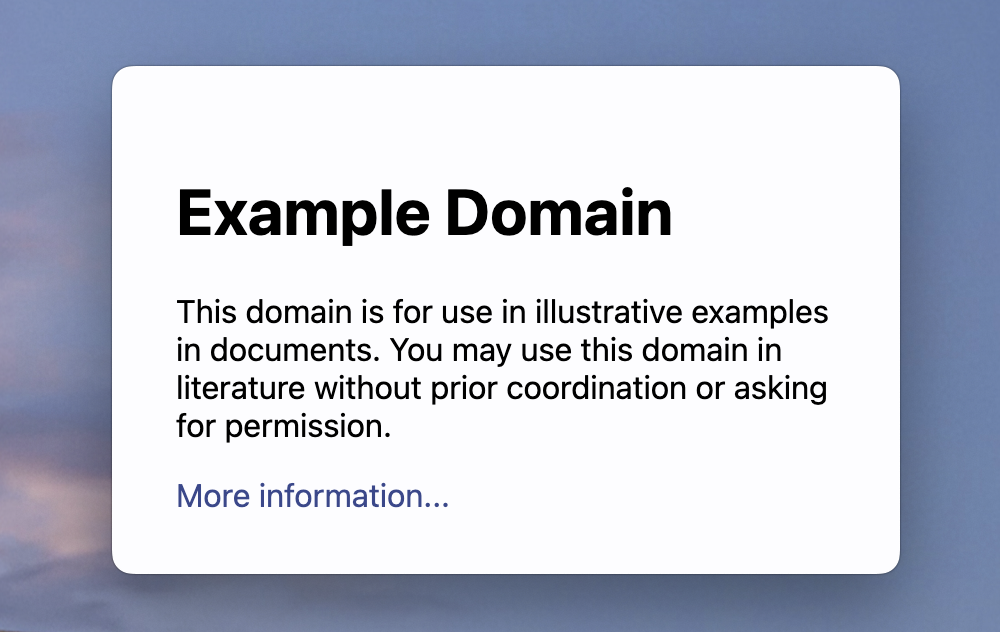
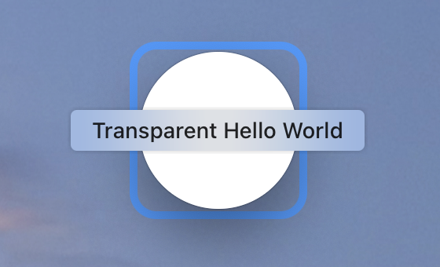

# Custom Window Styles

## Frameless windows



A frameless window removes all [chrome][] applied by the OS, including window controls.

To create a frameless window, set the [`BaseWindowContructorOptions`][] `frame` param in the `BrowserWindow` constructor to `false`.

```fiddle docs/fiddles/features/window-customization/custom-window-styles/frameless-windows

```

## Transparent windows




To create a fully transparent window, set the [`BaseWindowContructorOptions`][] `transparent` param in the `BrowserWindow` constructor to `true`.

The following fiddle takes advantage of a transparent window and CSS styling to create
the illusion of a circular window.

```fiddle docs/fiddles/features/window-customization/custom-window-styles/transparent-windows

```

### Limitations

* You cannot click through the transparent area. See
  [#1335](https://github.com/electron/electron/issues/1335) for details.
* Transparent windows are not resizable. Setting `resizable` to `true` may make
  a transparent window stop working on some platforms.
* The CSS [`blur()`][] filter only applies to the window's web contents, so there is
  no way to apply blur effect to the content below the window (i.e. other applications
  open on the user's system).
* The window will not be transparent when DevTools is opened.
* On _Windows_:
  * Transparent windows can not be maximized using the Windows system menu or by double
  clicking the title bar. The reasoning behind this can be seen on
  PR [#28207](https://github.com/electron/electron/pull/28207).
* On _macOS_:
  * The native window shadow will not be shown on a transparent window.

[`BaseWindowContructorOptions`]: ../api/structures/base-window-options.md
[`blur()`]: https://developer.mozilla.org/en-US/docs/Web/CSS/filter-function/blur()
[chrome]: https://developer.mozilla.org/en-US/docs/Glossary/Chrome
