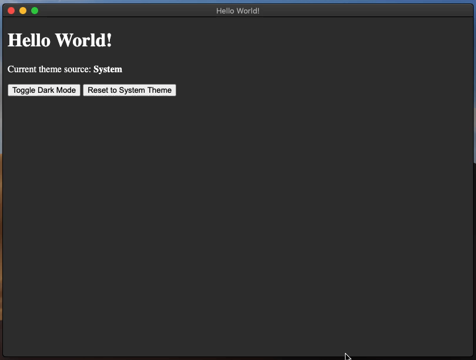

# Dark Mode

## Overview

### Automatically update the native interfaces

"Native interfaces" include the file picker, window border, dialogs, context
menus, and more - anything where the UI comes from your operating system and
not from your app. The default behavior is to opt into this automatic theming
from the OS.

### Automatically update your own interfaces

If your app has its own dark mode, you should toggle it on and off in sync with
the system's dark mode setting. You can do this by using the
[prefer-color-scheme] CSS media query.

### Manually update your own interfaces

If you want to manually switch between light/dark modes, you can do this by
setting the desired mode in the
[themeSource](../api/native-theme.md#nativethemethemesource)
property of the `nativeTheme` module. This property's value will be propagated
to your Renderer process. Any CSS rules related to `prefers-color-scheme` will
be updated accordingly.

## macOS settings

In macOS 10.14 Mojave, Apple introduced a new [system-wide dark mode][system-wide-dark-mode]
for all macOS computers. If your Electron app has a dark mode, you can make it
follow the system-wide dark mode setting using
[the `nativeTheme` api](../api/native-theme.md).

In macOS 10.15 Catalina, Apple introduced a new "automatic" dark mode option
for all macOS computers. In order for the `nativeTheme.shouldUseDarkColors` and
`Tray` APIs to work correctly in this mode on Catalina, you need to use Electron
`>=7.0.0`, or set `NSRequiresAquaSystemAppearance` to `false` in your
`Info.plist` file for older versions. Both [Electron Packager][electron-packager]
and [Electron Forge][electron-forge] have a
[`darwinDarkModeSupport` option][packager-darwindarkmode-api]
to automate the `Info.plist` changes during app build time.

If you wish to opt-out while using Electron &gt; 8.0.0, you must
set the `NSRequiresAquaSystemAppearance` key in the `Info.plist` file to
`true`. Please note that Electron 8.0.0 and above will not let you opt-out
of this theming, due to the use of the macOS 10.14 SDK.

## Example

This example demonstrates an Electron application that derives its theme colors from the
`nativeTheme`. Additionally, it provides theme toggle and reset controls using IPC channels.

```javascript fiddle='docs/fiddles/features/macos-dark-mode'

```

### How does this work?

Starting with the `index.html` file:

```html title='index.html'
<!DOCTYPE html>
<html>
<head>
    <meta charset="UTF-8">
    <title>Hello World!</title>
    <meta http-equiv="Content-Security-Policy" content="script-src 'self' 'unsafe-inline';" />
    <link rel="stylesheet" type="text/css" href="./styles.css">
</head>
<body>
    <h1>Hello World!</h1>
    <p>Current theme source: <strong id="theme-source">System</strong></p>

    <button id="toggle-dark-mode">Toggle Dark Mode</button>
    <button id="reset-to-system">Reset to System Theme</button>

    <script src="renderer.js"></script>
  </body>
</body>
</html>
```

And the `styles.css` file:

```css title='styles.css'
@media (prefers-color-scheme: dark) {
  body { background: #333; color: white; }
}

@media (prefers-color-scheme: light) {
  body { background: #ddd; color: black; }
}
```

The example renders an HTML page with a couple elements. The `<strong id="theme-source">`
 element shows which theme is currently selected, and the two `<button>` elements are the
 controls. The CSS file uses the [`prefers-color-scheme`][prefers-color-scheme] media query
 to set the `<body>` element background and text colors.

The `preload.js` script adds a new API to the `window` object called `darkMode`. This API
 exposes two IPC channels to the renderer process, `'dark-mode:toggle'` and `'dark-mode:system'`.
 It also assigns two methods, `toggle` and `system`, which pass messages from the renderer to the
 main process.

```js title='preload.js'
const { contextBridge, ipcRenderer } = require('electron')

contextBridge.exposeInMainWorld('darkMode', {
  toggle: () => ipcRenderer.invoke('dark-mode:toggle'),
  system: () => ipcRenderer.invoke('dark-mode:system')
})
```

Now the renderer process can communicate with the main process securely and perform the necessary
 mutations to the `nativeTheme` object.

The `renderer.js` file is responsible for controlling the `<button>` functionality.

```js title='renderer.js'
document.getElementById('toggle-dark-mode').addEventListener('click', async () => {
  const isDarkMode = await window.darkMode.toggle()
  document.getElementById('theme-source').innerHTML = isDarkMode ? 'Dark' : 'Light'
})

document.getElementById('reset-to-system').addEventListener('click', async () => {
  await window.darkMode.system()
  document.getElementById('theme-source').innerHTML = 'System'
})
```

Using `addEventListener`, the `renderer.js` file adds `'click'` [event listeners][event-listeners]
 to each button element. Each event listener handler makes calls to the respective `window.darkMode`
 API methods.

Finally, the `main.js` file represents the main process and contains the actual `nativeTheme` API.

```js
const { app, BrowserWindow, ipcMain, nativeTheme } = require('electron')
const path = require('path')

const createWindow = () => {
  const win = new BrowserWindow({
    width: 800,
    height: 600,
    webPreferences: {
      preload: path.join(__dirname, 'preload.js')
    }
  })

  win.loadFile('index.html')

  ipcMain.handle('dark-mode:toggle', () => {
    if (nativeTheme.shouldUseDarkColors) {
      nativeTheme.themeSource = 'light'
    } else {
      nativeTheme.themeSource = 'dark'
    }
    return nativeTheme.shouldUseDarkColors
  })

  ipcMain.handle('dark-mode:system', () => {
    nativeTheme.themeSource = 'system'
  })
}

app.whenReady().then(() => {
  createWindow()

  app.on('activate', () => {
    if (BrowserWindow.getAllWindows().length === 0) {
      createWindow()
    }
  })
})

app.on('window-all-closed', () => {
  if (process.platform !== 'darwin') {
    app.quit()
  }
})
```

The `ipcMain.handle` methods are how the main process responds to the click events from the buttons
 on the HTML page.

The `'dark-mode:toggle'` IPC channel handler method checks the `shouldUseDarkColors` boolean property,
 sets the corresponding `themeSource`, and then returns the current `shouldUseDarkColors` property.
 Looking back on the renderer process event listener for this IPC channel, the return value from this
 handler is utilized to assign the correct text to the `<strong id='theme-source'>` element.

The `'dark-mode:system'` IPC channel handler method assigns the string `'system'` to the `themeSource`
 and returns nothing. This also corresponds with the relative renderer process event listener as the
 method is awaited with no return value expected.

Run the example using Electron Fiddle and then click the "Toggle Dark Mode" button; the app should
 start alternating between a light and dark background color.



[system-wide-dark-mode]: https://developer.apple.com/design/human-interface-guidelines/macos/visual-design/dark-mode/
[electron-forge]: https://www.electronforge.io/
[electron-packager]: https://github.com/electron/electron-packager
[packager-darwindarkmode-api]: https://electron.github.io/electron-packager/main/interfaces/electronpackager.options.html#darwindarkmodesupport
[prefers-color-scheme]: https://developer.mozilla.org/en-US/docs/Web/CSS/@media/prefers-color-scheme
[event-listeners]: https://developer.mozilla.org/en-US/docs/Web/API/EventTarget/addEventListener
