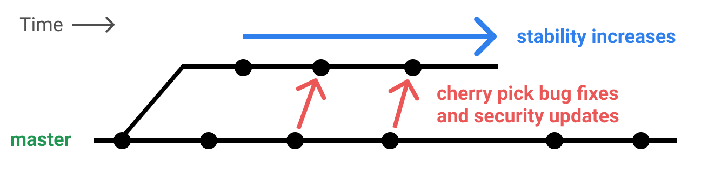
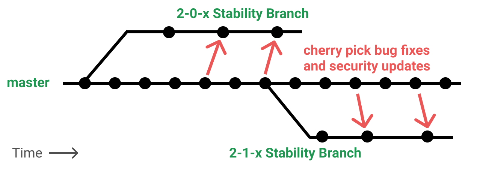
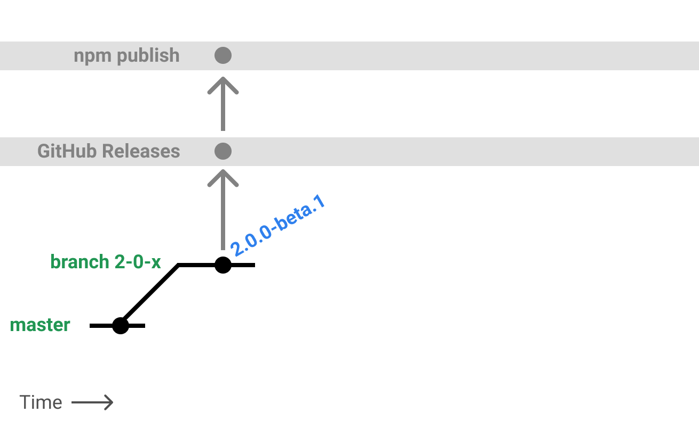
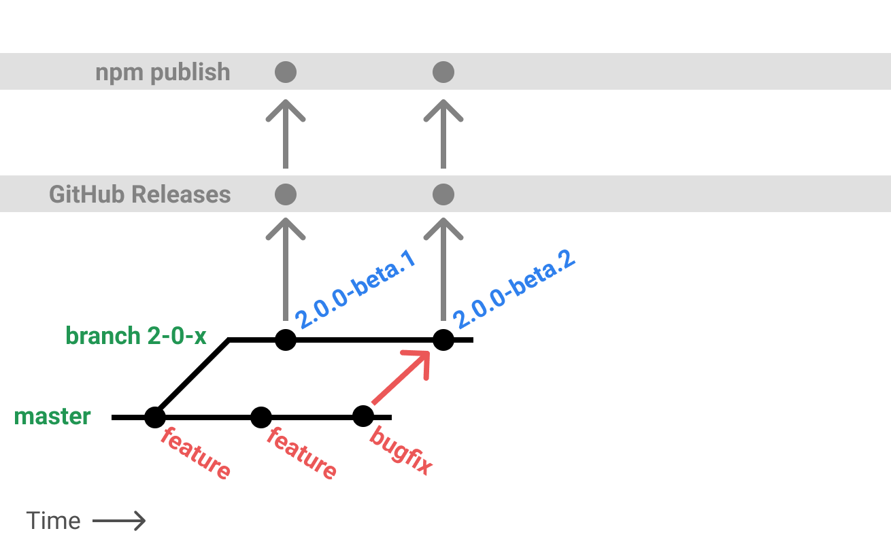
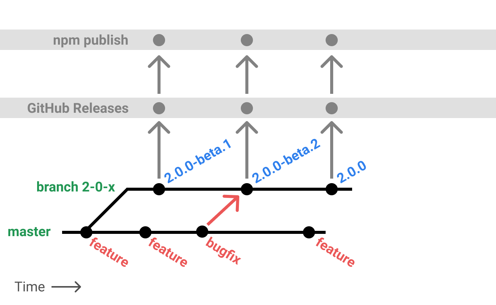
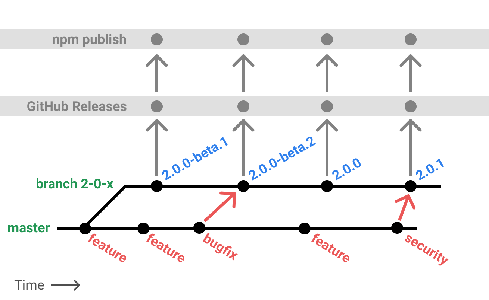
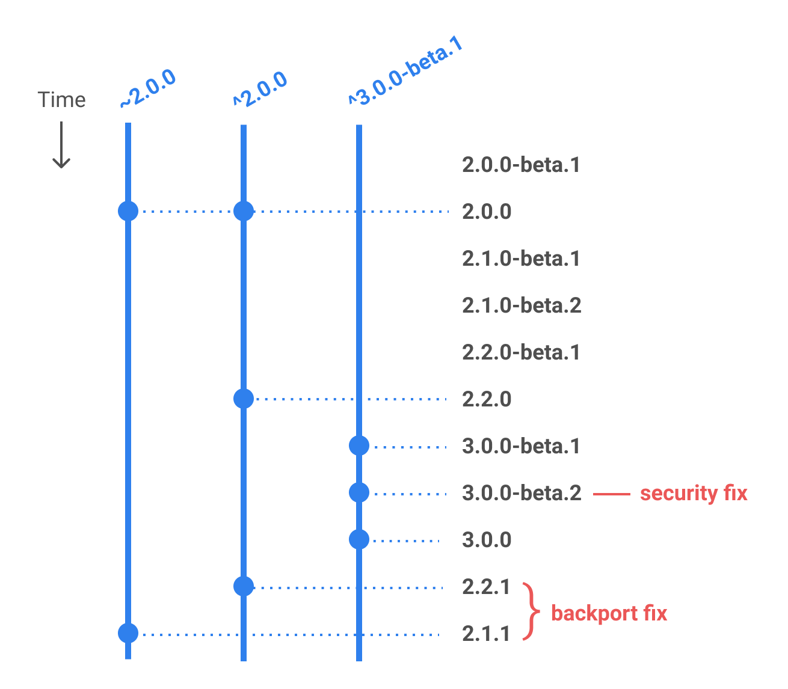
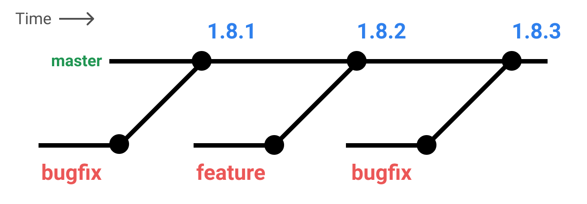

# Electron Versioning

> A detailed look at our versioning policy and implementation.

As of version 2.0.0, Electron follows the [SemVer](#semver) spec. The following command will install the most recent stable build of Electron:

```sh npm2yarn
npm install --save-dev electron
```

To update an existing project to use the latest stable version:

```sh npm2yarn
npm install --save-dev electron@latest
```

## Versioning scheme

There are several major changes from our 1.x strategy outlined below. Each change is intended to satisfy the needs and priorities of developers/maintainers and app developers.

1. Strict use of the the [SemVer](#semver) spec
2. Introduction of semver-compliant `-beta` tags
3. Introduction of [conventional commit messages](https://conventionalcommits.org/)
4. Well-defined stabilization branches
5. The `main` branch is versionless; only stabilization branches contain version information

We will cover in detail how git branching works, how npm tagging works, what developers should expect to see, and how one can backport changes.

## SemVer

Below is a table explicitly mapping types of changes to their corresponding category of SemVer (e.g. Major, Minor, Patch).

| Major Version Increments        | Minor Version Increments           | Patch Version Increments      |
| ------------------------------- | ---------------------------------- | ----------------------------- |
| Electron breaking API changes   | Electron non-breaking API changes  | Electron bug fixes            |
| Node.js major version updates   | Node.js minor version updates      | Node.js patch version updates |
| Chromium version updates        |                                    | fix-related chromium patches  |

For more information, see the [Semantic Versioning 2.0.0](https://semver.org/) spec.

Note that most Chromium updates will be considered breaking. Fixes that can be backported will likely be cherry-picked as patches.

## Stabilization branches

Stabilization branches are branches that run parallel to `main`, taking in only cherry-picked commits that are related to security or stability. These branches are never merged back to `main`.



Since Electron 8, stabilization branches are always **major** version lines, and named against the following template `$MAJOR-x-y` e.g. `8-x-y`.  Prior to that we used **minor** version lines and named them as `$MAJOR-$MINOR-x` e.g. `2-0-x`.

We allow for multiple stabilization branches to exist simultaneously, one for each supported version. For more details on which versions are supported, see our [Electron Releases](./electron-timelines.md) doc.



Older lines will not be supported by the Electron project, but other groups can take ownership and backport stability and security fixes on their own. We discourage this, but recognize that it makes life easier for many app developers.

## Beta releases and bug fixes

Developers want to know which releases are _safe_ to use. Even seemingly innocent features can introduce regressions in complex applications. At the same time, locking to a fixed version is dangerous because you’re ignoring security patches and bug fixes that may have come out since your version. Our goal is to allow the following standard semver ranges in `package.json` :

* Use `~2.0.0` to admit only stability or security related fixes to your `2.0.0` release.
* Use `^2.0.0` to admit non-breaking _reasonably stable_ feature work as well as security and bug fixes.

What’s important about the second point is that apps using `^` should still be able to expect a reasonable level of stability. To accomplish this, SemVer allows for a _pre-release identifier_ to indicate a particular version is not yet _safe_ or _stable_.

Whatever you choose, you will periodically have to bump the version in your `package.json` as breaking changes are a fact of Chromium life.

The process is as follows:

1. All new major and minor releases lines begin with a beta series indicated by SemVer prerelease tags of `beta.N`, e.g. `2.0.0-beta.1`. After the first beta, subsequent beta releases must meet all of the following conditions:
    1. The change is backwards API-compatible (deprecations are allowed)
    2. The risk to meeting our stability timeline must be low.
2. If allowed changes need to be made once a release is beta, they are applied and the prerelease tag is incremented, e.g. `2.0.0-beta.2`.
3. If a particular beta release is _generally regarded_ as stable, it will be re-released as a stable build, changing only the version information. e.g. `2.0.0`. After the first stable, all changes must be backwards-compatible bug or security fixes.
4. If future bug fixes or security patches need to be made once a release is stable, they are applied and the _patch_ version is incremented
e.g. `2.0.1`.

Specifically, the above means:

1. Admitting non-breaking-API changes before Week 3 in the beta cycle is okay, even if those changes have the potential to cause moderate side-effects.
2. Admitting feature-flagged changes, that do not otherwise alter existing code paths, at most points in the beta cycle is okay. Users can explicitly enable those flags in their apps.
3. Admitting features of any sort after Week 3 in the beta cycle is 👎 without a very good reason.

For each major and minor bump, you should expect to see something like the following:

```plaintext
2.0.0-beta.1
2.0.0-beta.2
2.0.0-beta.3
2.0.0
2.0.1
2.0.2
```

An example lifecycle in pictures:

* A new release branch is created that includes the latest set of features. It is published as `2.0.0-beta.1`.

* A bug fix comes into master that can be backported to the release branch. The patch is applied, and a new beta is published as `2.0.0-beta.2`.

* The beta is considered _generally stable_ and it is published again as a non-beta under `2.0.0`.

* Later, a zero-day exploit is revealed and a fix is applied to master. We backport the fix to the `2-0-x` line and release `2.0.1`.


A few examples of how various SemVer ranges will pick up new releases:



### Backport request process

All supported release lines will accept external pull requests to backport
fixes previously merged to `main`, though this may be on a case-by-case
basis for some older supported lines. All contested decisions around release
line backports will be resolved by the
[Releases Working Group](https://github.com/electron/governance/tree/main/wg-releases)
as an agenda item at their weekly meeting the week the backport PR is raised.

## Feature flags

Feature flags are a common practice in Chromium, and are well-established in the web-development ecosystem. In the context of Electron, a feature flag or **soft branch** must have the following properties:

* it is enabled/disabled either at runtime, or build-time; we do not support the concept of a request-scoped feature flag
* it completely segments new and old code paths; refactoring old code to support a new feature _violates_ the feature-flag contract
* feature flags are eventually removed after the feature is released

## Semantic commits

All pull requests must adhere to the [Conventional Commits](https://conventionalcommits.org/) spec, which can be summarized as follows:

* Commits that would result in a SemVer **major** bump must start their body with `BREAKING CHANGE:`.
* Commits that would result in a SemVer **minor** bump must start with `feat:`.
* Commits that would result in a SemVer **patch** bump must start with `fix:`.

The `electron/electron` repository also enforces squash merging, so you only need to make sure that your pull request has the correct title prefix.

## Versioned `main` branch

* The `main` branch will always contain the next major version `X.0.0-nightly.DATE` in its `package.json`.
* Release branches are never merged back to `main`.
* Release branches _do_ contain the correct version in their `package.json`.
* As soon as a release branch is cut for a major, `main` must be bumped to the next major (i.e. `main` is always versioned as the next theoretical release branch).

## Historical versioning (Electron 1.X)

Electron versions *< 2.0* did not conform to the [SemVer](https://semver.org) spec: major versions corresponded to end-user API changes, minor versions corresponded to Chromium major releases, and patch versions corresponded to new features and bug fixes. While convenient for developers merging features, it creates problems for developers of client-facing applications. The QA testing cycles of major apps like Slack, Teams, Skype, VS Code, and GitHub Desktop can be lengthy and stability is a highly desired outcome. There is a high risk in adopting new features while trying to absorb bug fixes.

Here is an example of the 1.x strategy:



An app developed with `1.8.1` cannot take the `1.8.3` bug fix without either absorbing the `1.8.2` feature, or by backporting the fix and maintaining a new release line.
