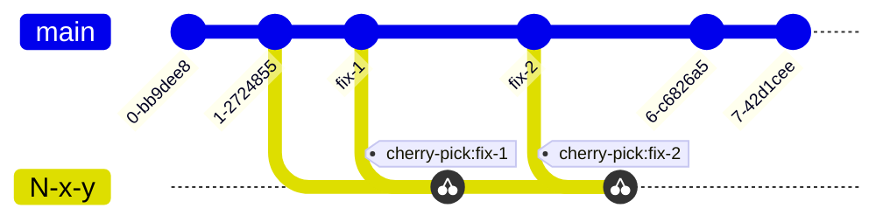
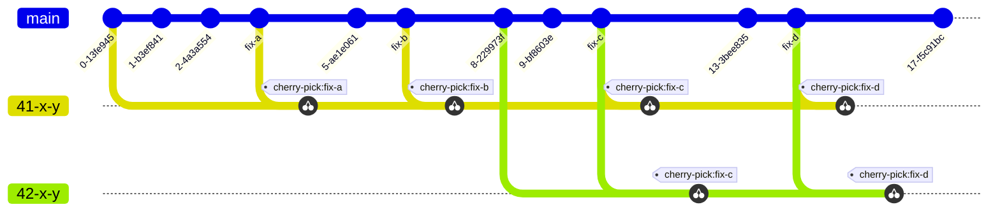
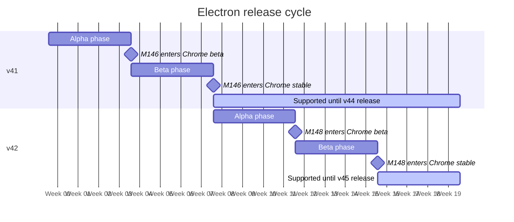
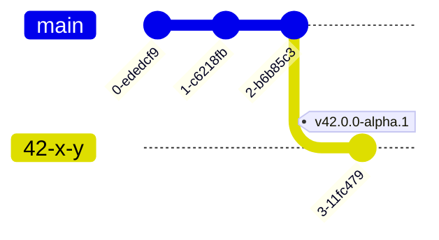
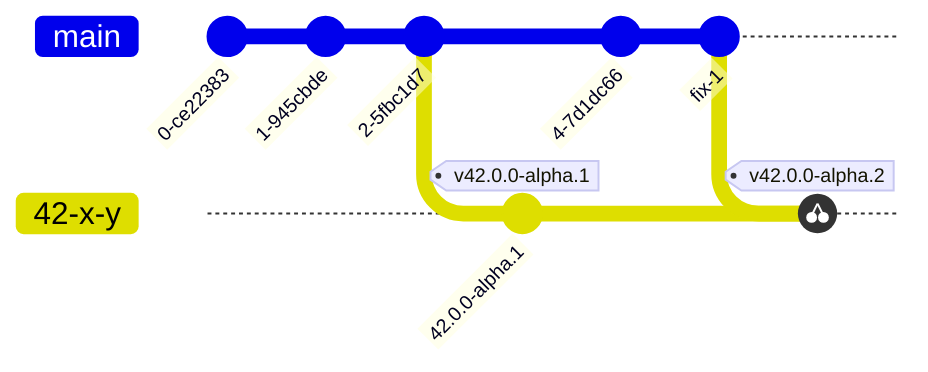
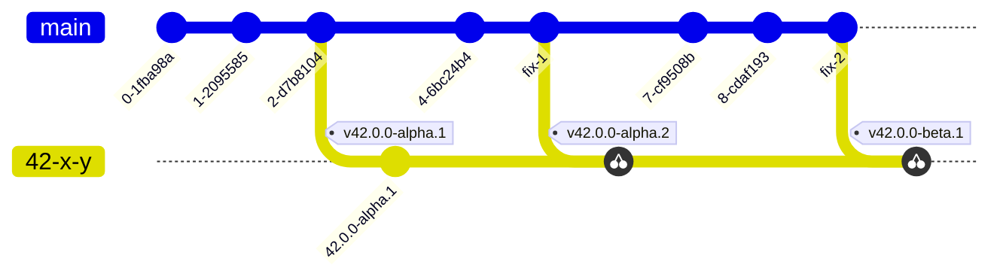
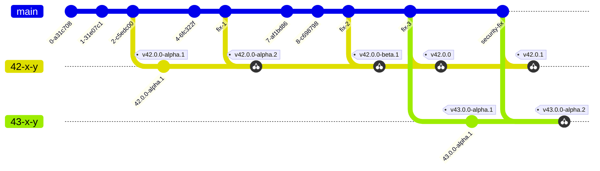
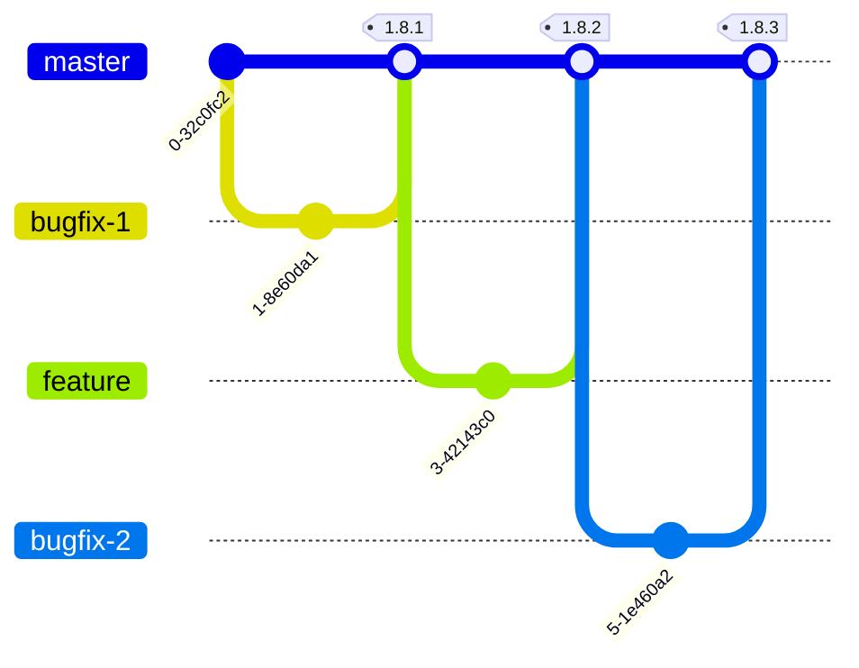

# Electron Versioning

> A detailed look at our versioning policy and implementation.

As of version 2.0.0, Electron follows the [SemVer](#semver) spec. The following command will install the most recent stable build of Electron:

```sh npm2yarn
npm install --save-dev electron
```

To update an existing project to use the latest stable version:

```sh npm2yarn
npm install --save-dev electron@latest
```

## SemVer

Below is a table explicitly mapping types of changes to their corresponding category of SemVer (e.g. Major, Minor, Patch).

| Major Version Increments        | Minor Version Increments           | Patch Version Increments      |
| ------------------------------- | ---------------------------------- | ----------------------------- |
| Electron breaking API changes   | Electron non-breaking API changes  | Electron bug fixes            |
| Node.js major version updates   | Node.js minor version updates      | Node.js patch version updates |
| Chromium version updates        |                                    | fix-related Chromium patches  |

For more information, see the [Semantic Versioning 2.0.0](https://semver.org/) spec.

Note that most Chromium updates will be considered breaking. Fixes that can be backported will likely be cherry-picked as patches.

## Stabilization branches

Stabilization branches are branches that run parallel to `main`, taking in only cherry-picked commits that are related to security or stability. These branches are never merged back to `main`.


```mermaid
gitGraph
    commit
    commit
    branch N-x-y
    checkout main
    commit id:"fix-1"
    checkout N-x-y
    cherry-pick id:"fix-1"
    checkout main
    commit id:"fix-2"
    checkout N-x-y
    cherry-pick id:"fix-2"
    checkout main
    commit
    commit
```

Since Electron 8, stabilization branches are always **major** version lines, and named against the following template `$MAJOR-x-y` e.g. `8-x-y`. (Prior to that, we used **minor** version lines and named them as `$MAJOR-$MINOR-x` e.g. `2-0-x`.)

We allow for multiple stabilization branches to exist simultaneously, one for each supported version.

> [!TIP]
> For more details on which versions are supported, see our [Electron Releases](./electron-timelines.md) doc.


```mermaid
gitGraph
    commit
    branch "41-x-y"
    checkout main
    commit
    commit
    commit id:"fix-a"
    checkout "41-x-y"
    cherry-pick id:"fix-a"
    checkout main
    commit
    commit id:"fix-b"
    checkout "41-x-y"
    cherry-pick id:"fix-b"
    checkout main
    commit
    branch "42-x-y"
    checkout main
    commit
    commit id:"fix-c"
    checkout "41-x-y"
    cherry-pick id:"fix-c"
    checkout "42-x-y"
    cherry-pick id:"fix-c"
    checkout main
    commit
    commit id:"fix-d"
    checkout "41-x-y"
    cherry-pick id:"fix-d"
    checkout "42-x-y"
    cherry-pick id:"fix-d"
    checkout main
    commit
```

Older lines will not be supported by the Electron project.

## Release cycle

Electron follows an **8-week regular release cycle** where key milestones correspond to
matching dates in the Chromium release cycle.


```mermaid
gantt
    title Electron release cycle
    dateFormat  YYYY-MM-DD
    axisFormat  Week %W
    todayMarker off
    section v41
    Alpha phase                    :a1, 2026-01-01, 4w
    M146 enters Chrome beta        :milestone, bm1, after a1, 0d
    Beta phase                     :b1, after a1, 4w
    M146 enters Chrome stable      :milestone, s1, after b1, 0d
    Supported until v44 release    :active, after b1, 12w
    section v42
    Alpha phase                    :a2, after b1, 4w
    M148 enters Chrome beta        :milestone, bm2, after a2, 0d
    Beta phase                     :b2, after a2, 4w
    M148 enters Chrome stable      :milestone, s2, after b2, 0d
    Supported until v45 release    :active, after b2, 4w
```

### Example

When Electron 41 hits its stable release, the release line for Electron 42 is branched off of `main`.
Its first alpha release is created with all the changes contained on `main`:


```mermaid
gitGraph
    commit
    commit
    commit
    branch "42-x-y"
    checkout "42-x-y"
    commit tag:"v42.0.0-alpha.1"
```

A bug fix comes into `main` that can be backported to the release branch. The patch is applied,
and it is published in the next `v42.0.0-alpha.2` release.


```mermaid
gitGraph
    commit
    commit
    commit
    branch "42-x-y"
    checkout "42-x-y"
    commit id:"42.0.0-alpha.1" tag:"v42.0.0-alpha.1"
    checkout "main"
    commit
    commit id:"fix-1"
    checkout "42-x-y"
    cherry-pick id:"fix-1" tag:"v42.0.0-alpha.2"
```

The version of Chromium that powers Electron 42 hits Chrome's beta channel. The `alpha` line is
promoted to `beta`.


```mermaid
gitGraph
    commit
    commit
    commit
    branch "42-x-y"
    checkout "42-x-y"
    commit id:"42.0.0-alpha.1" tag:"v42.0.0-alpha.1"
    checkout "main"
    commit
    commit id:"fix-1"
    checkout "42-x-y"
    cherry-pick id:"fix-1" tag:"v42.0.0-alpha.2"
    checkout "main"
    commit
    commit
    commit id:"fix-2"
    checkout "42-x-y"
    cherry-pick id:"fix-2" tag:"v42.0.0-beta.1"
```

Beta releases continue weekly until Electron 42 is promoted to stable and the same cycle starts again
with `43-x-y`. Later, a zero-day exploit is revealed and a fix is applied to `main`. We backport the
fix to the `42-x-y` line and release `42.0.1`.


```mermaid
gitGraph
    commit
    commit
    commit
    branch "42-x-y"
    checkout "42-x-y"
    commit id:"42.0.0-alpha.1" tag:"v42.0.0-alpha.1"
    checkout "main"
    commit
    commit id:"fix-1"
    checkout "42-x-y"
    cherry-pick id:"fix-1" tag:"v42.0.0-alpha.2"
    checkout "main"
    commit
    commit
    commit id:"fix-2"
    checkout "42-x-y"
    cherry-pick id:"fix-2" tag:"v42.0.0-beta.1"
    checkout "main"
    commit id:"fix-3"
    checkout "42-x-y"
    cherry-pick id:"fix-3" tag:"v42.0.0"
    checkout "main"
    branch "43-x-y"
    checkout "43-x-y"
    commit id:"43.0.0-alpha.1" tag:"v43.0.0-alpha.1"
    checkout "main"
    commit id:"security-fix"
    checkout "42-x-y"
    cherry-pick id:"security-fix" tag:"v42.0.1"
    checkout "43-x-y"
    cherry-pick id:"security-fix" tag:"v43.0.0-alpha.2"
```

### Backport request process

All supported release lines will accept external pull requests to backport
fixes previously merged to `main`, though this may be on a case-by-case
basis for some older supported lines. All contested decisions around release
line backports will be resolved by the
[Releases Working Group](https://github.com/electron/governance/tree/main/wg-releases)
as an agenda item at their weekly meeting the week the backport PR is raised.

## Feature flags

Feature flags are a common practice in Chromium, and are well-established in the web-development ecosystem. In the context of Electron, a feature flag or **soft branch** must have the following properties:

* it is enabled/disabled either at runtime, or build-time; we do not support the concept of a request-scoped feature flag
* it completely segments new and old code paths; refactoring old code to support a new feature _violates_ the feature-flag contract
* feature flags are eventually removed after the feature is released

## Semantic commits

All pull requests must adhere to the [Conventional Commits](https://conventionalcommits.org/) spec, which can be summarized as follows:

* Commits that would result in a SemVer **major** bump must start their body with `BREAKING CHANGE:`.
* Commits that would result in a SemVer **minor** bump must start with `feat:`.
* Commits that would result in a SemVer **patch** bump must start with `fix:`.

The `electron/electron` repository also enforces squash merging, so you only need to make sure that your pull request has the correct title prefix.

## Versioned `main` branch

* The `main` branch always corresponds to the major version above the current pre-release line.
* Release branches are never merged back to `main`.
* All `package.json` values are fixed at `0.0.0-development`.

## Historical versioning (Electron 1.X)

Electron versions _< 2.0_ did not conform to the [SemVer](https://semver.org) spec: major versions corresponded to end-user API changes, minor versions corresponded to Chromium major releases, and patch versions corresponded to new features and bug fixes. While convenient for developers merging features, it creates problems for developers of client-facing applications. The QA testing cycles of major apps like Slack, Teams, VS Code, and GitHub Desktop can be lengthy and stability is a highly desired outcome. There is a high risk in adopting new features while trying to absorb bug fixes.

Here is an example of the 1.x strategy:


```mermaid
---
config:
  gitGraph:
    mainBranchName: 'master'
---
gitGraph
    commit
    branch "bugfix-1"
    checkout "bugfix-1"
    commit
    checkout master
    merge "bugfix-1" tag:"1.8.1"
    branch "feature"
    checkout "feature"
    commit
    checkout master
    merge "feature" tag:"1.8.2"
    branch "bugfix-2"
    checkout "bugfix-2"
    commit
    checkout master
    merge "bugfix-2" tag:"1.8.3"
```

An app developed with `1.8.1` cannot take the `1.8.3` bug fix without either absorbing the `1.8.2` feature, or by backporting the fix and maintaining a new release line.
