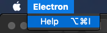

# Keyboard Shortcuts

## Overview

This feature allows you to configure local and global keyboard shortcuts
for your Electron application.

## Example

### Local Shortcuts

Local keyboard shortcuts are triggered only when the application is focused.
To configure a local keyboard shortcut, you need to specify an [`accelerator`]
property when creating a [MenuItem] within the [Menu] module.

Starting with a working application from the
[Quick Start Guide](quick-start.md), update the `main.js` file with the
following lines:

```javascript fiddle='docs/fiddles/features/keyboard-shortcuts/local'
const { Menu, MenuItem } = require('electron')

const menu = new Menu()
menu.append(new MenuItem({
  label: 'Electron',
  submenu: [{
    role: 'help',
    accelerator: process.platform === 'darwin' ? 'Alt+Cmd+I' : 'Alt+Shift+I',
    click: () => { console.log('Electron rocks!') }
  }]
}))

Menu.setApplicationMenu(menu)
```

> NOTE: In the code above, you can see that the accelerator differs based on the
user's operating system. For MacOS, it is `Alt+Cmd+I`, whereas for Linux and
Windows, it is `Alt+Shift+I`.

After launching the Electron application, you should see the application menu
along with the local shortcut you just defined:



If you click `Help` or press the defined accelerator and then open the terminal
that you ran your Electron application from, you will see the message that was
generated after triggering the `click` event: "Electron rocks!".

### Global Shortcuts

To configure a global keyboard shortcut, you need to use the [globalShortcut]
module to detect keyboard events even when the application does not have
keyboard focus.

Starting with a working application from the
[Quick Start Guide](quick-start.md), update the `main.js` file with the
following lines:

```javascript fiddle='docs/fiddles/features/keyboard-shortcuts/global'
const { app, globalShortcut } = require('electron')

app.whenReady().then(() => {
  globalShortcut.register('Alt+CommandOrControl+I', () => {
    console.log('Electron loves global shortcuts!')
  })
}).then(createWindow)
```

> NOTE: In the code above, the `CommandOrControl` combination uses `Command`
on macOS and `Control` on Windows/Linux.

After launching the Electron application, if you press the defined key
combination then open the terminal that you ran your Electron application from,
you will see that Electron loves global shortcuts!

### Shortcuts within a BrowserWindow

#### Using web APIs

If you want to handle keyboard shortcuts within a [BrowserWindow], you can
listen for the `keyup` and `keydown` [DOM events][dom-events] inside the
renderer process using the [addEventListener() API][addEventListener-api].

```javascript fiddle='docs/fiddles/features/keyboard-shortcuts/web-apis|focus=renderer.js'
function handleKeyPress(event) {
  // You can put code here to handle the keypress.
  document.getElementById("last-keypress").innerText = event.key;
  console.log(`You pressed ${event.key}`);
}

window.addEventListener('keyup', handleKeyPress, true);
```

> Note:  the third parameter `true` indicates that the listener will always receive
key presses before other listeners so they can't have `stopPropagation()`
called on them.

#### Intercepting events in the main process

The [`before-input-event`](../api/web-contents.md#event-before-input-event) event
is emitted before dispatching `keydown` and `keyup` events in the page. It can
be used to catch and handle custom shortcuts that are not visible in the menu.

Starting with a working application from the
[Quick Start Guide](quick-start.md), update the `main.js` file with the
following lines:

```javascript fiddle='docs/fiddles/features/keyboard-shortcuts/interception-from-main'
const { app, BrowserWindow } = require('electron')

app.whenReady().then(() => {
  const win = new BrowserWindow({ width: 800, height: 600 })

  win.loadFile('index.html')
  win.webContents.on('before-input-event', (event, input) => {
    if (input.control && input.key.toLowerCase() === 'i') {
      console.log('Pressed Control+I')
      event.preventDefault()
    }
  })
})
```

After launching the Electron application, if you open the terminal that you ran
your Electron application from and press `Ctrl+I` key combination, you will
see that this key combination was successfully intercepted.

#### Using third-party libraries

If you don't want to do manual shortcut parsing, there are libraries that do
advanced key detection, such as [mousetrap]. Below are examples of usage of the
`mousetrap` running in the Renderer process:

```js
Mousetrap.bind('4', () => { console.log('4') })
Mousetrap.bind('?', () => { console.log('show shortcuts!') })
Mousetrap.bind('esc', () => { console.log('escape') }, 'keyup')

// combinations
Mousetrap.bind('command+shift+k', () => { console.log('command shift k') })

// map multiple combinations to the same callback
Mousetrap.bind(['command+k', 'ctrl+k'], () => {
  console.log('command k or control k')

  // return false to prevent default behavior and stop event from bubbling
  return false
})

// gmail style sequences
Mousetrap.bind('g i', () => { console.log('go to inbox') })
Mousetrap.bind('* a', () => { console.log('select all') })

// konami code!
Mousetrap.bind('up up down down left right left right b a enter', () => {
  console.log('konami code')
})
```

[Menu]: ../api/menu.md
[MenuItem]: ../api/menu-item.md
[globalShortcut]: ../api/global-shortcut.md
[`accelerator`]: ../api/accelerator.md
[BrowserWindow]: ../api/browser-window.md
[mousetrap]: https://github.com/ccampbell/mousetrap
[dom-events]: https://developer.mozilla.org/en-US/docs/Web/Events
[addEventListener-api]: https://developer.mozilla.org/en-US/docs/Web/API/EventTarget/addEventListener
