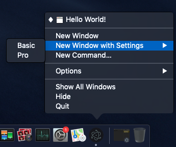

# Dock

Electron has APIs to configure the app's icon in the macOS Dock. A macOS-only
API exists to create a custom dock menu, but Electron also uses the app dock
icon as the entry point for cross-platform features like
[recent documents][recent-documents] and [application progress][progress-bar].

The custom dock is commonly used to add shortcuts to tasks the user wouldn't
want to open the whole app window for.

**Dock menu of Terminal.app:**

![Dock Menu][dock-menu-image]

To set your custom dock menu, you need to use the
[`app.dock.setMenu`](../api/dock.md#docksetmenumenu-macos) API,
which is only available on macOS.

```fiddle docs/fiddles/features/macos-dock-menu
const { app, BrowserWindow, Menu } = require('electron/main')

function createWindow () {
  const win = new BrowserWindow({
    width: 800,
    height: 600
  })

  win.loadFile('index.html')
}

const dockMenu = Menu.buildFromTemplate([
  {
    label: 'New Window',
    click () { console.log('New Window') }
  }, {
    label: 'New Window with Settings',
    submenu: [
      { label: 'Basic' },
      { label: 'Pro' }
    ]
  },
  { label: 'New Command...' }
])

app.whenReady().then(() => {
  if (process.platform === 'darwin') {
    app.dock.setMenu(dockMenu)
  }
}).then(createWindow)

app.on('window-all-closed', () => {
  if (process.platform !== 'darwin') {
    app.quit()
  }
})

app.on('activate', () => {
  if (BrowserWindow.getAllWindows().length === 0) {
    createWindow()
  }
})
```

After launching the Electron application, right click the application icon.
You should see the custom menu you just defined:



[dock-menu-image]: https://cloud.githubusercontent.com/assets/639601/5069962/6032658a-6e9c-11e4-9953-aa84006bdfff.png
[recent-documents]: ./recent-documents.md
[progress-bar]: ./progress-bar.md
