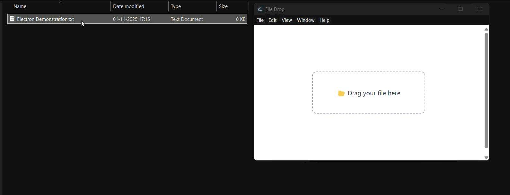

# Native File Drag & Drop

## Overview

Certain kinds of applications that manipulate files might want to support the operating system's native file drag & drop feature. Electron supports dragging files both out from web content into the operating system, and dragging files from the operating system into your application.

---

## Dragging Files Out (From Electron to OS)

To implement this feature in your app, you need to call the
[`webContents.startDrag(item)`](../api/web-contents.md#contentsstartdragitem)
API in response to the `ondragstart` event.

## Example

An example demonstrating how you can create a file on the fly to be dragged out of the window.

### Preload.js

In `preload.js` use the [`contextBridge`][] to inject a method `window.electron.startDrag(...)` that will send an IPC message to the main process.

```js
const { contextBridge, ipcRenderer } = require('electron')

contextBridge.exposeInMainWorld('electron', {
  startDrag: (fileName) => ipcRenderer.send('ondragstart', fileName)
})
```

### Index.html

Add a draggable element to `index.html`, and reference your renderer script:

```html
<div style="border:2px solid black;border-radius:3px;padding:5px;display:inline-block" draggable="true" id="drag">Drag me</div>
<script src="renderer.js"></script>
```

### Renderer.js

In `renderer.js` set up the renderer process to handle drag events by calling the method you added via the [`contextBridge`][] above.

```js @ts-expect-error=[3]
document.getElementById('drag').ondragstart = (event) => {
  event.preventDefault()
  window.electron.startDrag('drag-and-drop.md')
}
```

### Main.js

In the Main process (`main.js` file), expand the received event with a path to the file that is
being dragged and an icon:

```fiddle docs/fiddles/features/drag-and-drop
const { app, BrowserWindow, ipcMain } = require('electron/main')
const path = require('node:path')
const fs = require('node:fs')
const https = require('node:https')

function createWindow () {
  const win = new BrowserWindow({
    width: 800,
    height: 600,
    webPreferences: {
      preload: path.join(__dirname, 'preload.js')
    }
  })

  win.loadFile('index.html')
}

const iconName = path.join(__dirname, 'iconForDragAndDrop.png')
const icon = fs.createWriteStream(iconName)

// Create a new file to copy - you can also copy existing files.
fs.writeFileSync(path.join(__dirname, 'drag-and-drop-1.md'), '# First file to test drag and drop')
fs.writeFileSync(path.join(__dirname, 'drag-and-drop-2.md'), '# Second file to test drag and drop')

https.get('https://img.icons8.com/ios/452/drag-and-drop.png', (response) => {
  response.pipe(icon)
})

app.whenReady().then(createWindow)

ipcMain.on('ondragstart', (event, filePath) => {
  event.sender.startDrag({
    file: path.join(__dirname, filePath),
    icon: iconName
  })
})

app.on('window-all-closed', () => {
  if (process.platform !== 'darwin') {
    app.quit()
  }
})

app.on('activate', () => {
  if (BrowserWindow.getAllWindows().length === 0) {
    createWindow()
  }
})
```

After launching the Electron application, try dragging and dropping
the item from the BrowserWindow onto your desktop. In this guide,
the item is a Markdown file located in the root of the project:


[`contextBridge`]: ../api/context-bridge.md

## Dragging Files In (From OS to Electron)

To accept files being dragged into your Electron app from the operating system, you need to handle drag and drop events in the renderer process and use `webUtils.getPathForFile()` to safely access file paths.

### Example

An example demonstrating how to accept files dragged into your application and access their file paths.

#### Index.html

Create a drop zone element where users can drag and drop files:

```html
  
  <!DOCTYPE html>
<html lang="en">
  <head>
    <meta charset="UTF-8" />
    <title>File Drop</title>
    <style>
      body {
        display: flex;
        justify-content: center;
        align-items: center;
        height: 100vh;
        background: #f8fafc;
        font-family: system-ui, sans-serif;
        flex-direction: column;
      }
      #dropzone {
        border: 2px dashed #94a3b8;
        border-radius: 10px;
        padding: 40px 60px;
        background: #ffffff;
        text-align: center;
        color: #334155;
        transition: 0.2s ease;
      }
      #dropzone.dragover {
        border-color: #2563eb;
        color: #2563eb;
        background: #f1f5f9;
      }
      #path {
        margin-top: 20px;
        color: #1e293b;
        font-size: 14px;
      }
    </style>
  </head>
  <body>
    <div id="dropzone">📂 Drag your file here</div>
    <div id="path"></div>

    <script src="renderer.js"></script>
  </body>
</html>

```

#### Renderer.js

In `renderer.js`, handle the drag and drop events and use the exposed API to get the file path:

```js
const dropzone = document.getElementById('dropzone')
const pathOutput = document.getElementById('path')

dropzone.addEventListener('dragover', (event) => {
  event.preventDefault()
  dropzone.classList.add('dragover')
})

dropzone.addEventListener('dragleave', () => {
  dropzone.classList.remove('dragover')
})

dropzone.addEventListener('drop', (event) => {
  event.preventDefault()
  dropzone.classList.remove('dragover')

  const file = event.dataTransfer.files[0]
  if (!file) return

  //  Safely show only the file name (not full path)
  //  Note: For security reasons, Electron recommends not exposing full file paths to the renderer. Only share minimal or non-sensitive information such as the file name.
  pathOutput.textContent = `📁 File: ${file.name}`
})
```

### Main.js

In the main process, set up your BrowserWindow and load the renderer file:

```fiddle docs/fiddles/features/drag-and-drop
const { app, BrowserWindow } = require('electron')
const path = require('node:path')

function createWindow () {
  const win = new BrowserWindow({
    width: 600,
    height: 400,
  })

  win.loadFile('index.html')
}

app.whenReady().then(createWindow)

app.on('window-all-closed', () => {
  if (process.platform !== 'darwin') {
    app.quit()
  }
})

app.on('activate', () => {
  if (BrowserWindow.getAllWindows().length === 0) {
    createWindow()
  }
})
```

After launching the Electron application, try dragging a file from your file system into the drop zone. The application will display the file name in the drop zone.



### Security Note

> ⚠️ **Tip:** If your app needs to work with the actual file paths, handle them **in the main process** and communicate securely via IPC.

When you need to access full file paths securely, use webUtils.getPathForFile(), which is the recommended method for maintaining security through context isolation.
