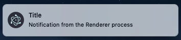
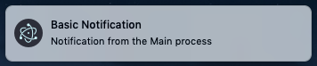

# Notifications

## Overview

All three operating systems provide means for applications to send
notifications to the user. The technique of showing notifications is different
for the Main and Renderer processes.

For the Renderer process, Electron conveniently allows developers to send
notifications with the [HTML5 Notification API](https://notifications.spec.whatwg.org/),
using the currently running operating system's native notification APIs
to display it.

To show notifications in the Main process, you need to use the
[Notification](../api/notification.md) module.

## Example

### Show notifications in the Renderer process

Starting with a working application from the
[Quick Start Guide](quick-start.md), add the following line to the
`index.html` file before the closing `</body>` tag:

```html
<script src="renderer.js"></script>
```

...and add the `renderer.js` file:

```javascript fiddle='docs/fiddles/features/notifications/renderer'
const NOTIFICATION_TITLE = 'Title'
const NOTIFICATION_BODY = 'Notification from the Renderer process. Click to log to console.'
const CLICK_MESSAGE = 'Notification clicked'

new Notification(NOTIFICATION_TITLE, { body: NOTIFICATION_BODY })
  .onclick = () => console.log(CLICK_MESSAGE)
```

After launching the Electron application, you should see the notification:



Additionally, if you click on the notification, the DOM will update to show "Notification clicked!".

### Show notifications in the Main process

Starting with a working application from the
[Quick Start Guide](quick-start.md), update the `main.js` file with the following lines:

```javascript fiddle='docs/fiddles/features/notifications/main'
const { Notification } = require('electron')

const NOTIFICATION_TITLE = 'Basic Notification'
const NOTIFICATION_BODY = 'Notification from the Main process'

const showNotification = () => {
  new Notification({ title: NOTIFICATION_TITLE, body: NOTIFICATION_BODY }).show()
}

app.whenReady().then(createWindow).then(showNotification)
```

After launching the Electron application, you should see the system notification:



## Additional information

While code and user experience across operating systems are similar, there
are subtle differences.

### Windows

* On Windows 10, a shortcut to your app with an
[Application User Model ID][app-user-model-id] must be installed to the
Start Menu. This can be overkill during development, so adding
`node_modules\electron\dist\electron.exe` to your Start Menu also does the
trick. Navigate to the file in Explorer, right-click and 'Pin to Start Menu'.
You will then need to add the line `app.setAppUserModelId(process.execPath)` to
your main process to see notifications.
* On Windows 8.1 and Windows 8, a shortcut to your app with an [Application User
Model ID][app-user-model-id] must be installed to the Start screen. Note,
however, that it does not need to be pinned to the Start screen.
* On Windows 7, notifications work via a custom implementation which visually
resembles the native one on newer systems.

Electron attempts to automate the work around the Application User Model ID. When
Electron is used together with the installation and update framework Squirrel,
[shortcuts will automatically be set correctly][squirrel-events]. Furthermore,
Electron will detect that Squirrel was used and will automatically call
`app.setAppUserModelId()` with the correct value. During development, you may have
to call [`app.setAppUserModelId()`][set-app-user-model-id] yourself.

Furthermore, in Windows 8, the maximum length for the notification body is 250
characters, with the Windows team recommending that notifications should be kept
to 200 characters. That said, that limitation has been removed in Windows 10, with
the Windows team asking developers to be reasonable. Attempting to send gigantic
amounts of text to the API (thousands of characters) might result in instability.

#### Advanced Notifications

Later versions of Windows allow for advanced notifications, with custom templates,
images, and other flexible elements. To send those notifications (from either the
main process or the renderer process), use the userland module
[electron-windows-notifications](https://github.com/felixrieseberg/electron-windows-notifications),
which uses native Node addons to send `ToastNotification` and `TileNotification` objects.

While notifications including buttons work with `electron-windows-notifications`,
handling replies requires the use of
[`electron-windows-interactive-notifications`](https://github.com/felixrieseberg/electron-windows-interactive-notifications),
which helps with registering the required COM components and calling your
Electron app with the entered user data.

#### Quiet Hours / Presentation Mode

To detect whether or not you're allowed to send a notification, use the
userland module [electron-notification-state](https://github.com/felixrieseberg/electron-notification-state).

This allows you to determine ahead of time whether or not Windows will
silently throw the notification away.

### macOS

Notifications are straight-forward on macOS, but you should be aware of
[Apple's Human Interface guidelines regarding notifications][apple-notification-guidelines].

Note that notifications are limited to 256 bytes in size and will be truncated
if you exceed that limit.

[apple-notification-guidelines]: https://developer.apple.com/macos/human-interface-guidelines/system-capabilities/notifications/

#### Do not disturb / Session State

To detect whether or not you're allowed to send a notification, use the userland module
[electron-notification-state][electron-notification-state].

This will allow you to detect ahead of time whether or not the notification will be displayed.

[electron-notification-state]: https://github.com/felixrieseberg/electron-notification-state

### Linux

Notifications are sent using `libnotify` which can show notifications on any
desktop environment that follows [Desktop Notifications
Specification][notification-spec], including Cinnamon, Enlightenment, Unity,
GNOME, KDE.

[notification-spec]: https://developer-old.gnome.org/notification-spec/
[app-user-model-id]: https://msdn.microsoft.com/en-us/library/windows/desktop/dd378459(v=vs.85).aspx
[set-app-user-model-id]: ../api/app.md#appsetappusermodelidid-windows
[squirrel-events]: https://github.com/electron/windows-installer/blob/master/README.md#handling-squirrel-events
