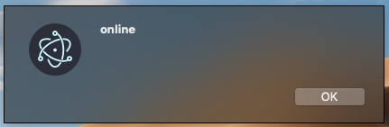

# Online/Offline Event Detection

## Overview

[Online and offline event](https://developer.mozilla.org/en-US/docs/Online_and_offline_events)
detection can be implemented in the Renderer process using the
[`navigator.onLine`](http://html5index.org/Offline%20-%20NavigatorOnLine.html)
attribute, part of standard HTML5 API.

The `navigator.onLine` attribute returns:

* `false` if all network requests are guaranteed to fail (e.g. when disconnected from the network).
* `true` in all other cases.

Since many cases return `true`, you should treat with care situations of
getting false positives, as we cannot always assume that `true` value means
that Electron can access the Internet. For example, in cases when the computer
is running a virtualization software that has virtual Ethernet adapters in "always
connected" state. Therefore, if you want to determine the Internet access
status of Electron, you should develop additional means for this check.

## Example

### Event detection in the Renderer process

Starting with a working application from the
[Quick Start Guide](quick-start.md), update the `main.js` file
with the following lines:

```javascript
const { app, BrowserWindow } = require('electron')

let onlineStatusWindow

app.whenReady().then(() => {
  onlineStatusWindow = new BrowserWindow({ width: 0, height: 0, show: false })
  onlineStatusWindow.loadURL(`file://${__dirname}/index.html`)
})
```

in the `index.html` file, add the following line before the
closing `</body>` tag:

```html
<script src="renderer.js"></script>
```

and add the `renderer.js` file:

```javascript fiddle='docs/fiddles/features/online-detection/renderer'
const alertOnlineStatus = () => { window.alert(navigator.onLine ? 'online' : 'offline') }

window.addEventListener('online', alertOnlineStatus)
window.addEventListener('offline', alertOnlineStatus)

alertOnlineStatus()
```

After launching the Electron application, you should see the notification:



### Event detection in the Main process

There may be situations when you want to respond to online/offline events in
the Main process as well. The Main process, however, does not have a
`navigator` object and cannot detect these events directly. In this case, you
need to forward the events to the Main process using Electron's inter-process
communication (IPC) utilities.

Starting with a working application from the
[Quick Start Guide](quick-start.md), update the `main.js` file
with the following lines:

```javascript
const { app, BrowserWindow, ipcMain } = require('electron')
let onlineStatusWindow

app.whenReady().then(() => {
  onlineStatusWindow = new BrowserWindow({ width: 0, height: 0, show: false, webPreferences: { nodeIntegration: true } })
  onlineStatusWindow.loadURL(`file://${__dirname}/index.html`)
})

ipcMain.on('online-status-changed', (event, status) => {
  console.log(status)
})
```

in the `index.html` file, add the following line before the
closing `</body>` tag:

```html
<script src="renderer.js"></script>
```

and add the `renderer.js` file:

```javascript fiddle='docs/fiddles/features/online-detection/main'
const { ipcRenderer } = require('electron')
const updateOnlineStatus = () => { ipcRenderer.send('online-status-changed', navigator.onLine ? 'online' : 'offline') }

window.addEventListener('online', updateOnlineStatus)
window.addEventListener('offline', updateOnlineStatus)

updateOnlineStatus()
```

After launching the Electron application, you should see the notification in the
Console:

```sh
npm start

> electron@1.0.0 start /electron
> electron .

online
```
