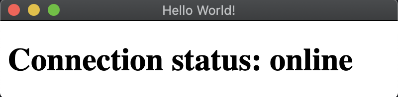

# Online/Offline Event Detection

## Overview

[Online and offline event](https://developer.mozilla.org/en-US/docs/Online_and_offline_events)
detection can be implemented in the Renderer process using the
[`navigator.onLine`](http://html5index.org/Offline%20-%20NavigatorOnLine.html)
attribute, part of standard HTML5 API.

The `navigator.onLine` attribute returns:

* `false` if all network requests are guaranteed to fail (e.g. when disconnected from the network).
* `true` in all other cases.

Since many cases return `true`, you should treat with care situations of
getting false positives, as we cannot always assume that `true` value means
that Electron can access the Internet. For example, in cases when the computer
is running a virtualization software that has virtual Ethernet adapters in "always
connected" state. Therefore, if you want to determine the Internet access
status of Electron, you should develop additional means for this check.

## Example

Starting with an HTML file `index.html`, this example will demonstrate how the `navigator.onLine` API can be used to build a connection status indicator.

```html title="index.html"
<!DOCTYPE html>
<html>
<head>
    <meta charset="UTF-8">
    <title>Hello World!</title>
    <meta http-equiv="Content-Security-Policy" content="script-src 'self' 'unsafe-inline';" />
</head>
<body>
    <h1>Connection status: <strong id='status'></strong></h1>
    <script src="renderer.js"></script>
</body>
</html>
```

In order to mutate the DOM, create a `renderer.js` file that adds event listeners to the `'online'` and `'offline'` `window` events. The event handler sets the content of the `<strong id='status'>` element depending on the result of `navigator.onLine`.

```js title='renderer.js'
const updateOnlineStatus = () => {
  document.getElementById('status').innerHTML = navigator.onLine ? 'online' : 'offline'
}

window.addEventListener('online', updateOnlineStatus)
window.addEventListener('offline', updateOnlineStatus)

updateOnlineStatus()
```

Finally, create a `main.js` file for main process that creates the window.

```js title='main.js'
const { app, BrowserWindow } = require('electron')

const createWindow = () => {
  const onlineStatusWindow = new BrowserWindow({
    width: 400,
    height: 100
  })

  onlineStatusWindow.loadFile('index.html')
}

app.whenReady().then(() => {
  createWindow()

  app.on('activate', () => {
    if (BrowserWindow.getAllWindows().length === 0) {
      createWindow()
    }
  })
})

app.on('window-all-closed', () => {
  if (process.platform !== 'darwin') {
    app.quit()
  }
})
```

After launching the Electron application, you should see the notification:



> Note: If you need to communicate the connection status to the main process, use the [IPC renderer](../api/ipc-renderer.md) API.
