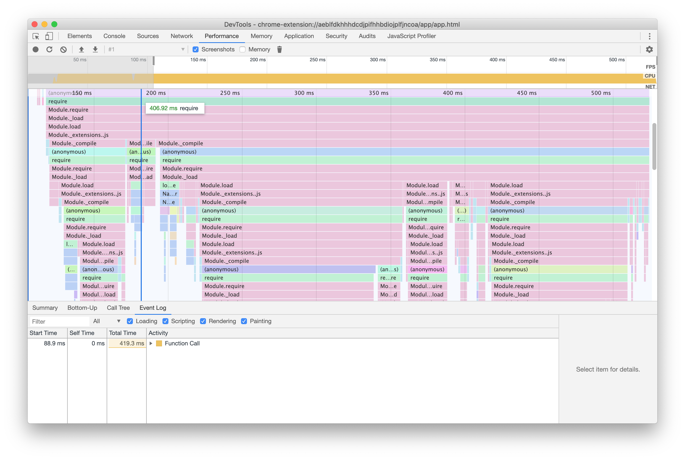
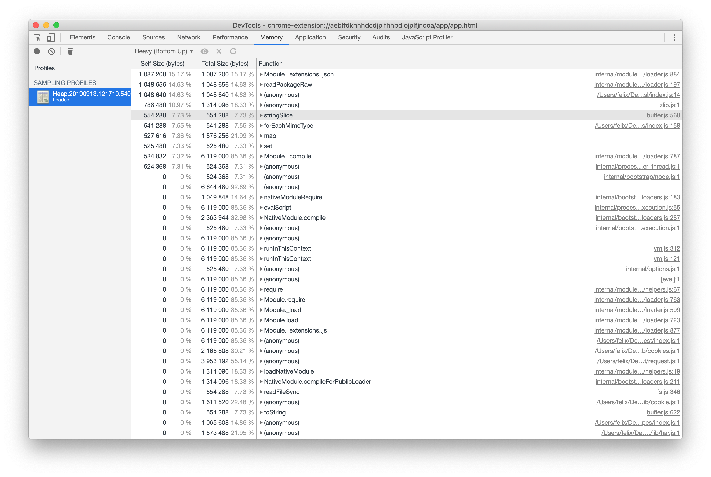

# Performance

Developers frequently ask about strategies to optimize the performance of
Electron applications. Software engineers, consumers, and framework developers
do not always agree on one single definition of what "performance" means. This
document outlines some of the Electron maintainers' favorite ways to reduce the
amount of memory, CPU, and disk resources being used while ensuring that your
app is responsive to user input and completes operations as quickly as
possible. Furthermore, we want all performance strategies to maintain a high
standard for your app's security.

Wisdom and information about how to build performant websites with JavaScript
generally applies to Electron apps, too. To a certain extent, resources
discussing how to build performant Node.js applications also apply, but be
careful to understand that the term "performance" means different things for
a Node.js backend than it does for an application running on a client.

This list is provided for your convenience – and is, much like our
[security checklist][security] – not meant to exhaustive. It is probably possible
to build a slow Electron app that follows all the steps outlined below. Electron
is a powerful development platform that enables you, the developer, to do more
or less whatever you want. All that freedom means that performance is largely
your responsibility.

## Measure, Measure, Measure

The list below contains a number of steps that are fairly straightforward and
easy to implement. However, building the most performant version of your app
will require you to go beyond a number of steps. Instead, you will have to
closely examine all the code running in your app by carefully profiling and
measuring. Where are the bottlenecks? When the user clicks a button, what
operations take up the brunt of the time? While the app is simply idling, which
objects take up the most memory?

Time and time again, we have seen that the most successful strategy for building
a performant Electron app is to profile the running code, find the most
resource-hungry piece of it, and to optimize it. Repeating this seemingly
laborious process over and over again will dramatically increase your app's
performance. Experience from working with major apps like Visual Studio Code or
Slack has shown that this practice is by far the most reliable strategy to
improve performance.

To learn more about how to profile your app's code, familiarize yourself with
the Chrome Developer Tools. For advanced analysis looking at multiple processes
at once, consider the [Chrome Tracing](https://www.chromium.org/developers/how-tos/trace-event-profiling-tool) tool.

### Recommended Reading

* [Get Started With Analyzing Runtime Performance][chrome-devtools-tutorial]
* [Talk: "Visual Studio Code - The First Second"][vscode-first-second]

## Checklist: Performance recommendations

Chances are that your app could be a little leaner, faster, and generally less
resource-hungry if you attempt these steps.

1. [Carelessly including modules](#1-carelessly-including-modules)
2. [Loading and running code too soon](#2-loading-and-running-code-too-soon)
3. [Blocking the main process](#3-blocking-the-main-process)
4. [Blocking the renderer process](#4-blocking-the-renderer-process)
5. [Unnecessary polyfills](#5-unnecessary-polyfills)
6. [Unnecessary or blocking network requests](#6-unnecessary-or-blocking-network-requests)
7. [Bundle your code](#7-bundle-your-code)

### 1. Carelessly including modules

Before adding a Node.js module to your application, examine said module. How
many dependencies does that module include? What kind of resources does
it need to simply be called in a `require()` statement? You might find
that the module with the most downloads on the NPM package registry or the most stars on GitHub
is not in fact the leanest or smallest one available.

#### Why?

The reasoning behind this recommendation is best illustrated with a real-world
example. During the early days of Electron, reliable detection of network
connectivity was a problem, resulting many apps to use a module that exposed a
simple `isOnline()` method.

That module detected your network connectivity by attempting to reach out to a
number of well-known endpoints. For the list of those endpoints, it depended on
a different module, which also contained a list of well-known ports. This
dependency itself relied on a module containing information about ports, which
came in the form of a JSON file with more than 100,000 lines of content.
Whenever the module was loaded (usually in a `require('module')` statement),
it would load all its dependencies and eventually read and parse this JSON
file. Parsing many thousands lines of JSON is a very expensive operation. On
a slow machine it can take up whole seconds of time.

In many server contexts, startup time is virtually irrelevant. A Node.js server
that requires information about all ports is likely actually "more performant"
if it loads all required information into memory whenever the server boots at
the benefit of serving requests faster. The module discussed in this example is
not a "bad" module. Electron apps, however, should not be loading, parsing, and
storing in memory information that it does not actually need.

In short, a seemingly excellent module written primarily for Node.js servers
running Linux might be bad news for your app's performance. In this particular
example, the correct solution was to use no module at all, and to instead use
connectivity checks included in later versions of Chromium.

#### How?

When considering a module, we recommend that you check:

1. the size of dependencies included
2. the resources required to load (`require()`) it
3. the resources required to perform the action you're interested in

Generating a CPU profile and a heap memory profile for loading a module can be done
with a single command on the command line. In the example below, we're looking at
the popular module `request`.

```sh
node --cpu-prof --heap-prof -e "require('request')"
```

Executing this command results in a `.cpuprofile` file and a `.heapprofile`
file in the directory you executed it in. Both files can be analyzed using
the Chrome Developer Tools, using the `Performance` and `Memory` tabs
respectively.





In this example, on the author's machine, we saw that loading `request` took
almost half a second, whereas `node-fetch` took dramatically less memory
and less than 50ms.

### 2. Loading and running code too soon

If you have expensive setup operations, consider deferring those. Inspect all
the work being executed right after the application starts. Instead of firing
off all operations right away, consider staggering them in a sequence more
closely aligned with the user's journey.

In traditional Node.js development, we're used to putting all our `require()`
statements at the top. If you're currently writing your Electron application
using the same strategy _and_ are using sizable modules that you do not
immediately need, apply the same strategy and defer loading to a more
opportune time.

#### Why?

Loading modules is a surprisingly expensive operation, especially on Windows.
When your app starts, it should not make users wait for operations that are
currently not necessary.

This might seem obvious, but many applications tend to do a large amount of
work immediately after the app has launched - like checking for updates,
downloading content used in a later flow, or performing heavy disk I/O
operations.

Let's consider Visual Studio Code as an example. When you open a file, it will
immediately display the file to you without any code highlighting, prioritizing
your ability to interact with the text. Once it has done that work, it will
move on to code highlighting.

#### How?

Let's consider an example and assume that your application is parsing files
in the fictitious `.foo` format. In order to do that, it relies on the
equally fictitious `foo-parser` module. In traditional Node.js development,
you might write code that eagerly loads dependencies:

```js title='parser.js'
const fs = require('fs')
const fooParser = require('foo-parser')

class Parser {
  constructor () {
    this.files = fs.readdirSync('.')
  }

  getParsedFiles () {
    return fooParser.parse(this.files)
  }
}

const parser = new Parser()

module.exports = { parser }
```

In the above example, we're doing a lot of work that's being executed as soon
as the file is loaded. Do we need to get parsed files right away? Could we
do this work a little later, when `getParsedFiles()` is actually called?

```js title='parser.js'
// "fs" is likely already being loaded, so the `require()` call is cheap
const fs = require('fs')

class Parser {
  async getFiles () {
    // Touch the disk as soon as `getFiles` is called, not sooner.
    // Also, ensure that we're not blocking other operations by using
    // the asynchronous version.
    this.files = this.files || await fs.readdir('.')

    return this.files
  }

  async getParsedFiles () {
    // Our fictitious foo-parser is a big and expensive module to load, so
    // defer that work until we actually need to parse files.
    // Since `require()` comes with a module cache, the `require()` call
    // will only be expensive once - subsequent calls of `getParsedFiles()`
    // will be faster.
    const fooParser = require('foo-parser')
    const files = await this.getFiles()

    return fooParser.parse(files)
  }
}

// This operation is now a lot cheaper than in our previous example
const parser = new Parser()

module.exports = { parser }
```

In short, allocate resources "just in time" rather than allocating them all
when your app starts.

### 3. Blocking the main process

Electron's main process (sometimes called "browser process") is special: It is
the parent process to all your app's other processes and the primary process
the operating system interacts with. It handles windows, interactions, and the
communication between various components inside your app. It also houses the
UI thread.

Under no circumstances should you block this process and the UI thread with
long-running operations. Blocking the UI thread means that your entire app
will freeze until the main process is ready to continue processing.

#### Why?

The main process and its UI thread are essentially the control tower for major
operations inside your app. When the operating system tells your app about a
mouse click, it'll go through the main process before it reaches your window.
If your window is rendering a buttery-smooth animation, it'll need to talk to
the GPU process about that – once again going through the main process.

Electron and Chromium are careful to put heavy disk I/O and CPU-bound operations
onto new threads to avoid blocking the UI thread. You should do the same.

#### How?

Electron's powerful multi-process architecture stands ready to assist you with
your long-running tasks, but also includes a small number of performance traps.

1. For long running CPU-heavy tasks, make use of
[worker threads][worker-threads], consider moving them to the BrowserWindow, or
(as a last resort) spawn a dedicated process.

2. Avoid using the synchronous IPC and the `@electron/remote` module as much
as possible. While there are legitimate use cases, it is far too easy to
unknowingly block the UI thread.

3. Avoid using blocking I/O operations in the main process. In short, whenever
core Node.js modules (like `fs` or `child_process`) offer a synchronous or an
asynchronous version, you should prefer the asynchronous and non-blocking
variant.

### 4. Blocking the renderer process

Since Electron ships with a current version of Chrome, you can make use of the
latest and greatest features the Web Platform offers to defer or offload heavy
operations in a way that keeps your app smooth and responsive.

#### Why?

Your app probably has a lot of JavaScript to run in the renderer process. The
trick is to execute operations as quickly as possible without taking away
resources needed to keep scrolling smooth, respond to user input, or animations
at 60fps.

Orchestrating the flow of operations in your renderer's code is
particularly useful if users complain about your app sometimes "stuttering".

#### How?

Generally speaking, all advice for building performant web apps for modern
browsers apply to Electron's renderers, too. The two primary tools at your
disposal  are currently `requestIdleCallback()` for small operations and
`Web Workers` for long-running operations.

*`requestIdleCallback()`* allows developers to queue up a function to be
executed as soon as the process is entering an idle period. It enables you to
perform low-priority or background work without impacting the user experience.
For more information about how to use it,
[check out its documentation on MDN][request-idle-callback].

*Web Workers* are a powerful tool to run code on a separate thread. There are
some caveats to consider – consult Electron's
[multithreading documentation][multithreading] and the
[MDN documentation for Web Workers][web-workers]. They're an ideal solution
for any operation that requires a lot of CPU power for an extended period of
time.

### 5. Unnecessary polyfills

One of Electron's great benefits is that you know exactly which engine will
parse your JavaScript, HTML, and CSS. If you're re-purposing code that was
written for the web at large, make sure to not polyfill features included in
Electron.

#### Why?

When building a web application for today's Internet, the oldest environments
dictate what features you can and cannot use. Even though Electron supports
well-performing CSS filters and animations, an older browser might not. Where
you could use WebGL, your developers may have chosen a more resource-hungry
solution to support older phones.

When it comes to JavaScript, you may have included toolkit libraries like
jQuery for DOM selectors or polyfills like the `regenerator-runtime` to support
`async/await`.

It is rare for a JavaScript-based polyfill to be faster than the equivalent
native feature in Electron. Do not slow down your Electron app by shipping your
own version of standard web platform features.

#### How?

Operate under the assumption that polyfills in current versions of Electron
are unnecessary. If you have doubts, check [caniuse.com](https://caniuse.com/)
and check if the [version of Chromium used in your Electron version](../api/process.md#processversionschrome-readonly)
supports the feature you desire.

In addition, carefully examine the libraries you use. Are they really necessary?
`jQuery`, for example, was such a success that many of its features are now part
of the [standard JavaScript feature set available][jquery-need].

If you're using a transpiler/compiler like TypeScript, examine its configuration
and ensure that you're targeting the latest ECMAScript version supported by
Electron.

### 6. Unnecessary or blocking network requests

Avoid fetching rarely changing resources from the internet if they could easily
be bundled with your application.

#### Why?

Many users of Electron start with an entirely web-based app that they're
turning into a desktop application. As web developers, we are used to loading
resources from a variety of content delivery networks. Now that you are
shipping a proper desktop application, attempt to "cut the cord" where possible
and avoid letting your users wait for resources that never change and could
easily be included  in your app.

A typical example is Google Fonts. Many developers make use of Google's
impressive collection of free fonts, which comes with a content delivery
network. The pitch is straightforward: Include a few lines of CSS and Google
will take care of the rest.

When building an Electron app, your users are better served if you download
the fonts and include them in your app's bundle.

#### How?

In an ideal world, your application wouldn't need the network to operate at
all. To get there, you must understand what resources your app is downloading
\- and how large those resources are.

To do so, open up the developer tools. Navigate to the `Network` tab and check
the `Disable cache` option. Then, reload your renderer. Unless your app
prohibits such reloads, you can usually trigger a reload by hitting `Cmd + R`
or `Ctrl + R` with the developer tools in focus.

The tools will now meticulously record all network requests. In a first pass,
take stock of all the resources being downloaded, focusing on the larger files
first. Are any of them images, fonts, or media files that don't change and
could be included with your bundle? If so, include them.

As a next step, enable `Network Throttling`. Find the drop-down that currently
reads `Online` and select a slower speed such as `Fast 3G`. Reload your
renderer and see if there are any resources that your app is unnecessarily
waiting for. In many cases, an app will wait for a network request to complete
despite not actually needing the involved resource.

As a tip, loading resources from the Internet that you might want to change
without shipping an application update is a powerful strategy. For advanced
control over how resources are being loaded, consider investing in
[Service Workers][service-workers].

### 7. Bundle your code

As already pointed out in
"[Loading and running code too soon](#2-loading-and-running-code-too-soon)",
calling `require()` is an expensive operation. If you are able to do so,
bundle your application's code into a single file.

#### Why?

Modern JavaScript development usually involves many files and modules. While
that's perfectly fine for developing with Electron, we heavily recommend that
you bundle all your code into one single file to ensure that the overhead
included in calling `require()` is only paid once when your application loads.

#### How?

There are numerous JavaScript bundlers out there and we know better than to
anger the community by recommending one tool over another. We do however
recommend that you use a bundler that is able to handle Electron's unique
environment that needs to handle both Node.js and browser environments.

As of writing this article, the popular choices include [Webpack][webpack],
[Parcel][parcel], and [rollup.js][rollup].

### 8. Call `Menu.setApplicationMenu(null)` when you do not need a default menu

Electron will set a default menu on startup with some standard entries. But there are reasons your application might want to change that and it will benefit startup performance.

#### Why?

If you build your own menu or use a frameless window without native menu, you should tell Electron early enough to not setup the default menu.

#### How?

Call `Menu.setApplicationMenu(null)` before `app.on("ready")`. This will prevent Electron from setting a default menu. See also https://github.com/electron/electron/issues/35512 for a related discussion.

[security]: ./security.md
[chrome-devtools-tutorial]: https://developers.google.com/web/tools/chrome-devtools/evaluate-performance/
[worker-threads]: https://nodejs.org/api/worker_threads.html
[web-workers]: https://developer.mozilla.org/en-US/docs/Web/API/Web_Workers_API/Using_web_workers
[request-idle-callback]: https://developer.mozilla.org/en-US/docs/Web/API/Window/requestIdleCallback
[multithreading]: ./multithreading.md
[caniuse]: https://caniuse.com/
[jquery-need]: http://youmightnotneedjquery.com/
[service-workers]: https://developer.mozilla.org/en-US/docs/Web/API/Service_Worker_API
[webpack]: https://webpack.js.org/
[parcel]: https://parceljs.org/
[rollup]: https://rollupjs.org/
[vscode-first-second]: https://www.youtube.com/watch?v=r0OeHRUCCb4
