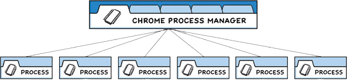

# Process Model

Electron inherits its multi-process architecture from Chromium, which makes the framework
architecturally very similar to a modern web browser. In this guide, we'll expound on
the conceptual knowledge of Electron that we applied in the minimal quick start app.

## Why not a single process?

Web browsers are incredibly complicated applications. Aside from their primary ability
to display web content, they have many secondary responsibilities,
such as managing multiple windows (or tabs) and loading third-party extensions.

In the earlier days, browsers usually used a single process for all of this
functionality. Although this pattern meant less overhead for each tab you had open,
it also meant that one website crashing or hanging would affect the entire browser.

## The multi-process model

To solve this problem, the Chrome team decided that each tab would render in its own
process, limiting the harm that buggy or malicious code on a web page could cause to
the app as a whole. A single browser process then controls these processes, as well
as the application lifecycle as a whole. This diagram below from the [Chrome Comic]
visualizes this model:



Electron applications are structured very similarly. As an app developer, you control
two types of processes: main and renderer. These are analogous to Chrome's own browser
and renderer processes outlined above.

## The main process

Each Electron app has a single main process, which acts as the application's entry
point. The main process runs in a Node.js environment, meaning it has the ability
to `require` modules and use all of Node.js APIs.

### Window management

The main process' primary purpose is to create and manage application windows with the
[`BrowserWindow`][browser-window] module.

Each instance of the `BrowserWindow` class creates an application window that loads
a web page in a separate renderer process. You can interact with this web content
from the main process using the window's [`webContents`][web-contents] object.

> Note: A renderer process is also created for [web embeds][web-embed] such as the
> `BrowserView` module. The `webContents` object is also accessible for embedded
> web content.

Because the `BrowserWindow` module is an [`EventEmitter`][event-emitter], you can also
add handlers for various user events (for example, minimizing or maximizing your window).

```js title='main.js'
const { BrowserWindow } = require('electron')

const win = new BrowserWindow({ width: 800, height: 1500 })
win.loadURL('https://github.com')

const contents = win.webContents
console.log(contents)
```

When a `BrowserWindow` instance is destroyed, its corresponding renderer process gets
terminated as well.

[browser-window]: ../api/browser-window.md
[web-embed]: ./web-embeds.md
[web-contents]: ../api/web-contents.md
[event-emitter]: https://nodejs.org/api/events.html#events_class_eventemitter

### Application lifecycle

The main process also controls your application's lifecycle through Electron's
[`app`][app] module. This module provides a large set of events and methods
that you can use to add custom application behaviour (for instance, programatically
quitting your application, modifying the application dock, or showing an About panel).

As a practical example, the app shown in the [quick start guide][quick-start-lifecycle]
uses `app` APIs to create a more native application window experience.

```js title='main.js'
// quitting the app when no windows are open on macOS
app.on('window-all-closed', function () {
  if (process.platform !== 'darwin') app.quit()
})
```

[app]: ../api/app.md

### Native APIs

To extend Electron's features beyond being a Chromium wrapper for web contents, the
main process also adds custom APIs to. Electron exposes various modules that control
native desktop functionality, such as menus, dialogs, and tray icons.

For a full list of Electron's main process modules, check out our API documentation.

## The renderer process

Each Electron app spawns a separate renderer process for each open `BrowserWindow`
(and each web embed). As its name implies, a renderer is responsible for
*rendering* web content. For all intents and purposes, code ran in renderer processes
should behave according to web standards (insofar as Chromium does, at least).

Therefore, all user interfaces and app functionality within a single browser
window should be written with the same tools and paradigms that you use on the
web.

Although explaining every web spec is out of scope for this guide, the bare minimum
to understand is:

* An HTML file is your entry point for the renderer process.
* UI styling is added through Cascading Style Sheets (CSS).
* Executable JavaScript code can be added through `<script>` elements.

Moreover, this also means that the renderer has no direct access to `require`
or other Node.js APIs. In order to import NPM modules in the renderer, you must use
the same bundler toolchains (for example, `webpack` or `parcel`) that you use for web
apps.

> Note: Renderer processes can be spawned with full Node.js environment for ease of
> development. Historically, this used to be the default, but this feature was disabled
> for security reasons.

At this point, you might be wondering how your renderer process user interfaces
can interact with Node.js and Electron's native desktop functionality if these
features are only accessible from the main process. In fact, there is no direct
way to even import Electron's content scripts.

## Preload scripts

<!-- Note: This guide doesn't take sandboxing into account, which might fundamentally 
change the statements here. -->
A preload script contains code that executes in a renderer process before its web content
begins loading. This script runs within the renderer context, but has a more privileged
environment, meaning it also has full access to Node.js APIs by default.

A preload script can be attached to the main process in the `BrowserWindow` constructor's
`webPreferences` option.

```js title='main.js'
const { BrowserWindow } = require('electron')
//...
const win = new BrowserWindow({
  preload: 'path/to/preload.js'
})
//...
```

Because the preload script shares a global [`Window`][window-mdn] interface with the
renderers and can access Node.js APIs, it serves to provide your renderer with
powers that it would not have by itself. Below are a few common tasks that can be done
using custom preload logic.

### Exposing arbitrary APIs to the renderer process

Although the two share a `window` global, you cannot directly attach any variables from
the preload to `window` to do this. By default, preload scripts are isolated from the
renderer to avoid leaking any privileged APIs into your web content's code (see the
[Context Isolation][context-isolation] guide for more details).

We use the [`contextBridge`][context-bridge] module to bootstrap this setup.

```js title='preload.js'

const { contextBridge } = require('electron')
```

#### APIs

##### Electron API

Electron APIs are assigned based on the process type, meaning that some modules can be used from either the Main or Renderer process, and some from both. Electron's API documentation indicates which process each module can be used from.

For example, to access the Electron API in both processes, require its included module:

```js
const electron = require('electron')
```

To create a window, call the `BrowserWindow` class, which is only available in the Main process:

```js
const { BrowserWindow } = require('electron')
const win = new BrowserWindow()
```

To call the Main process from the Renderer, use the IPC module:

```js
// In the Main process
const { ipcMain } = require('electron')

ipcMain.handle('perform-action', (event, ...args) => {
  // ... do actions on behalf of the Renderer
})
```

```js
// In the Renderer process
const { ipcRenderer } = require('electron')

ipcRenderer.invoke('perform-action', ...args)
```

> NOTE: Because Renderer processes may run untrusted code (especially from third parties), it is important to carefully validate the requests that come to the Main process.

##### Node.js API

> NOTE: To access the Node.js API from the Renderer process, you need to set the `nodeIntegration` preference to `true` and the `contextIsolation` preference to `false`.  Please note that access to the Node.js API in any renderer that loads remote content is not recommended for [security reasons](../tutorial/security.md#2-do-not-enable-nodejs-integration-for-remote-content).

Electron exposes full access to Node.js API and its modules both in the Main and the Renderer processes. For example, you can read all the files from the root directory:

```js
const fs = require('fs')

const root = fs.readdirSync('/')

console.log(root)
```

To use a Node.js module, you first need to install it as a dependency:

```sh
npm install --save aws-sdk
```

Then, in your Electron application, require the module:

```js
const S3 = require('aws-sdk/clients/s3')
```
