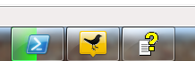
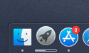
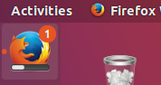
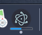
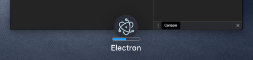

# Taskbar Progress Bar (Windows & macOS)

## Overview

A progress bar enables a window to provide progress information to the user
without the need of switching to the window itself.

On Windows, you can use a taskbar button to display a progress bar.



On macOS, the progress bar will be displayed as a part of the dock icon.



On Linux, the Unity graphical interface also has a similar feature that allows
you to specify the progress bar in the launcher.



> NOTE: on Windows, each window can have its own progress bar, whereas on macOS
and Linux (Unity) there can be only one progress bar for the application.

----

All three cases are covered by the same API - the
[`setProgressBar()`][setprogressbar] method available on an instance of
`BrowserWindow`. To indicate your progress, call this method with a number
between `0` and `1`. For example, if you have a long-running task that is
currently at 63% towards completion, you would call it as
`setProgressBar(0.63)`.

Setting the parameter to negative values (e.g. `-1`) will remove the progress
bar. Setting it to a value greater than `1` will indicate an indeterminate progress bar
in Windows or clamp to 100% in other operating systems. An indeterminate progress bar
remains active but does not show an actual percentage, and is used for situations when
you do not know how long an operation will take to complete.

See the [API documentation for more options and modes][setprogressbar].

## Example

In this example, we add a progress bar to the main window that increments over time
using Node.js timers.

```fiddle docs/latest/fiddles/features/progress-bar
const { app, BrowserWindow } = require('electron')

let progressInterval

const createWindow = () => {
  const win = new BrowserWindow({
    width: 800,
    height: 600
  })

  win.loadFile('index.html')

  const INCREMENT = 0.03
  const INTERVAL_DELAY = 100 // ms

  let c = 0
  progressInterval = setInterval(() => {
    // update progress bar to next value
    // values between 0 and 1 will show progress, >1 will show indeterminate or stick at 100%
    win.setProgressBar(c)

    // increment or reset progress bar
    if (c < 2) c += INCREMENT
    else c = 0
  }, INTERVAL_DELAY)
}

app.whenReady().then(createWindow)

// before the app is terminated, clear both timers
app.on('before-quit', () => {
  clearInterval(progressInterval)
})

app.on('window-all-closed', () => {
  if (process.platform !== 'darwin') {
    app.quit()
  }
})

app.on('activate', () => {
  if (BrowserWindow.getAllWindows().length === 0) {
    createWindow()
  }
})
```

After launching the Electron application, the dock (macOS) or taskbar (Windows, Unity)
should show a progress bar that starts at zero and progresses through 100% to completion.
It should then show indeterminate (Windows) or pin to 100% (other operating systems)
briefly and then loop.



For macOS, the progress bar will also be indicated for your application
when using [Mission Control](https://support.apple.com/en-us/HT204100):


[setprogressbar]: ../api/browser-window.md#winsetprogressbarprogress-options
