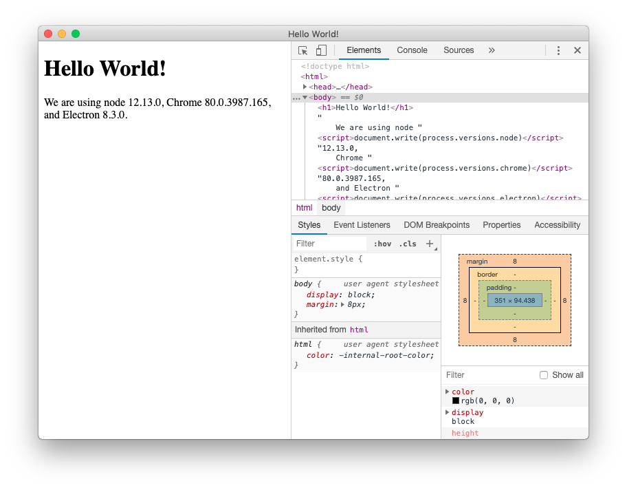

# Quick Start

This guide will step you through the process of creating a barebones Hello World app in
Electron, similar to [`electron/electron-quick-start`][quick-start].

By the end of this tutorial, your app will open a browser window that displays a web page
with information about which Chromium, Node.js, and Electron versions are running.

[quick-start]: https://github.com/electron/electron-quick-start

## Prerequisites

To use Electron, you need to install [Node.js][node-download]. We recommend that you
use the latest `LTS` version available.

> Please install Node.js using pre-built installers for your platform.
> You may encounter incompatibility issues with different development tools otherwise.

To check that Node.js was installed correctly, type the following commands in your
terminal client:

```sh
node -v
npm -v
```

The commands should print the versions of Node.js and npm accordingly.

**Note:** Since Electron embeds Node.js into its binary, the version of Node.js running
your code is unrelated to the version running on your system.

[node-download]: https://nodejs.org/en/download/

## Create your application

### Scaffold the project

Electron apps follow the same general structure as other Node.js projects.
Start by creating a folder and initializing an npm package.

```sh npm2yarn
mkdir my-electron-app && cd my-electron-app
npm init
```

The interactive `init` command will prompt you to set some fields in your config.
There are a few rules to follow for the purposes of this tutorial:

* `entry point` should be `main.js`.
* `author` and `description` can be any value, but are necessary for
[app packaging](#package-and-distribute-your-application).

Your `package.json` file should look something like this:

```json
{
  "name": "my-electron-app",
  "version": "1.0.0",
  "description": "Hello World!",
  "main": "main.js",
  "author": "Jane Doe",
  "license": "MIT"
}
```

Then, install the `electron` package into your app's `devDependencies`.

```sh npm2yarn
$ npm install --save-dev electron
```

> Note: If you're encountering any issues with installing Electron, please
> refer to the [Advanced Installation][advanced-installation] guide.

Finally, you want to be able to execute Electron. In the [`scripts`][package-scripts]
field of your `package.json` config, add a `start` command like so:

```json
{
  "scripts": {
    "start": "electron ."
  }
}
```

This `start` command will let you open your app in development mode.

```sh npm2yarn
npm start
```

> Note: This script tells Electron to run on your project's root folder. At this stage,
> your app will immediately throw an error telling you that it cannot find an app to run.

[advanced-installation]: ./installation.md
[package-scripts]: https://docs.npmjs.com/cli/v7/using-npm/scripts

### Run the main process

The entry point of any Electron application is its `main` script. This script controls the
**main process**, which runs in a full Node.js environment and is responsible for
controlling your app's lifecycle, displaying native interfaces, performing privileged
operations, and managing renderer processes (more on that later).

During execution, Electron will look for this script in the [`main`][package-json-main]
field of the app's `package.json` config, which you should have configured during the
[app scaffolding](#scaffold-the-project) step.

To initialize the `main` script, create an empty file named `main.js` in the root folder
of your project.

> Note: If you run the `start` script again at this point, your app will no longer throw
> any errors! However, it won't do anything yet because we haven't added any code into
> `main.js`.

[package-json-main]: https://docs.npmjs.com/cli/v7/configuring-npm/package-json#main

### Create a web page

Before we can create a window for our application, we need to create the content that
will be loaded into it. In Electron, each window displays web contents that can be loaded
from either from a local HTML file or a remote URL.

For this tutorial, you will be doing the former. Create an `index.html` file in the root
folder of your project:

```html
<!DOCTYPE html>
<html>
  <head>
    <meta charset="UTF-8">
    <!-- https://developer.mozilla.org/en-US/docs/Web/HTTP/CSP -->
    <meta http-equiv="Content-Security-Policy" content="default-src 'self'; script-src 'self'">
    <meta http-equiv="X-Content-Security-Policy" content="default-src 'self'; script-src 'self'">
    <title>Hello World!</title>
  </head>
  <body>
    <h1>Hello World!</h1>
    We are using Node.js <span id="node-version"></span>,
    Chromium <span id="chrome-version"></span>,
    and Electron <span id="electron-version"></span>.
  </body>
</html>
```

> Note: Looking at this HTML document, you can observe that the version numbers are
> missing from the body text. We'll manually insert them later using JavaScript.

### Opening your web page in a browser window

Now that you have a web page, load it into an application window. To do so, you'll
need two Electron modules:

* The [`app`][app] module, which controls your application's event lifecycle.
* The [`BrowserWindow`][browser-window] module, which creates and manages application
  windows.

Because the main process runs Node.js, you can import these as [CommonJS][commonjs]
modules at the top of your file:

```js
const { app, BrowserWindow } = require('electron')
```

Then, add a `createWindow()` function that loads `index.html` into a new `BrowserWindow`
instance.

```js
const createWindow = () => {
  const win = new BrowserWindow({
    width: 800,
    height: 600
  })

  win.loadFile('index.html')
}
```

Next, call this `createWindow()` function to open your window.

In Electron, browser windows can only be created after the `app` module's
[`ready`][app-ready] event is fired. You can wait for this event by using the
[`app.whenReady()`][app-when-ready] API. Call `createWindow()` after `whenReady()`
resolves its Promise.

```js
app.whenReady().then(() => {
  createWindow()
})
```

> Note: At this point, your Electron application should successfully
> open a window that displays your web page!

[app]: ../api/app.md
[browser-window]: ../api/browser-window.md
[commonjs]: https://nodejs.org/docs/latest/api/modules.html#modules_modules_commonjs_modules
[app-ready]: ../api/app.md#event-ready
[app-when-ready]: ../api/app.md#appwhenready

### Manage your window's lifecycle

Although you can now open a browser window, you'll need some additional boilerplate code
to make it feel more native to each platform. Application windows behave differently on
each OS, and Electron puts the responsibility on developers to implement these
conventions in their app.

In general, you can use the `process` global's [`platform`][node-platform] attribute
to run code specifically for certain operating systems.

#### Quit the app when all windows are closed (Windows & Linux)

On Windows and Linux, exiting all windows generally quits an application entirely.

To implement this, listen for the `app` module's [`'window-all-closed'`][window-all-closed]
event, and call [`app.quit()`][app-quit] if the user is not on macOS (`darwin`).

```js
app.on('window-all-closed', () => {
  if (process.platform !== 'darwin') app.quit()
})
```

[node-platform]: https://nodejs.org/api/process.html#process_process_platform
[window-all-closed]: ../api/app.md#event-window-all-closed
[app-quit]: ../api/app.md#appquit

#### Open a window if none are open (macOS)

Whereas Linux and Windows apps quit when they have no windows open, macOS apps generally
continue running even without any windows open, and activating the app when no windows
are available should open a new one.

To implement this feature, listen for the `app` module's [`activate`][activate]
event, and call your existing `createWindow()` method if no browser windows are open.

Because windows cannot be created before the `ready` event, you should only listen for
`activate` events after your app is initialized. Do this by attaching your event listener
from within your existing `whenReady()` callback.

[activate]: ../api/app.md#event-activate-macos

```js
app.whenReady().then(() => {
  createWindow()

  app.on('activate', () => {
    if (BrowserWindow.getAllWindows().length === 0) createWindow()
  })
})
```

> Note: At this point, your window controls should be fully functional!

### Access Node.js from the renderer with a preload script

Now, the last thing to do is print out the version numbers for Electron and its
dependencies onto your web page.

Accessing this information is trivial to do in the main process through Node's
global `process` object. However, you can't just edit the DOM from the main
process because it has no access to the renderer's `document` context.
They're in entirely different processes!

> Note: If you need a more in-depth look at Electron processes, see the
> [Process Model][] document.

This is where attaching a **preload** script to your renderer comes in handy.
A preload script runs before the renderer process is loaded, and has access to both
renderer globals (e.g. `window` and `document`) and a Node.js environment.

Create a new script named `preload.js` as such:

```js
window.addEventListener('DOMContentLoaded', () => {
  const replaceText = (selector, text) => {
    const element = document.getElementById(selector)
    if (element) element.innerText = text
  }

  for (const dependency of ['chrome', 'node', 'electron']) {
    replaceText(`${dependency}-version`, process.versions[dependency])
  }
})
```

The above code accesses the Node.js `process.versions` object and runs a basic `replaceText`
helper function to insert the version numbers into the HTML document.

To attach this script to your renderer process, pass in the path to your preload script
to the `webPreferences.preload` option in your existing `BrowserWindow` constructor.

```js
// include the Node.js 'path' module at the top of your file
const path = require('path')

// modify your existing createWindow() function
const createWindow = () => {
  const win = new BrowserWindow({
    width: 800,
    height: 600,
    webPreferences: {
      preload: path.join(__dirname, 'preload.js')
    }
  })

  win.loadFile('index.html')
}
// ...
```

There are two Node.js concepts that are used here:

* The [`__dirname`][dirname] string points to the path of the currently executing script
  (in this case, your project's root folder).
* The [`path.join`][path-join] API joins multiple path segments together, creating a
  combined path string that works across all platforms.

We use a path relative to the currently executing JavaScript file so that your relative
path will work in both development and packaged mode.

[Process Model]: ./process-model.md
[dirname]: https://nodejs.org/api/modules.html#modules_dirname
[path-join]: https://nodejs.org/api/path.html#path_path_join_paths

### Bonus: Add functionality to your web contents

At this point, you might be wondering how to add more functionality to your application.

For any interactions with your web contents, you want to add scripts to your
renderer process. Because the renderer runs in a normal web environment, you can add a
`<script>` tag right before your `index.html` file's closing `</body>` tag to include
any arbitrary scripts you want:

```html
<script src="./renderer.js"></script>
```

The code contained in `renderer.js` can then use the same JavaScript APIs and tooling
you use for typical front-end development, such as using [`webpack`][webpack] to bundle
and minify your code or [React][react] to manage your user interfaces.

[webpack]: https://webpack.js.org
[react]: https://reactjs.org

### Recap

After following the above steps, you should have a fully functional
Electron application that looks like this:



<!--TODO(erickzhao): Remove the individual code blocks for static website -->
The full code is available below:

```js
// main.js

// Modules to control application life and create native browser window
const { app, BrowserWindow } = require('electron')
const path = require('path')

const createWindow = () => {
  // Create the browser window.
  const mainWindow = new BrowserWindow({
    width: 800,
    height: 600,
    webPreferences: {
      preload: path.join(__dirname, 'preload.js')
    }
  })

  // and load the index.html of the app.
  mainWindow.loadFile('index.html')

  // Open the DevTools.
  // mainWindow.webContents.openDevTools()
}

// This method will be called when Electron has finished
// initialization and is ready to create browser windows.
// Some APIs can only be used after this event occurs.
app.whenReady().then(() => {
  createWindow()

  app.on('activate', () => {
    // On macOS it's common to re-create a window in the app when the
    // dock icon is clicked and there are no other windows open.
    if (BrowserWindow.getAllWindows().length === 0) createWindow()
  })
})

// Quit when all windows are closed, except on macOS. There, it's common
// for applications and their menu bar to stay active until the user quits
// explicitly with Cmd + Q.
app.on('window-all-closed', () => {
  if (process.platform !== 'darwin') app.quit()
})

// In this file you can include the rest of your app's specific main process
// code. You can also put them in separate files and require them here.
```

```js
// preload.js

// All of the Node.js APIs are available in the preload process.
// It has the same sandbox as a Chrome extension.
window.addEventListener('DOMContentLoaded', () => {
  const replaceText = (selector, text) => {
    const element = document.getElementById(selector)
    if (element) element.innerText = text
  }

  for (const dependency of ['chrome', 'node', 'electron']) {
    replaceText(`${dependency}-version`, process.versions[dependency])
  }
})
```

```html
<!--index.html-->

<!DOCTYPE html>
<html>
  <head>
    <meta charset="UTF-8">
    <!-- https://developer.mozilla.org/en-US/docs/Web/HTTP/CSP -->
    <meta http-equiv="Content-Security-Policy" content="default-src 'self'; script-src 'self'">
    <meta http-equiv="X-Content-Security-Policy" content="default-src 'self'; script-src 'self'">
    <title>Hello World!</title>
  </head>
  <body>
    <h1>Hello World!</h1>
    We are using Node.js <span id="node-version"></span>,
    Chromium <span id="chrome-version"></span>,
    and Electron <span id="electron-version"></span>.

    <!-- You can also require other files to run in this process -->
    <script src="./renderer.js"></script>
  </body>
</html>
```

```fiddle docs/fiddles/quick-start
```

To summarize all the steps we've done:

* We bootstrapped a Node.js application and added Electron as a dependency.
* We created a `main.js` script that runs our main process, which controls our app
  and runs in a Node.js environment. In this script, we used Electron's `app` and
  `BrowserWindow` modules to create a browser window that displays web content
  in a separate process (the renderer).
* In order to access certain Node.js functionality in the renderer, we attached
  a preload script to our `BrowserWindow` constructor.

## Package and distribute your application

The fastest way to distribute your newly created app is using
[Electron Forge](https://www.electronforge.io).

1. Add Electron Forge as a development dependency of your app, and use its `import` command to set up
Forge's scaffolding:

    ```sh npm2yarn
    npm install --save-dev @electron-forge/cli
    npx electron-forge import

    ✔ Checking your system
    ✔ Initializing Git Repository
    ✔ Writing modified package.json file
    ✔ Installing dependencies
    ✔ Writing modified package.json file
    ✔ Fixing .gitignore

    We have ATTEMPTED to convert your app to be in a format that electron-forge understands.

    Thanks for using "electron-forge"\!\!\!
    ```

1. Create a distributable using Forge's `make` command:

    ```sh npm2yarn
    npm run make

    > my-electron-app@1.0.0 make /my-electron-app
    > electron-forge make

    ✔ Checking your system
    ✔ Resolving Forge Config
    We need to package your application before we can make it
    ✔ Preparing to Package Application for arch: x64
    ✔ Preparing native dependencies
    ✔ Packaging Application
    Making for the following targets: zip
    ✔ Making for target: zip - On platform: darwin - For arch: x64
    ```

    Electron Forge creates the `out` folder where your package will be located:

    ```plain
    // Example for macOS
    out/
    ├── out/make/zip/darwin/x64/my-electron-app-darwin-x64-1.0.0.zip
    ├── ...
    └── out/my-electron-app-darwin-x64/my-electron-app.app/Contents/MacOS/my-electron-app
    ```
