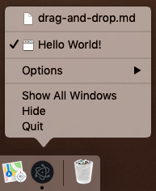

# Recent Documents (Windows & macOS)

## Overview

Windows and macOS provide access to a list of recent documents opened by
the application via JumpList or dock menu, respectively.

__JumpList:__

![JumpList Recent Files][jumplist-image]

__Application dock menu:__

![macOS Dock Menu][dock-menu-image]

To add a file to recent documents, you need to use the
[app.addRecentDocument][addrecentdocument] API.

## Example

### Add an item to recent documents

Starting with a working application from the
[Quick Start Guide](quick-start.md), add the following lines to the
`main.js` file:

```javascript fiddle='docs/fiddles/features/recent-documents'
const { app } = require('electron')

app.addRecentDocument('/Users/USERNAME/Desktop/work.type')
```

After launching the Electron application, right click the application icon.
You should see the item you just added. In this guide, the item is a Markdown
file located in the root of the project:



### Clear the list of recent documents

To clear the list of recent documents, you need to use
[app.clearRecentDocuments][clearrecentdocuments] API in the `main.js` file:

```javascript
const { app } = require('electron')

app.clearRecentDocuments()
```

## Additional information

### Windows Notes

To use this feature on Windows, your application has to be registered as
a handler of the file type of the document, otherwise the file won't appear
in JumpList even after you have added it. You can find everything
on registering your application in [Application Registration][app-registration].

When a user clicks a file from the JumpList, a new instance of your application
will be started with the path of the file added as a command line argument.

### macOS Notes

#### Add the Recent Documents list to the application menu

You can add menu items to access and clear recent documents by adding the
following code snippet to your menu template:

```json
{
  "submenu":[
    {
      "label":"Open Recent",
      "role":"recentdocuments",
      "submenu":[
        {
          "label":"Clear Recent",
          "role":"clearrecentdocuments"
        }
      ]
    }
  ]
}
```

![macOS Recent Documents menu item][menu-item-image]

When a file is requested from the recent documents menu, the `open-file` event
of `app` module will be emitted for it.

[jumplist-image]: https://cloud.githubusercontent.com/assets/2289/23446924/11a27b98-fdfc-11e6-8485-cc3b1e86b80a.png
[dock-menu-image]: https://cloud.githubusercontent.com/assets/639601/5069610/2aa80758-6e97-11e4-8cfb-c1a414a10774.png
[addrecentdocument]: ../api/app.md#appaddrecentdocumentpath-macos-windows
[clearrecentdocuments]: ../api/app.md#appclearrecentdocuments-macos-windows
[app-registration]: https://msdn.microsoft.com/en-us/library/cc144104(VS.85).aspx
[menu-item-image]: https://user-images.githubusercontent.com/3168941/33003655-ea601c3a-cd70-11e7-97fa-7c062149cfb1.png
