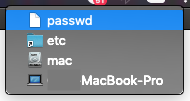

# Representing Files in a BrowserWindow (macOS)

## Overview

On macOS, you can set a represented file for any window in your application.
The represented file's icon will be shown in the title bar, and when users
`Command-Click` or `Control-Click`, a popup with a path to the file will be
shown.

![Represented File][represented-image]

> NOTE: The screenshot above is an example where this feature is used to indicate the currently opened file in the Atom text editor.

You can also set the edited state for a window so that the file icon can
indicate whether the document in this window has been modified.

To set the represented file of window, you can use the
[BrowserWindow.setRepresentedFilename][setrepresentedfilename] and
[BrowserWindow.setDocumentEdited][setdocumentedited] APIs.

## Example

```javascript fiddle='docs/fiddles/features/represented-file'
const { app, BrowserWindow } = require('electron')
const os = require('os');

const createWindow = () => {
  const win = new BrowserWindow({
    width: 800,
    height: 600
  })
}

app.whenReady().then(() => {
  const win = new BrowserWindow()

  win.setRepresentedFilename(os.homedir())
  win.setDocumentEdited(true)
})

app.on('window-all-closed', () => {
  if (process.platform !== 'darwin') {
    app.quit()
  }
})

app.on('activate', () => {
  if (BrowserWindow.getAllWindows().length === 0) {
    createWindow()
  }
})
```

After launching the Electron application, click on the title with `Command` or
`Control` key pressed. You should see a popup with the represented file at the top.
In this guide, this is the current user's home directory:



[represented-image]: https://cloud.githubusercontent.com/assets/639601/5082061/670a949a-6f14-11e4-987a-9aaa04b23c1d.png
[setrepresentedfilename]: ../api/browser-window.md#winsetrepresentedfilenamefilename-macos
[setdocumentedited]: ../api/browser-window.md#winsetdocumenteditededited-macos
