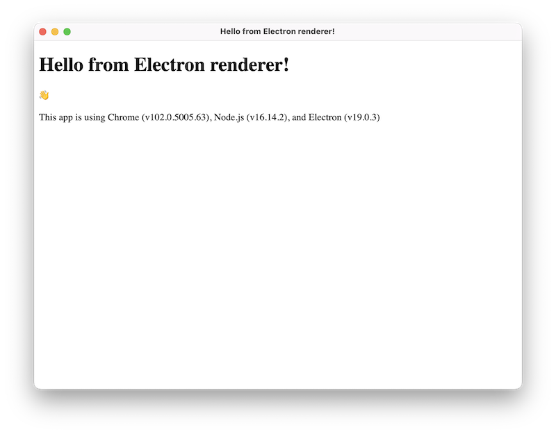

:::info Follow along the tutorial

This is **part 3** of the Electron tutorial.

1. [Prerequisites][prerequisites]
1. [Building your First App][building your first app]
1. **[Using Preload Scripts][preload]**
1. [Adding Features][features]
1. [Packaging Your Application][packaging]
1. [Publishing and Updating][updates]

:::

## Learning goals

In this part of the tutorial, you will learn what a preload script is and how to use one
to securely expose privileged APIs into the renderer process. You will also learn how to
communicate between main and renderer processes with Electron's inter-process
communication (IPC) modules.

## What is a preload script?

Electron's main process is a Node.js environment that has full operating system access.
On top of [Electron modules][modules], you can also access [Node.js built-ins][node-api],
as well as any packages installed via npm. On the other hand, renderer processes run web
pages and do not run Node.js by default for security reasons.

To bridge Electron's different process types together, we will need to use a special script
called a **preload**.

## Augmenting the renderer with a preload script

A BrowserWindow's preload script runs in a context that has access to both the HTML DOM
and a limited subset of Node.js and Electron APIs.

:::info Preload script sandboxing

From Electron 20 onwards, preload scripts are **sandboxed** by default and no longer have access
to a full Node.js environment. Practically, this means that you have a polyfilled `require`
function that only has access to a limited set of APIs.

| Available API      | Details                                                                                                                                                                                                                                                        |
| ------------------ | -------------------------------------------------------------------------------------------------------------------------------------------------------------------------------------------------------------------------------------------------------------- |
| Electron modules   | Renderer process modules                                                                                                                                                                                                                                       |
| Node.js modules    | [`events`](https://nodejs.org/api/events.html), [`timers`](https://nodejs.org/api/timers.html), [`url`](https://nodejs.org/api/url.html)                                                                                                                       |
| Polyfilled globals | [`Buffer`](https://nodejs.org/api/buffer.html), [`process`](../api/process.md), [`clearImmediate`](https://nodejs.org/api/timers.html#timers_clearimmediate_immediate), [`setImmediate`](https://nodejs.org/api/timers.html#timers_setimmediate_callback_args) |

For more information, check out the [Process Sandboxing](./sandbox.md) guide.

:::

Preload scripts are injected before a web page loads in the renderer,
similar to a Chrome extension's [content scripts][content-script]. To add features to your renderer
that require privileged access, you can define [global][] objects through the
[contextBridge][contextbridge] API.

To demonstrate this concept, you will create a preload script that exposes your app's
versions of Chrome, Node, and Electron into the renderer.

Add a new `preload.js` script that exposes selected properties of Electron's `process.versions`
object to the renderer process in a `versions` global variable.

```js title="preload.js"
const { contextBridge } = require('electron')

contextBridge.exposeInMainWorld('versions', {
  node: () => process.versions.node,
  chrome: () => process.versions.chrome,
  electron: () => process.versions.electron
  // we can also expose variables, not just functions
})
```

To attach this script to your renderer process, pass its path to the
`webPreferences.preload` option in the BrowserWindow constructor:

```js {2,8-10} title="main.js"
const { app, BrowserWindow } = require('electron')
const path = require('node:path')

const createWindow = () => {
  const win = new BrowserWindow({
    width: 800,
    height: 600,
    webPreferences: {
      preload: path.join(__dirname, 'preload.js')
    }
  })

  win.loadFile('index.html')
}

app.whenReady().then(() => {
  createWindow()
})
```

:::info

There are two Node.js concepts that are used here:

- The [`__dirname`][dirname] string points to the path of the currently executing script
  (in this case, your project's root folder).
- The [`path.join`][path-join] API joins multiple path segments together, creating a
  combined path string that works across all platforms.

:::

At this point, the renderer has access to the `versions` global, so let's display that
information in the window. This variable can be accessed via `window.versions` or simply
`versions`. Create a `renderer.js` script that uses the [`document.getElementById`][]
DOM API to replace the displayed text for the HTML element with `info` as its `id` property.

```js title="renderer.js" @ts-nocheck
const information = document.getElementById('info')
information.innerText = `This app is using Chrome (v${versions.chrome()}), Node.js (v${versions.node()}), and Electron (v${versions.electron()})`
```

Then, modify your `index.html` by adding a new element with `info` as its `id` property,
and attach your `renderer.js` script:

```html {18,20} title="index.html"
<!DOCTYPE html>
<html>
  <head>
    <meta charset="UTF-8" />
    <meta
      http-equiv="Content-Security-Policy"
      content="default-src 'self'; script-src 'self'"
    />
    <meta
      http-equiv="X-Content-Security-Policy"
      content="default-src 'self'; script-src 'self'"
    />
    <title>Hello from Electron renderer!</title>
  </head>
  <body>
    <h1>Hello from Electron renderer!</h1>
    <p>👋</p>
    <p id="info"></p>
  </body>
  <script src="./renderer.js"></script>
</html>
```

After following the above steps, your app should look something like this:



And the code should look like this:

```fiddle docs/fiddles/tutorial-preload

```

## Communicating between processes

As we have mentioned above, Electron's main and renderer process have distinct responsibilities
and are not interchangeable. This means it is not possible to access the Node.js APIs directly
from the renderer process, nor the HTML Document Object Model (DOM) from the main process.

The solution for this problem is to use Electron's `ipcMain` and `ipcRenderer` modules for
inter-process communication (IPC). To send a message from your web page to the main process,
you can set up a main process handler with `ipcMain.handle` and
then expose a function that calls `ipcRenderer.invoke` to trigger the handler in your preload script.

To illustrate, we will add a global function to the renderer called `ping()`
that will return a string from the main process.

First, set up the `invoke` call in your preload script:

```js {1,7} title="preload.js"
const { contextBridge, ipcRenderer } = require('electron')

contextBridge.exposeInMainWorld('versions', {
  node: () => process.versions.node,
  chrome: () => process.versions.chrome,
  electron: () => process.versions.electron,
  ping: () => ipcRenderer.invoke('ping')
  // we can also expose variables, not just functions
})
```

:::caution IPC security

Notice how we wrap the `ipcRenderer.invoke('ping')` call in a helper function rather
than expose the `ipcRenderer` module directly via context bridge. You **never** want to
directly expose the entire `ipcRenderer` module via preload. This would give your renderer
the ability to send arbitrary IPC messages to the main process, which becomes a powerful
attack vector for malicious code.

:::

Then, set up your `handle` listener in the main process. We do this _before_
loading the HTML file so that the handler is guaranteed to be ready before
you send out the `invoke` call from the renderer.

```js {1,15} title="main.js"
const { app, BrowserWindow, ipcMain } = require('electron/main')
const path = require('node:path')

const createWindow = () => {
  const win = new BrowserWindow({
    width: 800,
    height: 600,
    webPreferences: {
      preload: path.join(__dirname, 'preload.js')
    }
  })
  win.loadFile('index.html')
}
app.whenReady().then(() => {
  ipcMain.handle('ping', () => 'pong')
  createWindow()
})
```

Once you have the sender and receiver set up, you can now send messages from the renderer
to the main process through the `'ping'` channel you just defined.

```js title='renderer.js' @ts-expect-error=[2]
const func = async () => {
  const response = await window.versions.ping()
  console.log(response) // prints out 'pong'
}

func()
```

:::info

For more in-depth explanations on using the `ipcRenderer` and `ipcMain` modules,
check out the full [Inter-Process Communication][ipc] guide.

:::

## Summary

A preload script contains code that runs before your web page is loaded into the browser
window. It has access to both DOM APIs and Node.js environment, and is often used to
expose privileged APIs to the renderer via the `contextBridge` API.

Because the main and renderer processes have very different responsibilities, Electron
apps often use the preload script to set up inter-process communication (IPC) interfaces
to pass arbitrary messages between the two kinds of processes.

In the next part of the tutorial, we will be showing you resources on adding more
functionality to your app, then teaching you distributing your app to users.

<!-- Links -->

[content-script]: https://developer.chrome.com/docs/extensions/mv3/content_scripts/
[contextbridge]: ../api/context-bridge.md
[`document.getelementbyid`]: https://developer.mozilla.org/en-US/docs/Web/API/Document/getElementById
[dirname]: https://nodejs.org/api/modules.html#modules_dirname
[global]: https://developer.mozilla.org/en-US/docs/Glossary/Global_object
[ipc]: ./ipc.md
[modules]: ../api/app.md
[node-api]: https://nodejs.org/dist/latest/docs/api/
[path-join]: https://nodejs.org/api/path.html#path_path_join_paths

<!-- Tutorial links -->

[prerequisites]: tutorial-1-prerequisites.md
[building your first app]: tutorial-2-first-app.md
[preload]: tutorial-3-preload.md
[features]: tutorial-4-adding-features.md
[packaging]: tutorial-5-packaging.md
[updates]: tutorial-6-publishing-updating.md
